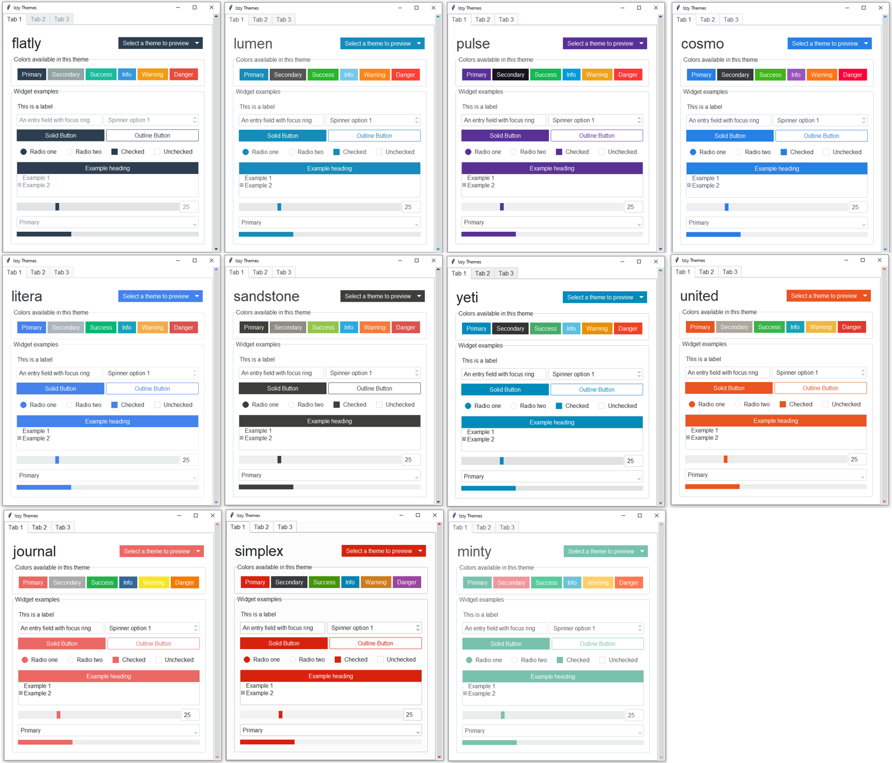
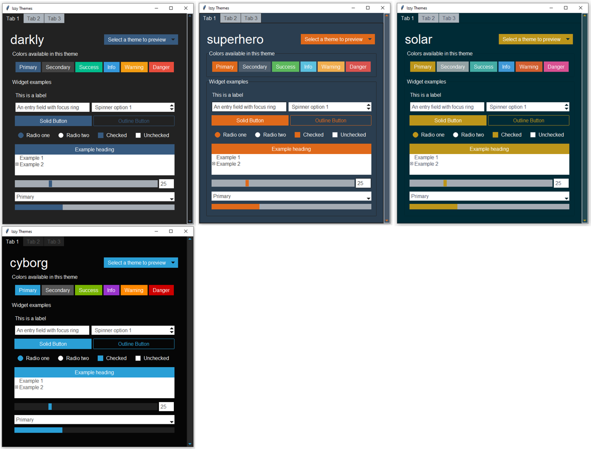

# Izzy-Themes-TTK  (IN PROGRESS)
A collection of modern themes for Tkinter TTK built using only built-in standard themes ('clam', 'alt', 'classic', 'default').

## Basic Usage
```python
from izzythemes import Style, ttk
style = Style()
style.theme_use('flatly')
```

- Add styled widgets to your window with ttk. 
- Use the `style` argument to set other available colors.
```python
root = style.master

# primary colors
ttk.Label(root, text='Hello world').pack()

# other colors
ttk.Label(root, text='Hello world', style='danger.TLabel').pack()
```


## Light Themes

  
## Dark Themes


## Applying Styles
By default, the colors will be primary. Secondary, etc... colors are available as well, as represented in the images in this readme.
  
To apply a theme color to a widget, use one of the following prefixes, followed by the widget class name.

For example: `style = 'danger.TLabel'` or `style = style = 'danger.TButton'`

The following color prefixes are available for most widgets:
- primary (default)
- secondary
- success
- info
- warning
- danger

IzzyThemes defines and/or inherits the following ttk widget classes:
- TButton
- Outline.TButton
- TSpinbox
- Horizontal.TScale
- Vertical.TScale
- Horizontal.TScrollbar
- Vertical.TScrollbar
- TCombobox
- TFrame
- TCheckbutton
- TEntry
- TLabel
- TLabelframe
- TNotebook
- TMenubutton
- Outline.TMenubutton
- Horizontal.TProgressbar
- Vertical.TProgressbar
- TRadiobutton
- Treeview
