# Izzy-Themes-TTK
A collection of modern themes for Tkinter TTK built using standard, cross-platform themes ('clam', 'alt', 'classic', 'default'). 
Most of these themes are adapted and or/inspired from the open source bootstrap themes published on https://bootswatch.com/  

This is a work-in-progress. Soon this will be published as a Python package. But, until then, you can clone the repo and use per below.

## Basic Usage

```python
from ttkbootstrap import BootStyle, ttk

style = BootStyle()
style.theme_use('flatly')
root = style.master

# create widget with primary colors
ttk.Label(root, text='Hello world').pack()

# create widget with other colors
ttk.Label(root, text='Hello world', style='danger.TLabel').pack()

# run the window
root.mainloop()
```
## Applying Styles
By default, the primary color for the theme will be used on widgets (See images below for examples of theme color options). All other themed colors can be used by applying the color prefix to the ttk widget class.
  
```python
ttk.Label(root, text='Hello World', style='info.TLabel')
ttk.Button(root, text='Hello World', style='info.TButton')
ttk.Button(root, text='Hello World', style='warning.Outline.TButton')
ttk.Radiobutton(root, text='Hello World', style='danger.TRadiobutton')
```

### Color prefixes
- primary <i>(default)</i>
- secondary
- success
- info
- warning
- danger

### Defined ttk widget classes
- TButton
- Outline.TButton
- TSpinbox
- Horizontal.TScale
- Vertical.TScale
- Horizontal.TScrollbar
- Vertical.TScrollbar
- TCombobox
- TFrame
- TCheckbutton
- TEntry
- TLabel
- TLabelframe
- TNotebook
- TMenubutton
- Outline.TMenubutton
- Horizontal.TProgressbar
- Vertical.TProgressbar
- TRadiobutton
- Treeview

### Exceptions
- The **Scale** widget is built with an image set in the primary theme color; this cannot be changed via styles.
- The **Checkbutton** and **Radiobutton** colors are only changeable on Linux and MacOS. Windows uses the built-in "xpnative" themed elements to build the widgets.

## Create New Themes
Creating a new theme is really easy... simply add a theme record to the `themes.json` file with the appropriate fields
```json
    {
      "name": "cosmo",
      "font": "Helvetica",
      "type": "light",
      "colors": {
        "primary": "#2780e3",
        "secondary": "#373a3c",
        "success": "#3fb618",
        "info": "#9954bb",
        "warning": "#ff7518",
        "danger": "#ff0039",
        "bg": "#ffffff",
        "fg": "#373a3c",
        "selectbg": "#3fb618",
        "selectfg": "#ffffff",
        "light": "#fdfdfe",
        "dark": "#373a3c",
        "active": "#dadada",
        "border": "#ced4da",
        "inputfg": "#49506a"
      }
    }
```

## Light Themes
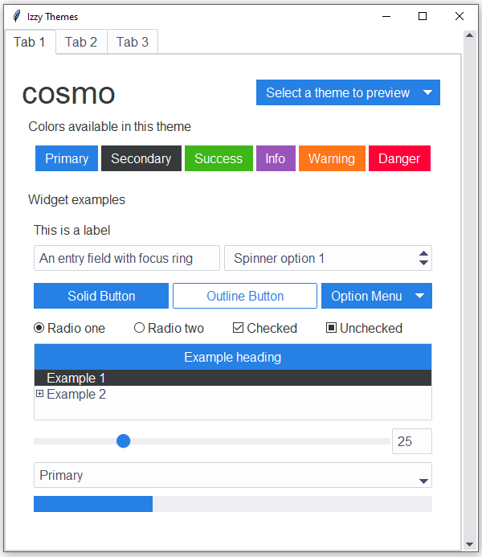 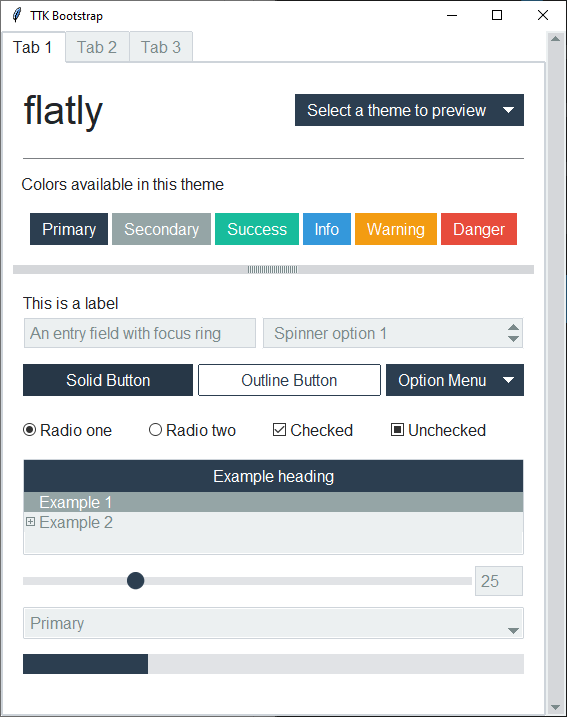  
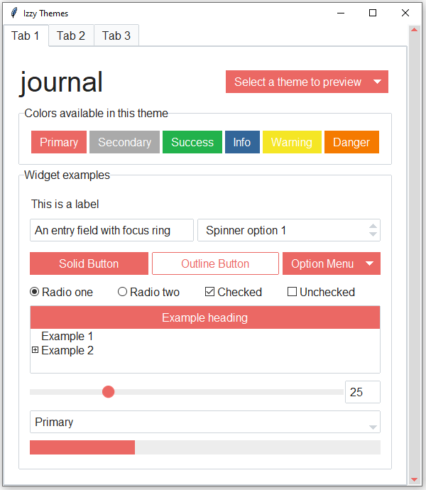 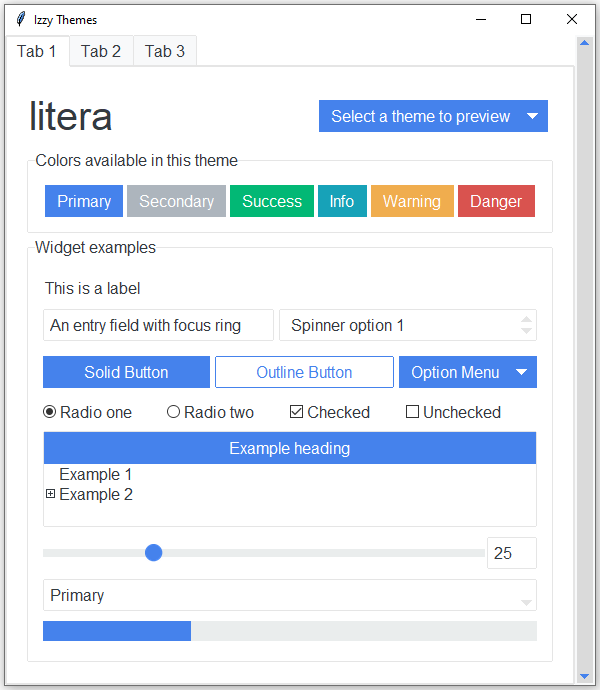  
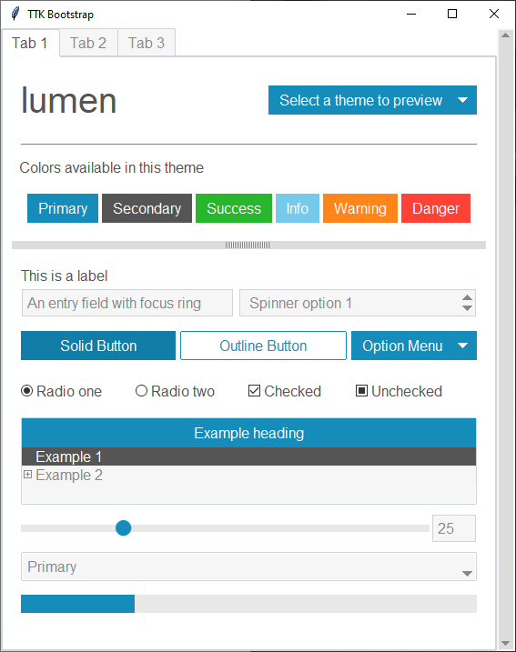 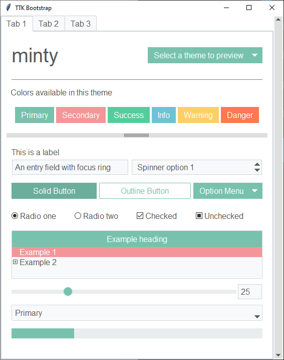  
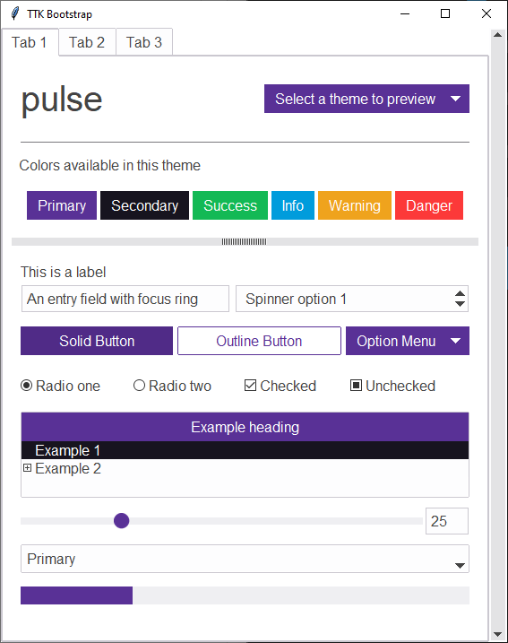 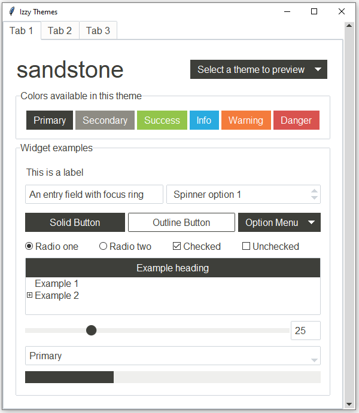  
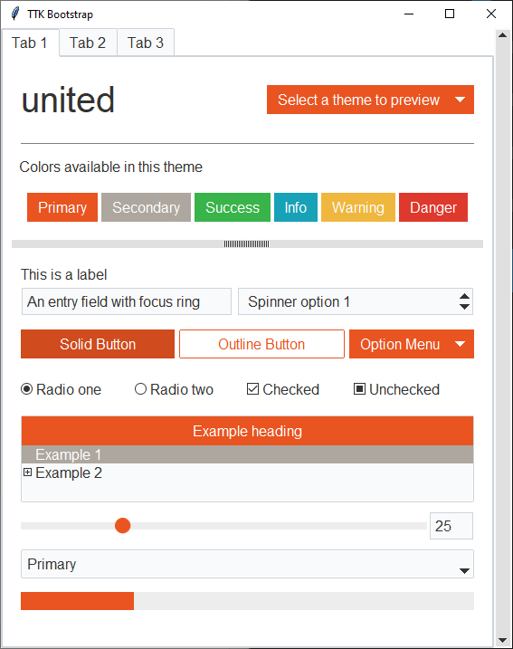 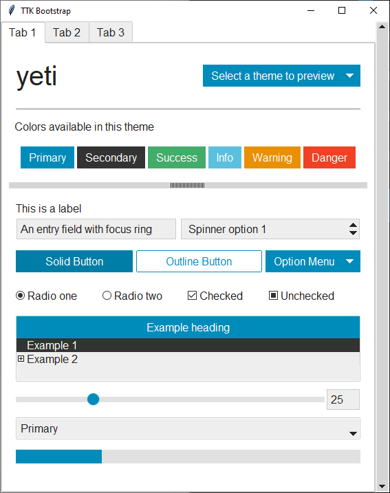  
  
## Dark Themes
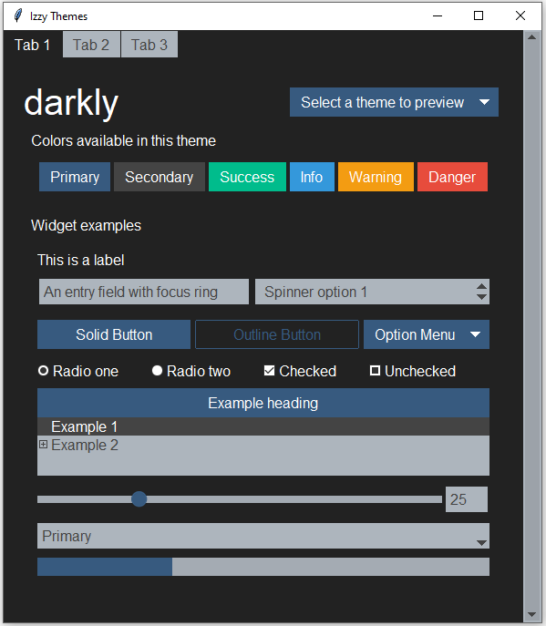 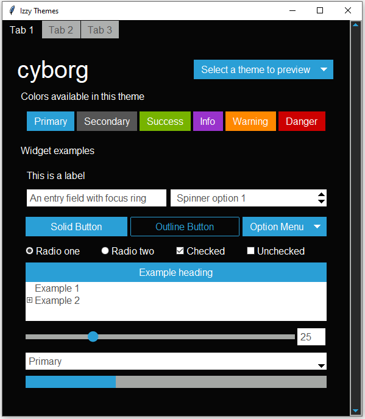
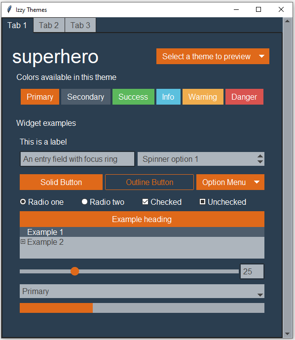 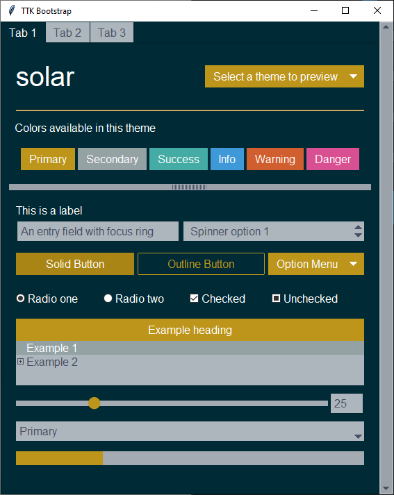  


