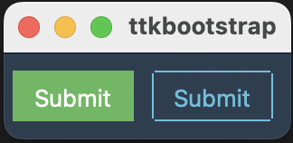

[](https://pepy.tech/project/ttkbootstrap)
[](https://pepy.tech/project/ttkbootstrap)


# ttkbootstrap
English | [中文](README_zh.md)

ttkbootstrap is a Python library that enhances tkinter by providing modern, flat-style themes inspired by Bootstrap. Easily create stylish GUI applications with built-in themes, pre-defined widget styles, and more.

## Documentation
👀 Check out the [documentation](https://ttkbootstrap.readthedocs.io/en/latest/).


> **1.0+ is a complete rebuild of the library.** If you are using [version 0.5](https://github.com/israel-dryer/ttkbootstrap/tree/version-0.5)
   you may run into issues trying to import themes with the themes.json as this 
   has been removed from 1.0. You can now import and save themes directly using 
   the ttkcreator.


## Features

✔️ [**Built-in Themes**](https://ttkbootstrap.readthedocs.io/en/latest/themes/)   
Over a dozen curated dark and light themes.

✔️ [**Pre-defined Styles:**](https://ttkbootstrap.readthedocs.io/en/latest/styleguide/)  
Loads of beautiful pre-defined widget styles such as **outline** and **round toggle** buttons.

✔️ [**Simple keyword API:**](https://ttkbootstrap.readthedocs.io/en/latest/gettingstarted/tutorial/#use-themed-widgets)  
Apply colors and types using simple keywords such as **primary** and **striped** instead of the legacy approach of **primary.Striped.Horizontal.TProgressbar**. If you've used Bootstrap for web development, you are already familiar with this approach using css classes.

✔️ [**Lots of new Widgets:**](https://ttkbootstrap.readthedocs.io/en/latest/api/widgets/dateentry/)  
ttkbootstrap comes with several new beautifully designed widgets such as **Meter**, **DateEntry**, and **Floodgauge**. Additionally, **dialogs** are now themed and fully customizable.

✔️ [**Built-in Theme Creator:**](https://ttkbootstrap.readthedocs.io/en/latest/themes/themecreator/)  
Want to create your own theme? Easy! ttkboostrap includes a built-in **theme creator** that enables you to easily build, load, expore, and apply your own custom themes.

## Installation
Install ttkbootstrap using pip in the terminal/command prompt!

```python
python -m pip install ttkbootstrap
```

## Simple Usage
Instead of using long, complicated ttk style classes, you can use simple keywords with the "bootstyle" parameter.

To get started, add the import statement at the top of your file in your preferred IDE:
```python
import ttkbootstrap as ttk
```

Then create a window using the ttk.Window(...) and .mainloop() commands.
And add a couple buttons (b1 and b2) to create your first window!
```python
root = ttk.Window(themename="superhero")

b1 = ttk.Button(root, text="Submit", bootstyle="success")
b1.pack(side=LEFT, padx=5, pady=10)

b2 = ttk.Button(root, text="Submit", bootstyle="info-outline")
b2.pack(side=LEFT, padx=5, pady=10)

root.mainloop()
```
Here is the desired result:




For more detailed usage, please refer to the [**Getting Started page**](https://ttkbootstrap.readthedocs.io/en/latest/gettingstarted/tutorial/)
This page includes creating buttons, adding widgets, different styles and more. 

The new keyword API is very flexible. The following examples all produce the same result:
- `bootstyle="info-outline"`
- `bootstyle="info outline"`
- `bootstyle=("info", "outline")`
- `bootstyle=(INFO, OUTLINE)`

## Contributing
We welcome contributions! If you'd like to contribute to ttkbootstrap, please check out our contributing guidelines.

## Links
- **Documentation:** https://ttkbootstrap.readthedocs.io/en/latest/  
- **GitHub:** https://github.com/israel-dryer/ttkbootstrap
