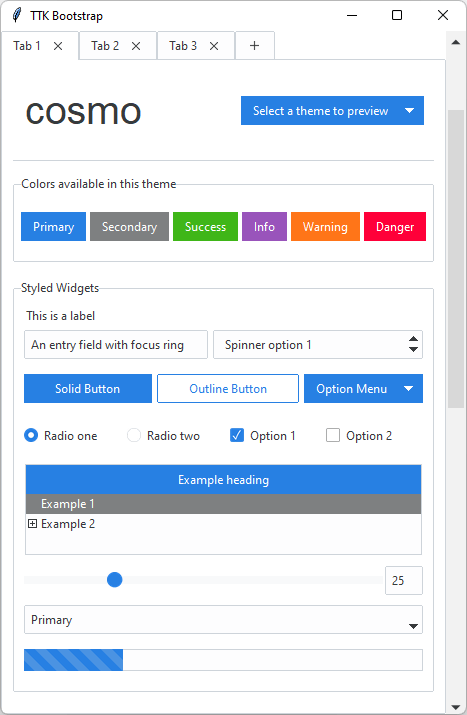

# ttkbootstrap
A collection of modern flat themes inspired by Bootstrap. Also includes **TTK Creator** which allows you to easily create and use your own themes.

### How to install
```python
pip install ttkbootstrap
```

If you are on **Linux**, you may need to install a font with emojii support. 

```
sudo apt-get install fonts-symbola
```

### Documentation
Read for more information about how to use along with full-size screenshots, and other useful information.
https://ttkbootstrap.readthedocs.io/en/latest/

### Sample of themes
Play with a live demo after installing the package
```python
python -m ttkbootstrap
```


### TTK Creator
Create your own themes with the built-in TTK Creator. Read the docs for instructions on how to create your own themes.  
```python
python -m ttkcreator
```


