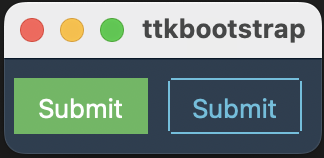

[](https://pepy.tech/project/ttkbootstrap)
[](https://pepy.tech/project/ttkbootstrap)


# ttkbootstrap
英語 | [日本語](README_ja.md) | [中国語](README_zh.md)

ttkbootstrap は、Bootstrap にインスパイアされたモダンでフラットなスタイルのテーマを提供することで、tkinter を強化する Python ライブラリです。組み込みのテーマや事前定義されたウィジェットスタイルなどを活用して、スタイリッシュな GUI アプリケーションを簡単に作成できます。

## ドキュメント
👀 [ドキュメント](https://ttkbootstrap.readthedocs.io/en/latest/)をご覧ください。


## 機能

✔️ [**組み込みテーマ**](https://ttkbootstrap.readthedocs.io/en/latest/themes/)   
厳選された12種類以上のダークテーマとライトテーマ。

✔️ [**定義済みスタイル:**](https://ttkbootstrap.readthedocs.io/en/latest/styleguide/)  
**アウトライン**や**丸いトグル**ボタンなど、美しい定義済みウィジェットスタイルが多数用意されています。

✔️ [**シンプルなキーワードAPI:**](https://ttkbootstrap.readthedocs.io/en/latest/gettingstarted/tutorial/#use-themed-widgets)  
**primary.Striped.Horizontal.TProgressbar**といった従来の記述方法の代わりに、**primary**や**striped**といったシンプルなキーワードを使って色やタイプを適用できます。Web開発でBootstrapを使用したことがある方なら、CSSクラスを使ったこのアプローチにはすでにお馴染みでしょう。

✔️ [**多数の新しいウィジェット:**](https://ttkbootstrap.readthedocs.io/en/latest/api/widgets/dateentry/)  
ttkbootstrap には、**Meter**、**DateEntry**、**Floodgauge** など、美しくデザインされた新しいウィジェットがいくつか含まれています。 さらに、**ダイアログ**もテーマ化され、完全にカスタマイズ可能になりました。

✔️ [**組み込みのテーマ作成ツール:**](https://ttkbootstrap.readthedocs.io/en/latest/themes/themecreator/)  
独自のテーマを作成したいですか？簡単です！ttkbootstrapには、独自のカスタムテーマを簡単に作成、読み込み、閲覧、適用できる組み込みの**テーマ作成ツール**が含まれています。

## インストール
ターミナルまたはコマンドプロンプトで pip を使用して ttkbootstrap をインストールしてください！

```python
python -m pip install ttkbootstrap
```

## 基本的な使い方
長くて複雑な ttk スタイルクラスを使う代わりに、「bootstyle」パラメータでシンプルなキーワードを使用できます。

まずは、お好みのIDEでファイルの先頭に次のインポート文を追加してください：
```python
import ttkbootstrap as ttk
```

次に、ttk.Window(...) および .mainloop() コマンドを使用してウィンドウを作成します。
そして、ボタン（b1 と b2）をいくつか追加して、最初のウィンドウを作成しましょう！
```python
root = ttk.Window(themename="superhero")

b1 = ttk.Button(root, text="Submit", bootstyle="success")
b1.pack(side=LEFT, padx=5, pady=10)

b2 = ttk.Button(root, text="Submit", bootstyle="info-outline")
b2.pack(side=LEFT, padx=5, pady=10)

root.mainloop()
```
期待される結果は以下の通りです：




より詳細な使用方法については、[**入門ページ**](https://ttkbootstrap.readthedocs.io/en/latest/gettingstarted/tutorial/)をご参照ください。
このページには、ボタンの作成、ウィジェットの追加、さまざまなスタイルなどが含まれています。 

新しいキーワードAPIは非常に柔軟です。以下の例はいずれも同じ結果を生成します：
- `bootstyle="info-outline"`
- `bootstyle="info outline"`
- `bootstyle=("info", "outline")`
- `bootstyle=(INFO, OUTLINE)`

## アイコン

[ttkbootstrap-icons](https://github.com/israel-dryer/ttkbootstrap-icons) ライブラリを使用して、アプリのボタンやラベルにアイコンを追加できます。

## 貢献
皆様からの貢献を歓迎します！ttkbootstrapへの貢献をご希望の場合は、貢献ガイドラインをご確認ください。

## リンク
- **ドキュメント:** https://ttkbootstrap.readthedocs.io/en/latest/  
- **GitHub:** https://github.com/israel-dryer/ttkbootstrap

## サポート

このプロジェクトは、JetBrains社が寛大にも提供してくださる
<a href="https://www.jetbrains.com/pycharm/" target="_blank" rel="noopener">PyCharm IDE</a>のサポートを受けて開発されています。

<a href="https://www.jetbrains.com/" target="_blank" rel="noopener"> <picture> <source media="(prefers-color-scheme: light)" srcset="https://github.com/user-attachments/assets/f6d4e79d-97f4-4368-a944-affd423aa922">  </picture> </a> 

<sub> © 2025 JetBrains s.r.o. JetBrains および JetBrains ロゴは、JetBrains s.r.o. の登録商標です。</sub>
