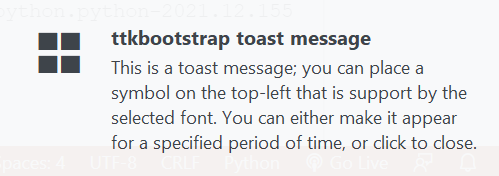

# toast module

## `ToastNotification`

A semi-transparent popup window for temporary alerts or messages. You may choose to display the toast for a specified period of time, otherwise you must click the toast to close it.



**Examples:**

```python
import ttkbootstrap as ttk
from ttkbootstrap.toast import ToastNotification

app = ttk.Window()

toast = ToastNotification(
    title="ttkbootstrap toast message",
    message="This is a toast message",
    duration=3000,
)
toast.show_toast()

app.mainloop()
```

### `__init__`
    (self, title, message, duration=None, bootstyle='light', alert=False, icon=None, position=None, **kwargs)

**Parameters:**

Name        |Type                   |Description|Default
---         |---                    |---        |---    
`title`     |`str`                  |The toast title|_required_
`message`   |`str`                  |The toast message|_required_
`duration`  |`int`                  |The number of milliseconds to show the toast. If None (default), then you must click the toast to close it.|`None`
`bootstyle` |`str`                  |Style keywords used to update the lable style. One of the accepted color keywords|`'light`'
`alert`     |`bool`                 |Indicate whether to ring the display bell when the toast is shown.|`False`
`icon`      |`str`                  |A unicode character to display on the top-left hand border of the toast. The default symbol is OS specific. Pass an empty string to remove the symbol.|`None`
`iconfont`  |`Union[str, Font]`     |The font used to render the icon. By default, this is OS specific. You may need to change the font to enable better character or emoji support for the icon you want to use. Windows (Segoe UI), Linux (FreeSerif), MacOS (Apple Symbol).|`None`
`position`  |`Tuple[int, int, str]` |A tuple that controls the position of the toast. Default is OS specific. The tuple corresponds to (horizontal, vertical, anchor), where the horizontal and vertical elements represent the position of the toplevel relative to the anchor, which is 'ne' or top-left by default. Acceptable anchors include: n, e, s, w, nw, ne, sw, se. For example: (100, 100, 'ne').|`None`
`**kwargs`  |`Dict`                 |Other keyword arguments passed to the `Toplevel` window|`{}`

### `hide_toast`
    (self, *_)
Destroy and close the toast window.

### `show_toast`
    (self, *_)
Create and show the toast window.
