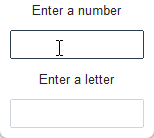

# Cookbook

A growing collection of recipes that demonstrate how to do particular things in ttkbootstrap.

## Validate user input

Any widget that derives from `Entry` has the ability to validate the user input. When 
the widget is in an **invalid** state, the border color changes to a **danger** color.



In this example, the validation type is `focus`, which means that the validation
function is run everytime the widget receives or loses focus. There are several
other types of validation, and many ways to configure the validation. A future
tutorial will discuss this in more detail, but in the meantime, you can consult
the [tcl/tk documentation](https://tcl.tk/man/tcl8.6/TkCmd/ttk_entry.htm) for more 
information on what is available for validation.

```python
import tkinter as tk
import ttkbootstrap as ttk

def validate_number(x) -> bool:
    """Validates that the input is a number"""
    if x.isdigit():
        return True
    elif x == "":
        return True
    else:
        return False

def validate_alpha(x) -> bool:
    """Validates that the input is alpha"""
    if x.isdigit():
        return False
    elif x == "":
        return True
    else:
        return True

# create the toplevel window
root = tk.Tk()
style = ttk.Style()

# register the validation callback
digit_func = root.register(validate_number)
alpha_func = root.register(validate_alpha)

# validate numeric entry
ttk.Label(root, text="Enter a number").pack()
num_entry = ttk.Entry(root, validate="focus", validatecommand=(digit_func, '%P'))
num_entry.pack(padx=10, pady=10, expand=True)

# validate alpha entry
ttk.Label(root, text="Enter a letter").pack()
let_entry = ttk.Entry(root, validate="focus", validatecommand=(alpha_func, '%P'))
let_entry.pack(padx=10, pady=10, expand=True)

root.mainloop()
```

## GIF animation
Add content here

## Multi-threaded applications
Add content here

## Dials and meters
Add content here

## Pagination using frames
Add content here

## Capture OpenCV output
Add content here

