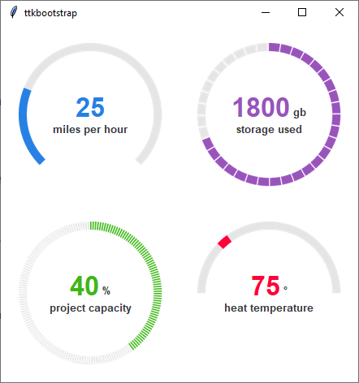

.. _dials_and_meters:

Dials & Meters
##############
This example demonstrates the versitility of the ``Meter`` widget. All of the example below were created using the same
class. All of the examples below include a supplemental label using the ``labeltext`` parameter, and all but the first
example use the ``textappend`` parameter to add the 'gb', '%', and degrees symbol. Finally, all of the examples use the
parameter ``interactive=True`` which turns the meter into a dial that can be manipulated directly with a mouse-click or
drag. The theme used for the examples below is `cosmo`.

:top-left: the ``metertype`` is *semi* which gives the meter a semi-circle arc. The ``meterstyle`` is `primary.TLabel`.

:top-right: the ``stripethickness`` is `10` pixels to give it a segmented appearance. The ``meterstyle`` is
    `info.TLabel`.

:bottom-left: the ``stripethickness`` is `2` pixels to give it a very thin segmented appearance. The ``meterstyle`` is
    `success.TLabel`.

:bottom-right: this example has a custom arc, with the ``arcrange`` at `180`, the ``arcoffset`` at `-180` and the
    ``wedgethickness`` at `5` pixels in order to create a wedge style indicator that rests at the meter value. The
    ``meterstyle`` is `danger.TLabel`.

.. literalinclude:: ../../src/ttkbootstrap/cookbook/dials_and_meters.py
    :language: python
