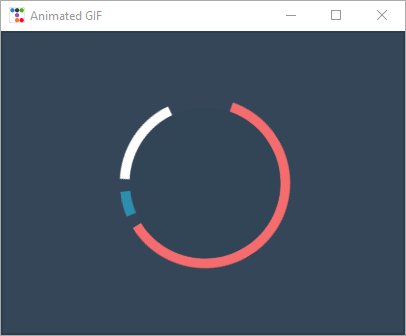

# Gif Animation

This example demonstrates how to animate a gif in the window while
keeping the window responsive to user input by scheduling updates
to the label image from a list of images.



```python
# https://dribbble.com/shots/1237618--Gif-Spinner
from pathlib import Path
from itertools import cycle
import ttkbootstrap as ttk
from ttkbootstrap.constants import *
from PIL import Image, ImageTk, ImageSequence


class AnimatedGif(ttk.Frame):
    def __init__(self, master):
        super().__init__(master, width=400, height=300)

        # open the GIF and create a cycle iterator
        file_path = Path(__file__).parent / "assets/spinners.gif"
        with Image.open(file_path) as im:
            # create a sequence
            sequence = ImageSequence.Iterator(im)
            images = [ImageTk.PhotoImage(s) for s in sequence]
            self.image_cycle = cycle(images)

            # length of each frame
            self.framerate = im.info["duration"]

        self.img_container = ttk.Label(self, image=next(self.image_cycle))
        self.img_container.pack(fill="both", expand="yes")
        self.after(self.framerate, self.next_frame)

    def next_frame(self):
        """Update the image for each frame"""
        self.img_container.configure(image=next(self.image_cycle))
        self.after(self.framerate, self.next_frame)


if __name__ == "__main__":

    app = ttk.Window("Animated GIF", themename="superhero")

    gif = AnimatedGif(app)
    gif.pack(fill=BOTH, expand=YES)

    app.mainloop()
```