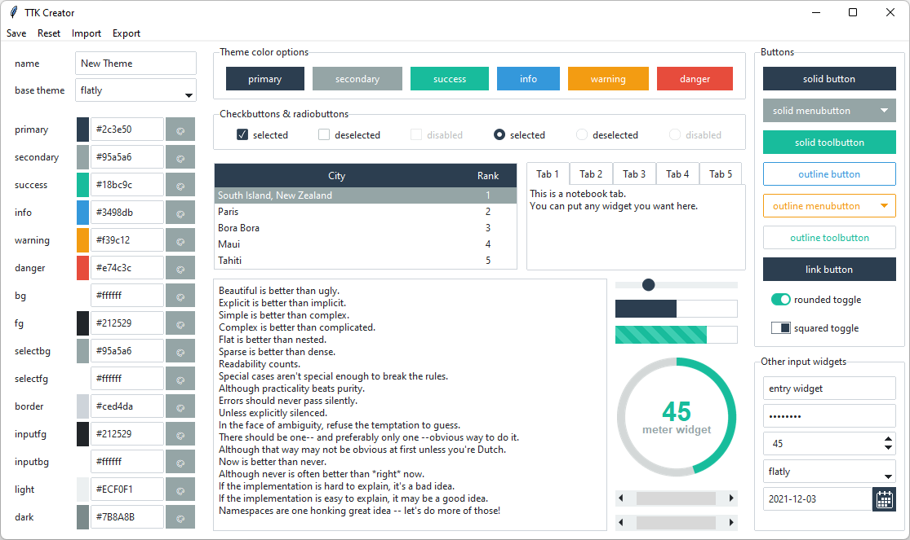
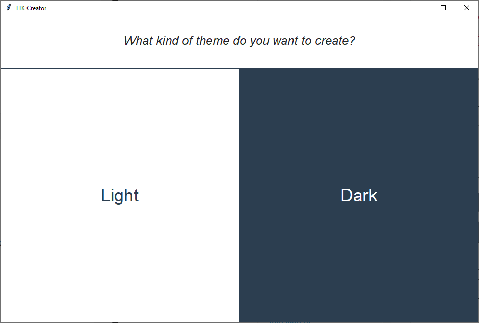

.. _ttkcreator:

TTK Creator
===========

TTK Creator is a program that makes it really easy to create and use your own defined themes.

Starting the application
------------------------
From the console, type:

.. code-block:: python

    python -m ttkcreator

Select a base theme
-------------------
When you start TTK Creator, you'll be prompted to select a *light* or *dark* theme base. The reason you need to choose a
base is that there are some nuanced differences in how the elements are constructed in a light vs a dark theme.

The first time you start TTK Creator, or if you happen to upgrade the package, you'll be prompted to select the
destination for your user-defined themes file. It is recommended to store these themes in a location that is safe and
writable. It is not recommended to store themes in the package directory as they may get overwritten if the package is
updated, re-installed, etc...

.. image:: images/ttkcreator-alert.png

.. image:: images/ttkcreator-filedialog.png

Create and save your theme
--------------------------
You should now see the TTK Creator design window

- Name your theme
- Click the color palette to select a color, or input a hex color directly
- Click **Save** to save your theme
- Click **Reset** to apply the defaults and start from scratch

Theme names must be unique. If you choose a theme name that already exists, you will be prompted to choose another.

You can check your new theme by starting up the ttkbootstrap demo application, which will load all available themes.
Then, select your new theme from the option menu.

.. code-block:: python

    python -m ttkbootstrap

.. warning:: If you are using Linux or MacOS and the program crashes without starting, you may not have a font with
    emoji support. To fix this ``sudo apt-get install fonts-symbola``
