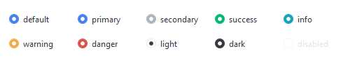
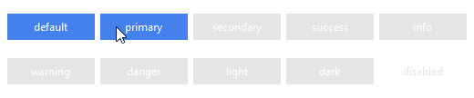

# Radiobutton

This widget features a variety of radiobutton style types that are **primary**
colored by default or the [selected color](index.md#colors).

This widget supports a special style for 
[disabled state](#other-radiobutton-styles).

## Radio (default)

The default widget style features the traditional **radiobutton** which has a
round indicator. The indicator is filled with the default or selected color 
when in a _selected state_.



```python
# default radiobutton style
Radiobutton()

# secondary colored radiobutton style
Radiobutton(bootstyle="secondary")
```

## Solid toolbutton

This style features a solid rectangular button that has a muted gray background
when _not selected_ and a default or [selected color](index.md#colors) when _selected_
or _active_.



```python
# default toolbutton style
Radiobutton(bootstyle="toolbutton")

# danger colored radio toolbutton style
Radiobutton(bootstyle="danger-toolbutton")
```

## Outline toolbutton

This style features a rectangular button that has an **outline** 
when _not selected_ and a **solid** background when _selected_ or 
_active_.


```python
# default outline radio toolbutton style
Radiobutton(bootstyle="outline-toolbutton")

# info colored outline radio toolbutton style
Radiobutton(bootstyle="info-outline-toolbutton")
```

## Other radiobutton styles

#### Disabled radiobutton
This style _cannot be applied via keywords_; it is configured through widget 
settings.

```python
# create the radiobutton in a disabled state
Radiobutton(state="disabled")

# disable a radiobutton after creation
rb = Radiobutton()
rb.configure(state="disabled")
```