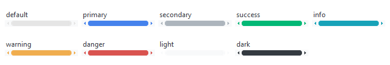

# Scrollbar

This widget style features a light gray trough with a styled thumb and arrow 
buttons. The thumb and arrows lighten on _hover_ and darken on _press_. The
thumb and arrows can be styled with any of the [available colors](index.md#colors). 

## Square (default)

The default style features a thumb with squared edges.


```python
# default scrollbar style
Scrollbar()

# success colored default scrollbar style
Scrollbar(bootstyle="success")
```

## Round

The **round** style features a thumb with rounded edges.



```python
# default round scrollbar style
Scrollbar(bootstyle="round")

# danger colored round scrollbar style
Scrollbar(bootstyle="danger-round")
```