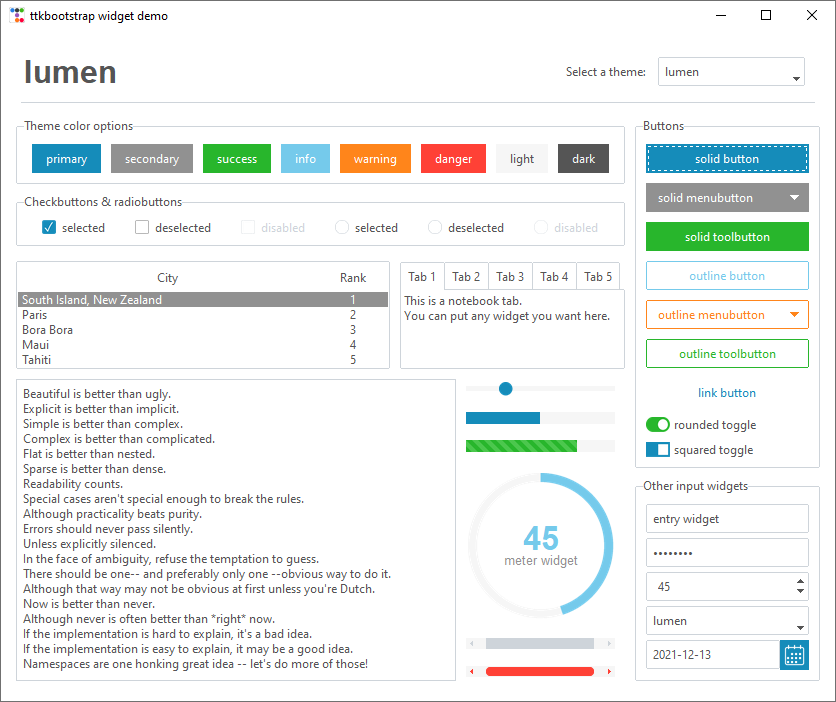
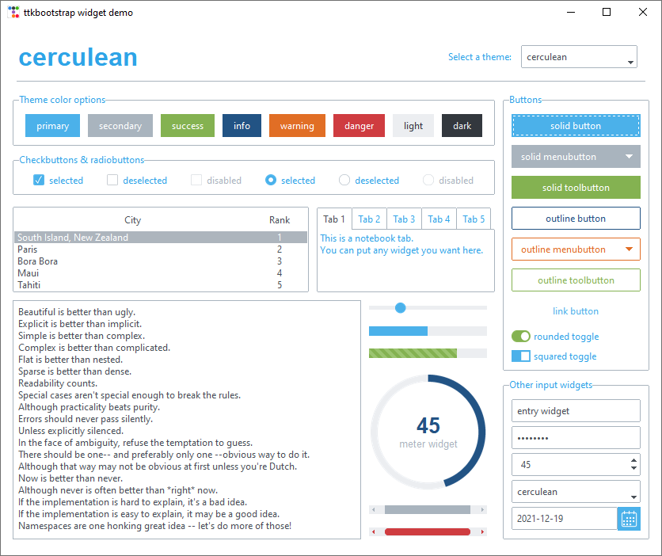

# Light themes

The following light themes are largly inspired by [https://bootswatch.com/](https://bootswatch.com/)

Source of [inspiration](https://bootswatch.com/cosmo/)

Source of [inspiration](https://bootswatch.com/flatly/)

Source of [inspiration](https://bootswatch.com/journal/)

Source of [inspiration](https://bootswatch.com/litera/)

Source of [inspiration](https://bootswatch.com/lumen/)

Source of [inspiration](https://bootswatch.com/minty/)

Source of [inspiration](https://bootswatch.com/pulse/)

Source of [inspiration](https://bootswatch.com/sandstone/)

Source of [inspiration](https://bootswatch.com/united/)

Source of [inspiration](https://bootswatch.com/yeti/)

Source of [inspiration](https://bootswatch.com/morph/)

Source of [inspiration](https://bootswatch.com/simplex/)

Source of [inspiration](https://bootswatch.com/cerulean/)