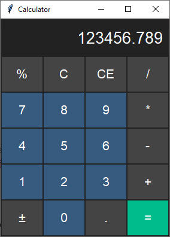

Calculator
==========
This basic calculator demonstrates how to use color styles to differentiate button functions.

- Digits: ``primary.TButton``
- Operators: ``secondary.TButton``
- Equals: ``success.TButton``

Run this code live on repl.it_

.. _repl.it: https://replit.com/@IsraelDryer/calculator

.. literalinclude:: ../../src/ttkbootstrap/examples/calculator.py
    :language: python
