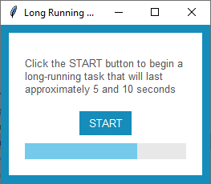

Long-Running (Determinate)
==========================
This example demonstrates the use of a progress bar for long-running tasks where the number of steps or time required is
known ahead of time or can be calculated.

IO task are thread-blocking in python, which means that if you create a gui with a button that downloads a file from
the internet, the gui will be unresponsive until that download task is completed. To prevent this kind of negative
user experience, you can use threading to handle IO tasks. This will ensure that your gui will remain responsive to the
end user while the task is being completed on another thread.

In this example, I'm using the python threading_ module to create a thread to run a simulated IO task using the
``sleep`` method. This sleep method is a proxy for any other thread-blocking operation you may perform.

When a task is finished, the gui needs to be notified in order to update the progress bar.  The vehicle for this
communication is a ``Queue``. When the long-running task is started, the application will add a thread to the Queue.
While the task is running, the application will poll the queue every 500ms to count how many tasks have been completed
and update the progressbar value. This is done by scheduling the ``listen_for_complete_task`` method to run in the main
event loop every 500ms using the ``after`` method in tkinter. When all tasks in the queue are completed,
the task thread will mark the task as compete in the queue and this will cause the gui to update the progress bar to the
maximum value and return a popup that indicates success.

.. note::
    If you set the parameter ``deaemon=True`` when creating the worker thread, it will close when your application
    window is closed, even if it has not yet finished. Most of the time this is the desired behavior. However, if you
    want the thread to continue to run until finished, even after the window has closed, you can ignore this parameter.

.. _threading: https://realpython.com/intro-to-python-threading/

Run this code live on repl.it_

.. _repl.it: https://replit.com/@IsraelDryer/long-running-determinate

.. literalinclude:: ../../src/ttkbootstrap/examples/long_running_determinate.py
    :language: python
