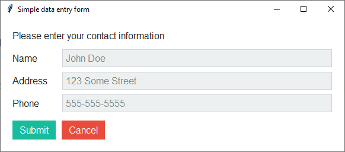
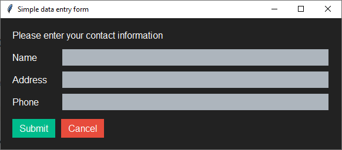

Simple Data Entry Form
======================
This simple data entry form accepts user input and then prints it to the screen when submitted. The *Submit* and
*Cancel* buttons are using different styles:

:Submit: ``style="info.TButton"``
:Cancel: ``style="danger.TButton"``

    *flatly* theme

    *darkly* theme

Run this code live on repl.it_

.. _repl.it: https://replit.com/@IsraelDryer/simple-data-entry

.. literalinclude:: ../../src/ttkbootstrap/examples/simple_data_entry.py
    :language: python
