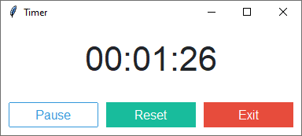
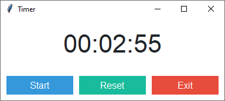

Timer Widget
============
This simple data entry form accepts user input and then prints it to the screen when submitted.

All three buttons use different styles. The *Start/Pause* toggle button uses a different style depending on the state of
the timer state:

:Start: ``style="info.TButton"``
:Pause: ``style="info.Outline.TButton"``
:Reset: ``style="success.TButton"``
:Exit: ``style="danger.TButton"``

    timer is running

    timer is paused

.. literalinclude:: ../../src/ttkbootstrap/examples/timer_widget.py
    :language: python
