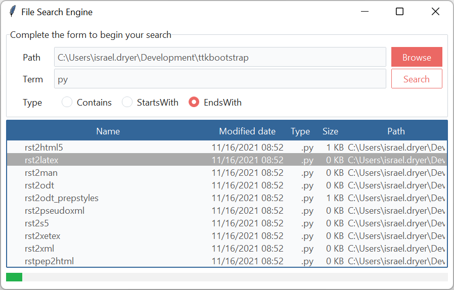
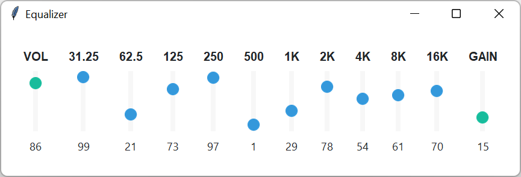
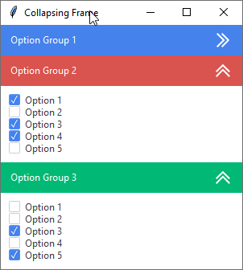
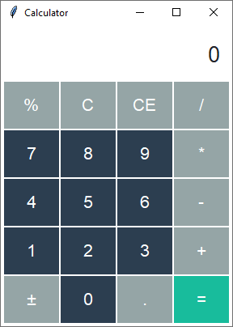
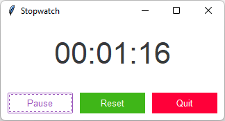
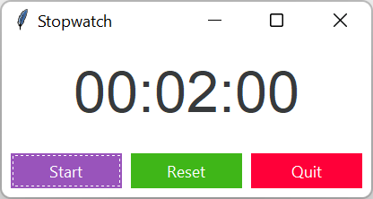
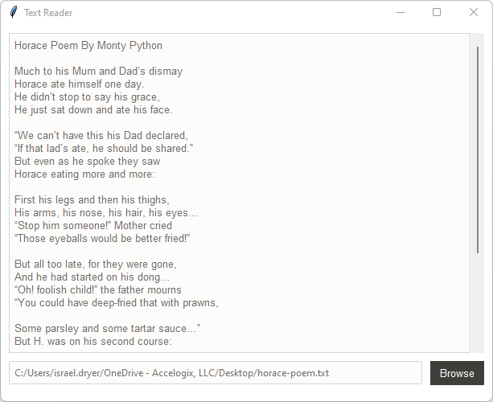

# Gallery

Below you will find a growing list of ttkbootstrap projects meant to provide 
inspiration or direction when creating your own applications. These are meant 
to demonstrate design and are not necessarily fully functional applications.

## File Search Engine

This application is a local file search engine that uses threading and a queue 
to manage IO tasks in order to keep the gui interactive. The `Treeview` updates 
the results in real-time and sets the focus and view on the most recently 
inserted result in the results `Treeview`. 

The theme used in this example is **journal**.



### Style Summary

| Item | Class | Bootstyle |
|---|---|---|
| Browse | `Button` | primary |
| Search | `Button` | primary-outline |
| Treeview | `Treeview` | info |
| Progressbar | `Progressbar` | success |

### Example Code

[Run this code live]() on repl.it

```python
import csv
import datetime
import pathlib
from queue import Queue
from threading import Thread
import tkinter as tk
from tkinter.filedialog import askdirectory, asksaveasfilename
import ttkbootstrap as ttk


class Application(tk.Tk):

    def __init__(self):
        super().__init__()
        self.title('File Search Engine')
        self.style = ttk.Style()
        self.search = SearchEngine(self, padding=10)
        self.search.pack(fill=tk.BOTH, expand=tk.YES)


class SearchEngine(ttk.Frame):
    def __init__(self, *args, **kwargs):
        super().__init__(*args, **kwargs)
        
        # application variables
        _path = pathlib.Path().absolute()
        self.search_path_var = tk.StringVar(value=_path)
        self.search_term_var = tk.StringVar(value='txt')
        self.search_type_var = tk.StringVar(value='endswidth')
        self.search_count = 0

        # container for user input
        input_labelframe = ttk.Labelframe(
            master=self, 
            text='Complete the form to begin your search', 
            padding=(20, 10, 10, 5)
        )
        input_labelframe.pack(side=tk.TOP, fill=tk.X)
        input_labelframe.columnconfigure(1, weight=1)

        # file path input
        lbl = ttk.Label(input_labelframe, text='Path')
        lbl.grid(row=0, column=0, padx=10, pady=2, sticky=tk.EW)
        e1 = ttk.Entry(input_labelframe, textvariable=self.search_path_var)
        e1.grid(row=0, column=1, sticky=tk.EW, padx=10, pady=2)
        b1 = ttk.Button(
            master=input_labelframe, 
            text='Browse', 
            command=self.on_browse
        )
        b1.grid(row=0, column=2, sticky=tk.EW, pady=2, ipadx=10)

        # search term input
        lbl = ttk.Label(input_labelframe, text='Term')
        lbl.grid(row=1, column=0, padx=10, pady=2, sticky=tk.EW)
        e2 = ttk.Entry(input_labelframe, textvariable=self.search_term_var)
        e2.grid(row=1, column=1, sticky=tk.EW, padx=10, pady=2)
        b2 = ttk.Button(
            master=input_labelframe, 
            text='Search', 
            command=self.on_search, 
            bootstyle='outline'
        )
        b2.grid(row=1, column=2, sticky=tk.EW, pady=2)

        # search type selection
        lbl = ttk.Label(input_labelframe, text='Type')
        lbl.grid(row=2, column=0, padx=10, pady=2, sticky=tk.EW)
        option_frame = ttk.Frame(input_labelframe, padding=(15, 10, 0, 10))
        option_frame.grid(row=2, column=1, columnspan=2, sticky=tk.EW)
        
        r1 = ttk.Radiobutton(
            master=option_frame, 
            text='Contains', 
            value='contains',
            variable=self.search_type_var
        )
        r1.pack(side=tk.LEFT, fill=tk.X, pady=2, padx=10)
        
        r2 = ttk.Radiobutton(
            master=option_frame, 
            text='StartsWith', 
            value='startswith', 
            variable=self.search_type_var
        )
        r2.pack(side=tk.LEFT, fill=tk.X, pady=2, padx=10)
        
        r3 = ttk.Radiobutton(
            master=option_frame, 
            text='EndsWith', 
            value='endswith',
            variable=self.search_type_var
        )
        r3.pack(side=tk.LEFT, fill=tk.X, pady=2, padx=10)
        r3.invoke()

        # search results tree
        self.tree = ttk.Treeview(self, bootstyle='info')
        self.tree.pack(fill=tk.BOTH, pady=5)
        self.tree.configure(columns=('modified', 'type', 'size', 'path'))
        self.tree.column('#0', width=400)
        self.tree.column('modified', width=150, stretch=False, anchor=tk.E)
        self.tree.column('type', width=50, stretch=False, anchor=tk.E)
        self.tree.column('size', width=50, stretch=False, anchor=tk.E)
        self.tree.heading('#0', text='Name')
        self.tree.heading('modified', text='Modified date')
        self.tree.heading('type', text='Type')
        self.tree.heading('size', text='Size')
        self.tree.heading('path', text='Path')

        # progress bar
        self.progressbar = ttk.Progressbar(
            master=self, 
            orient=tk.HORIZONTAL, 
            mode='indeterminate',
            bootstyle='success'
        )
        self.progressbar.pack(fill=tk.X, pady=5)

        # right-click menu for treeview
        self.menu = tk.Menu(self, tearoff=False)
        self.menu.add_command(
            label='Reveal in file manager', 
            command=self.on_doubleclick_tree
        )
        self.menu.add_command(
            label='Export results to csv', 
            command=self.export_to_csv
        )
        # event binding
        self.tree.bind('<Double-1>', self.on_doubleclick_tree)
        self.tree.bind('<Button-3>', self.right_click_tree)

    def on_browse(self):
        """Callback for directory browse"""
        path = askdirectory(title='Directory')
        if path:
            self.search_path_var.set(path)

    def on_doubleclick_tree(self, event=None):
        """Callback for double-click tree menu"""
        try:
            id = self.tree.selection()[0]
        except IndexError:
            return
        if id.startswith('I'):
            self.reveal_in_explorer(id)

    def right_click_tree(self, event=None):
        """Callback for right-click tree menu"""
        try:
            id = self.tree.selection()[0]
        except IndexError:
            return
        if id.startswith('I'):
            self.menu.entryconfigure(
                index='Export results to csv', 
                state=tk.DISABLED
            )
            self.menu.entryconfigure(
                index='Reveal in file manager', 
                state=tk.NORMAL
            )
        else:
            self.menu.entryconfigure(
                index='Export results to csv', 
                state=tk.NORMAL
            )
            self.menu.entryconfigure(
                index='Reveal in file manager', 
                state=tk.DISABLED
            )
        self.menu.post(event.x_root, event.y_root)

    def on_search(self):
        """Search for a term based on the search type"""
        search_term = self.search_term_var.get()
        search_path = self.search_path_var.get()
        search_type = self.search_type_var.get()
        
        if search_term == '':
            return
        
        Thread(
            target=SearchEngine.file_search, 
            args=(search_term, search_path, search_type), 
            daemon=True
        ).start()
        
        self.progressbar.start(10)
        self.search_count += 1
        
        id = self.tree.insert(
            parent='', 
            index='end', 
            iid=self.search_count, 
            text=f'Search {self.search_count}'
        )
        self.tree.item(id, open=True)
        self.check_queue(id)

    def reveal_in_explorer(self, id):
        """Callback for double-click event on tree"""
        values = self.tree.item(id, 'values')
        path = pathlib.Path(values[-1]).absolute().parent
        pathlib.os.startfile(path)

    def export_to_csv(self, _=None):
        """Export values to csv file"""
        try:
            id = self.tree.selection()[0]
        except IndexError:
            return

        filename = asksaveasfilename(
            initialfile='results.csv',
            filetypes=[('Comma-separated', '*.csv'), ('Text', '*.txt')]
        )
        
        if filename:
            with open(filename, mode='w', newline='') as f:
                writer = csv.writer(f)
                writer.writerow(
                    ['Name', 'Modified date', 'Type', 'Size', 'Path'])
                
                children = self.tree.get_children(id)
                
                for child in children:
                    name = [self.tree.item(child, 'text')]
                    values = list(self.tree.item(child, 'values'))
                    writer.writerow(name + values)
        
        # open file in explorer
        pathlib.os.startfile(filename)

    def check_queue(self, id):
        """Check file queue and print results if not empty"""
        if searching and not file_queue.empty():
            filename = file_queue.get()
            self.insert_row(filename, id)
            self.update_idletasks()
            self.after(1, lambda: self.check_queue(id))
        
        elif not searching and not file_queue.empty():
        
            while not file_queue.empty():
                filename = file_queue.get()
                self.insert_row(filename, id)
            self.update_idletasks()
            self.progressbar.stop()
        
        elif searching and file_queue.empty():
            self.after(100, lambda: self.check_queue(id))
        
        else:
            self.progressbar.stop()

    def insert_row(self, file, id):
        """Insert new row in tree search results"""
        try:
            file_stats = file.stat()
            file_name = file.stem
            file_modified = datetime.datetime\
                .fromtimestamp(file_stats.st_mtime)\
                    .strftime('%m/%d/%Y %I:%M:%S%p')
            file_type = file.suffix.lower()
            file_size = SearchEngine.convert_size(file_stats.st_size)
            file_path = file.absolute()
            iid = self.tree.insert(
                parent=id, 
                index='end', 
                text=file_name, 
                values=(file_modified, file_type, file_size, file_path)
            )
            self.tree.selection_set(iid)
            self.tree.see(iid)
        except OSError:
            return

    @staticmethod
    def file_search(term, search_path, search_type):
        """Recursively search directory for matching files"""
        SearchEngine.set_searching(1)
        if search_type == 'contains':
            SearchEngine.find_contains(term, search_path)
        elif search_type == 'startswith':
            SearchEngine.find_startswith(term, search_path)
        elif search_type == 'endswith':
            SearchEngine.find_endswith(term, search_path)

    @staticmethod
    def find_contains(term, search_path):
        """Find all files that contain the search term"""
        for path, _, files in pathlib.os.walk(search_path):
            if files:
                for file in files:
                    if term in file:
                        file_queue.put(pathlib.Path(path) / file)
        SearchEngine.set_searching(False)

    @staticmethod
    def find_startswith(term, search_path):
        """Find all files that start with the search term"""
        for path, _, files in pathlib.os.walk(search_path):
            if files:
                for file in files:
                    if file.startswith(term):
                        file_queue.put(pathlib.Path(path) / file)
        SearchEngine.set_searching(False)

    @staticmethod
    def find_endswith(term, search_path):
        """Find all files that end with the search term"""
        for path, _, files in pathlib.os.walk(search_path):
            if files:
                for file in files:
                    if file.endswith(term):
                        file_queue.put(pathlib.Path(path) / file)
        SearchEngine.set_searching(False)

    @staticmethod
    def set_searching(state=False):
        """Set searching status"""
        global searching
        searching = state

    @staticmethod
    def convert_size(size):
        """Convert bytes to mb or kb depending on scale"""
        kb = size // 1000
        mb = round(kb / 1000, 1)
        if kb > 1000:
            return f'{mb:,.1f} MB'
        else:
            return f'{kb:,d} KB'


if __name__ == '__main__':
    file_queue = Queue()
    searching = False
    Application().mainloop()
```

## File Backup Utility

In this example, I demonstrate how to use various styles to build a UI for a 
File Backup UI. I use a `CollapsingFrame` class to contain the left-side info 
panels as well as the output on the bottom right. These contain indicator 
buttons on the right-side of the header which collapse and expand the `Frame` 
with a mouse-click action. 

The theme used in this example is **flatly**.


### Style Summary

| Item | Class | Bootstyle |
|---|---|---|
| Top button bar | `Button` | primary |
| Collapsible frames | `CollapsingFrame` | secondary |
| Separators | `Separator` | secondary |
| Progressbar | `Progressbar` | success |
| Properties, stop, add to backup | `Button` | link |
| File Open | `Button` | secondary-link |

### Example Code

[Run this code live]() on repl.it

```python
from datetime import datetime
from random import choices
import tkinter as tk
import ttkbootstrap as ttk
from ttkbootstrap.style.utility import ttkstyle_widget_color
from tkinter.filedialog import askdirectory
from tkinter.messagebox import showinfo
from tkinter.scrolledtext import ScrolledText
from pathlib import Path


class Application(tk.Tk):

    def __init__(self):
        super().__init__()
        self.title('Back Me Up')

        self.style = ttk.Style()

        self.bmu = BackMeUp(self, padding=2)
        self.bmu.pack(fill=tk.BOTH, expand=tk.YES)


class BackMeUp(ttk.Frame):

    def __init__(self, *args, **kwargs):
        super().__init__(*args, **kwargs)
        image_files = {
            'properties-dark': 'icons8_settings_24px.png',
            'properties-light': 'icons8_settings_24px_2.png',
            'add-to-backup-dark': 'icons8_add_folder_24px.png',
            'add-to-backup-light': 'icons8_add_book_24px.png',
            'stop-backup-dark': 'icons8_cancel_24px.png',
            'stop-backup-light': 'icons8_cancel_24px_1.png',
            'play': 'icons8_play_24px_1.png',
            'refresh': 'icons8_refresh_24px_1.png',
            'stop-dark': 'icons8_stop_24px.png',
            'stop-light': 'icons8_stop_24px_1.png',
            'opened-folder': 'icons8_opened_folder_24px.png',
            'logo': 'backup.png'
        }
        self.photoimages = []
        imgpath = Path(__file__).parent / 'assets'
        for key, val in image_files.items():
            _path = imgpath / val
            self.photoimages.append(tk.PhotoImage(name=key, file=_path))

        # ----- buttonbar
        buttonbar = ttk.Frame(self, style='primary.TFrame')
        buttonbar.pack(fill=tk.X, pady=1, side=tk.TOP)

        ## new backup
        _func = lambda: showinfo(message='Adding new backup')
        btn = ttk.Button(
            master=buttonbar, text='New backup set',
            image='add-to-backup-light', 
            compound=tk.LEFT, 
            command=_func
        )
        btn.pack(side=tk.LEFT, ipadx=5, ipady=5, padx=(1, 0), pady=1)

        ## backup
        _func = lambda: showinfo(message='Backing up...')
        btn = ttk.Button(
            master=buttonbar, 
            text='Backup', 
            image='play', 
            compound=tk.LEFT, 
            command=_func
        )
        btn.pack(side=tk.LEFT, ipadx=5, ipady=5, padx=0, pady=1)

        ## refresh
        _func = lambda: showinfo(message='Refreshing...')
        btn = ttk.Button(
            master=buttonbar, 
            text='Refresh', 
            image='refresh',
            compound=tk.LEFT, 
            command=_func
        )
        btn.pack(side=tk.LEFT, ipadx=5, ipady=5, padx=0, pady=1)

        ## stop
        _func = lambda: showinfo(message='Stopping backup.')
        btn = ttk.Button(
            master=buttonbar, 
            text='Stop', 
            image='stop-light',
            compound=tk.LEFT, 
            command=_func
        )
        btn.pack(side=tk.LEFT, ipadx=5, ipady=5, padx=0, pady=1)

        ## settings
        _func = command=lambda: showinfo(message='Changing settings')
        btn = ttk.Button(
            master=buttonbar, 
            text='Settings', 
            image='properties-light',
            compound=tk.LEFT, 
            command=_func
        )
        btn.pack(side=tk.LEFT, ipadx=5, ipady=5, padx=0, pady=1)

        # ----- left panel
        left_panel = ttk.Frame(self, style='bg.TFrame')
        left_panel.pack(side=tk.LEFT, fill=tk.Y)

        ## ----- backup summary (collapsible)
        bus_cf = CollapsingFrame(left_panel)
        bus_cf.pack(fill=tk.X, pady=1)

        ## container
        bus_frm = ttk.Frame(bus_cf, padding=5)
        bus_frm.columnconfigure(1, weight=1)
        bus_cf.add(
            child=bus_frm, 
            title='Backup Summary', 
            bootstyle='secondary')

        ## destination
        lbl = ttk.Label(bus_frm, text='Destination:')
        lbl.grid(row=0, column=0, sticky=tk.W, pady=2)
        lbl = ttk.Label(bus_frm, textvariable='destination')
        lbl.grid(row=0, column=1, sticky=tk.EW, padx=5, pady=2)
        self.setvar('destination', 'd:/test/')

        ## last run
        lbl = ttk.Label(bus_frm, text='Last Run:')
        lbl.grid(row=1, column=0, sticky=tk.W, pady=2)
        lbl = ttk.Label(bus_frm, textvariable='lastrun')
        lbl.grid(row=1, column=1, sticky=tk.EW, padx=5, pady=2)
        self.setvar('lastrun', '14.06.2021 19:34:43')

        ## files Identical
        lbl = ttk.Label(bus_frm, text='Files Identical:')
        lbl.grid(row=2, column=0, sticky=tk.W, pady=2)
        lbl = ttk.Label(bus_frm, textvariable='filesidentical')
        lbl.grid(row=2, column=1, sticky=tk.EW, padx=5, pady=2)
        self.setvar('filesidentical', '15%')

        ## section separator
        sep = ttk.Separator(bus_frm, bootstyle='secondary')
        sep.grid(row=3, column=0, columnspan=2, pady=10, sticky=tk.EW)

        ## properties button
        _func = lambda: showinfo(message='Changing properties')
        bus_prop_btn = ttk.Button(
            master=bus_frm, 
            text='Properties', 
            image='properties-dark', 
            compound=tk.LEFT,
            command=_func, 
            bootstyle='link'
        )
        bus_prop_btn.grid(row=4, column=0, columnspan=2, sticky=tk.W)

        ## add to backup button
        _func = lambda: showinfo(message='Adding to backup')
        add_btn = ttk.Button(
            master=bus_frm, 
            text='Add to backup', 
            image='add-to-backup-dark', 
            compound=tk.LEFT,
            command=_func, 
            bootstyle='link'
        )
        add_btn.grid(row=5, column=0, columnspan=2, sticky=tk.W)

        # ----- backup status (collapsible)
        status_cf = CollapsingFrame(left_panel)
        status_cf.pack(fill=tk.BOTH, pady=1)

        ## container
        status_frm = ttk.Frame(status_cf, padding=10)
        status_frm.columnconfigure(1, weight=1)
        status_cf.add(
            child=status_frm, 
            title='Backup Status', 
            bootstyle='secondary'
        )
        ## progress message
        lbl = ttk.Label(
            master=status_frm, 
            textvariable='prog-message', 
            font='Helvetica 10 bold'
        )
        lbl.grid(row=0, column=0, columnspan=2, sticky=tk.W)
        self.setvar('prog-message', 'Backing up...')

        ## progress bar
        pb = ttk.Progressbar(
            master=status_frm, 
            variable='prog-value', 
            bootstyle='success'
        )
        pb.grid(row=1, column=0, columnspan=2, sticky=tk.EW, pady=(10, 5))
        self.setvar('prog-value', 71)

        ## time started
        lbl = ttk.Label(status_frm, textvariable='prog-time-started')
        lbl.grid(row=2, column=0, columnspan=2, sticky=tk.EW, pady=2)
        self.setvar('prog-time-started', 'Started at: 14.06.2021 19:34:56')

        ## time elapsed
        lbl = ttk.Label(status_frm, textvariable='prog-time-elapsed')
        lbl.grid(row=3, column=0, columnspan=2, sticky=tk.EW, pady=2)
        self.setvar('prog-time-elapsed', 'Elapsed: 1 sec')

        ## time remaining
        lbl = ttk.Label(status_frm, textvariable='prog-time-left')
        lbl.grid(row=4, column=0, columnspan=2, sticky=tk.EW, pady=2)
        self.setvar('prog-time-left', 'Left: 0 sec')

        ## section separator
        sep = ttk.Separator(status_frm, bootstyle='secondary')
        sep.grid(row=5, column=0, columnspan=2, pady=10, sticky=tk.EW)

        ## stop button
        _func = lambda: showinfo(message='Stopping backup')
        btn = ttk.Button(
            master=status_frm, 
            text='Stop', 
            image='stop-backup-dark', 
            compound=tk.LEFT, 
            command=_func, 
            bootstyle='link'
        )
        btn.grid(row=6, column=0, columnspan=2, sticky=tk.W)

        ## section separator
        sep = ttk.Separator(status_frm, bootstyle='secondary')
        sep.grid(row=7, column=0, columnspan=2, pady=10, sticky=tk.EW)

        # current file message
        lbl = ttk.Label(status_frm, textvariable='current-file-msg')
        lbl.grid(row=8, column=0, columnspan=2, pady=2, sticky=tk.EW)
        self.setvar('current-file-msg', 'Uploading: d:/test/settings.txt')

        # logo
        lbl = ttk.Label(left_panel, image='logo', style='bg.TLabel')
        lbl.pack(side='bottom')

        # ---- right panel
        right_panel = ttk.Frame(self, padding=(2, 1))
        right_panel.pack(side=tk.RIGHT, fill=tk.BOTH, expand=tk.YES)

        ## file input
        browse_frm = ttk.Frame(right_panel)
        browse_frm.pack(side=tk.TOP, fill=tk.X, padx=2, pady=1)
        
        file_entry = ttk.Entry(browse_frm, textvariable='folder-path')
        file_entry.pack(side=tk.LEFT, fill=tk.X, expand=tk.YES)
        
        btn = ttk.Button(
            master=browse_frm, 
            image='opened-folder', 
            bootstyle=('link', 'secondary'),
            command=self.get_directory
        )
        btn.pack(side=tk.RIGHT)

        ## Treeview
        tv = ttk.Treeview(right_panel, show='headings')
        tv.configure(columns=(
            'name', 'state', 'last-modified', 
            'last-run-time', 'size'
        ))
        tv.column('name', width=150, stretch=True)
        
        # for col in ['last-modified', 'last-run-time', 'size']:
        #     tv.column(col, stretch=False)
        
        # for col in tv['columns']:
        #     tv.heading(col, text=col.title(), anchor=tk.W)
        
        tv.pack(fill=tk.X, pady=1)

        ## scrolling text output
        scroll_cf = CollapsingFrame(right_panel)
        scroll_cf.pack(fill=tk.BOTH, expand=tk.YES)
        
        output_container = ttk.Frame(scroll_cf, padding=1)
        _value = 'Log: Backing up... [Uploading file: D:/sample_file_35.txt]'
        self.setvar('scroll-message', _value)
        st = ScrolledText(output_container)
        st.pack(fill=tk.BOTH, expand=tk.YES)
        scroll_cf.add(output_container, textvariable='scroll-message')

        # ----- seed with some sample data ----------------------------

        ## starting sample directory
        file_entry.insert('end', 'D:/text/myfiles/top-secret/samples/')

        ## treeview and backup logs
        for x in range(20, 35):
            result = choices(['Backup Up', 'Missed in Destination'])[0]
            st.insert('end', f'19:34:{x}\t\t Uploading: D:/file_{x}.txt\n')
            st.insert('end', f'19:34:{x}\t\t Upload {result}.\n')
            timestamp = datetime.now().strftime('%d.%m.%Y %H:%M:%S')
            tv.insert('', 'end', x, 
                      values=(f'sample_file_{x}.txt', 
                              result, timestamp, timestamp, 
                              f'{int(x // 3)} MB')
            )
        tv.selection_set(20)

    def get_directory(self):
        """Open dialogue to get directory and update variable"""
        self.update_idletasks()
        d = askdirectory()
        if d:
            self.setvar('folder-path', d)


class CollapsingFrame(ttk.Frame):
    """
    A collapsible frame widget that opens and closes with a click.
    """

    def __init__(self, *args, **kwargs):
        super().__init__(*args, **kwargs)
        self.columnconfigure(0, weight=1)
        self.cumulative_rows = 0

        _path = Path(__file__).parent / 'assets'
        self.images = [
            tk.PhotoImage(
                name='open', 
                file=_path / 'icons8_double_up_24px.png'
            ),
            tk.PhotoImage(
                name='closed', 
                file=_path / 'icons8_double_right_24px.png'
            )
        ]
    
    def add(self, child, title="", bootstyle='primary', **kwargs):
        """Add a child to the collapsible frame
        
        Parameters
        ----------
        child : Frame
            The child frame to add to the widget
        
        title : title
            The title appearing on the collapsible section header
        
        bootstyle : str
            The style to apply to the collapsible section header
        """
        if child.winfo_class() != 'TFrame':
            return
        style_color = ttkstyle_widget_color(bootstyle)
        frm = ttk.Frame(self, bootstyle=style_color)
        frm.grid(row=self.cumulative_rows, column=0, sticky=tk.EW)

        # header title
        lbl = ttk.Label(
            master=frm, 
            text=title, 
            bootstyle=(style_color, 'inverse')
        )
        
        if kwargs.get('textvariable'):
            lbl.configure(textvariable=kwargs.get('textvariable'))
        
        lbl.pack(side=tk.LEFT, fill=tk.BOTH, expand=tk.YES)

        # header toggle button
        _func = lambda c=child: self._toggle_open_close(child)
        btn = ttk.Button(
            master=frm, 
            image='open', 
            bootstyle=style_color, 
            command=_func
        )
        btn.pack(side=tk.RIGHT)

        # assign toggle button to child so that it's accesible when 
        # toggling (need to change image)
        child.btn = btn
        child.grid(row=self.cumulative_rows + 1, column=0, sticky='news')

        # increment the row assignment
        self.cumulative_rows += 2

    def _toggle_open_close(self, child):
        """Open or close the section and change the toggle button image 
        accordingly

        Parameters
        ----------
        child : Frame
            The child element to add or remove from grid manager
        """
        if child.winfo_viewable():
            child.grid_remove()
            child.btn.configure(image='closed')
        else:
            child.grid()
            child.btn.configure(image='open')


if __name__ == '__main__':
    Application().mainloop()
```

## Media Player

This example demonstrates how to build a media player GUI. The buttons are 
simple unicode characters. 

The theme used in this example is **minty**.


### Style Summary

| Item                  | Class     | Bootstyle |
| ---                   | ---       | --- |
| Header                | `Label`   | light-inverse |
| Media Controls        | `Button`  | primary |
| File Open             | `Button`  | secondary |
| Time Elapsed Slider   | `Scale`   | info |

### Example Code

[Run this code live]() on repl.it

```python
import tkinter as tk
import ttkbootstrap as ttk
from pathlib import Path


class Application(tk.Tk):

    def __init__(self):
        super().__init__()
        self.title('Media Player')

        self.style = ttk.Style()
        self.style.theme_use('minty')

        self.player = Player(self)
        self.player.pack(fill=tk.BOTH, expand=tk.YES)

class Player(ttk.Frame):
    """An interface for a media player"""

    def __init__(self, *args, **kwargs):
        super().__init__(*args, **kwargs)
        self.configure(padding=1)
        _path = Path(__file__).parent / 'assets'
        self.background = tk.PhotoImage(file=_path / 'mp_background.png')
        self.controls = {
            'skip-previous': '\u23EE',
            'play': '\u23F5',
            'pause': '\u23F8',
            'stop': '\u23F9',
            'skip-next': '\u23ED',
            'open-file': '\U0001f4c2'}

        # track information header
        self.track_info = tk.StringVar(value='Open a file to begin playback')
        header = ttk.Label(
            master=self,
            textvariable=self.track_info,
            font='Helvetica 12',
            bootstyle='light-inverse',
            padding=(5, 10)
        )
        header.pack(fill=tk.X, padx=2)

        # media container
        self.container = ttk.Label(self, image=self.background)
        self.container.pack(fill=tk.BOTH, expand=tk.YES)

        # progress bar
        progress_frame = ttk.Frame(self, padding=10)
        progress_frame.pack(fill=tk.X, expand=tk.YES)

        self.time_elapsed = ttk.Label(
            master=progress_frame,
            text='00:00',
            font='Helvetica 12'
        )
        self.time_elapsed.pack(side=tk.LEFT)

        self.time_scale = ttk.Scale(
            master=progress_frame,
            orient=tk.HORIZONTAL,
            bootstyle='info'
        )
        self.time_scale.pack(side=tk.LEFT, fill=tk.X, expand=tk.YES, padx=10)

        self.time_remaining = ttk.Label(
            master=progress_frame,
            text='00:00',
            font='Helvetica 12'
        )
        self.time_remaining.pack(side=tk.RIGHT)

        # button controls
        control_frame = ttk.Frame(self)
        control_frame.pack(fill=tk.X, expand=tk.YES)

        self.buttons = {
            'play': ttk.Button(
                master=control_frame,
                text=self.controls['play']),
            'skip-previous': ttk.Button(
                master=control_frame,
                text=self.controls['skip-previous']),
            'skip-next': ttk.Button(
                master=control_frame,
                text=self.controls['skip-next']),
            'pause': ttk.Button(
                master=control_frame,
                text=self.controls['pause']),
            'stop': ttk.Button(
                master=control_frame,
                text=self.controls['stop']),
            'open-file': ttk.Button(
                master=control_frame,
                text=self.controls['open-file'],
                bootstyle='secondary')
        }

        for button in [
            'skip-previous', 'play', 'skip-next',
            'pause', 'stop', 'open-file'
        ]:
            self.buttons[button].pack(
                side=tk.LEFT,
                fill=tk.X,
                expand=tk.YES,
                ipadx=5,
                ipady=5,
                padx=2,
                pady=2
            )


if __name__ == '__main__':
    Application().mainloop()
```

## Equalizer

This example demonstrates the use of styles to differentiate scale functions. 
Now for some comments on the code; because I wanted the scale value to be 
reflected in a label below the scale, this application is a lot more 
complicated than it really needs to be due to some oddities of the `Scale` 
implementation. The `Scale` widget outputs a double type, which means that 
in order to display a nice rounded integer, that number has to be converted 
when updated. Fortunately, the scale widget has a command parameter for setting 
a callback. The callback will get the scale value, which can then be converted 
into a nice clean format. 

The theme used is **flatly**.



### Style Summary

| Item | Class | Bootstyle |
|---|---|---|
| Volume Scale | `Scale` | success |
| Gain Scale  | `Scale` | success |
| Other Scales | `Scale` | info |

!!! note
    For a vertical orientation, the `from_` parameter corresponds to the top 
    and `to` corresponds to the bottom of the widget, so you’ll need to take 
    this into account when you set the minimum and maximum numbers for your 
    scale range.

### Example Code

[Run this code live]() on repl.it

```python
import tkinter as tk
import ttkbootstrap as ttk
from random import randint


class Application(tk.Tk):

    def __init__(self):
        super().__init__()
        self.title('Equalizer')
        self.style = ttk.Style()
        self.eq = Equalizer(self)
        self.eq.pack(fill=tk.BOTH, expand=tk.YES)


class Equalizer(ttk.Frame):

    def __init__(self, *args, **kwargs):
        super().__init__(*args, **kwargs)
        self.configure(padding=20)
        controls = [
            'VOL', '31.25', '62.5', '125',
            '250', '500', '1K', '2K',
            '4K', '8K', '16K', 'GAIN'
        ]

        # create band widgets
        for c in controls:
            # starting random value
            value = randint(1, 99)
            self.setvar(c, value)

            # container
            frame = ttk.Frame(self, padding=5)
            frame.pack(side=tk.LEFT, fill=tk.Y, padx=10)

            # header
            lbl = ttk.Label(
                master=frame,
                text=c,
                anchor=tk.CENTER,
                font=('Helvetica 10 bold')
            )
            lbl.pack(side=tk.TOP, fill=tk.X, pady=10)

            # slider

            if c in ['VOL', 'GAIN']:
                _bootstyle = 'success'
            else:
                _bootstyle = 'info'

            def _func(val, name=c): return self.setvar(
                name, f'{float(val):.0f}')

            scale = ttk.Scale(
                master=frame,
                orient=tk.VERTICAL,
                from_=99,
                to=1,
                value=value,
                command=_func,
                bootstyle=_bootstyle
            )
            scale.pack(fill=tk.Y)

            # slider value label
            ttk.Label(frame, textvariable=c).pack(pady=10)


if __name__ == '__main__':
    Application().mainloop()
```
## Collapsing Frame
This example demonstrates how to build a collapsing frame widget. Each `Frame` 
added to the widget can be assigned a title and style. Various bootstyles are
applied to each option group. 

The theme used is **flatly**.



### Style Summary

| Item | Class | Bootstyle |
|---|---|---|
| Option group 1 | `CollapsingFrame` | primary |
| Option group 2 | `CollapsingFrame` | danger |
| Option group 3 | `CollapsingFrame` | success |

### Example Code

[Run this code live]() on repl.it

```python
from pathlib import Path
import tkinter as tk
import ttkbootstrap as ttk
from ttkbootstrap.style.utility import ttkstyle_widget_color


class Application(tk.Tk):

    def __init__(self):
        super().__init__()
        self.title('Collapsing Frame')
        self.style = ttk.Style(theme='superhero')

        cf = CollapsingFrame(self)
        cf.pack(fill='both')

        # option group 1
        group1 = ttk.Frame(cf, padding=10)
        for x in range(5):
            ttk.Checkbutton(group1, text=f'Option {x + 1}').pack(fill=tk.X)
        cf.add(child=group1, title='Option Group 1')

        # option group 2
        group2 = ttk.Frame(cf, padding=10)
        for x in range(5):
            ttk.Checkbutton(group2, text=f'Option {x + 1}').pack(fill=tk.X)
        cf.add(group2, title='Option Group 2', bootstyle='danger')

        # option group 3
        group3 = ttk.Frame(cf, padding=10)
        for x in range(5):
            ttk.Checkbutton(group3, text=f'Option {x + 1}').pack(fill=tk.X)
        cf.add(group3, title='Option Group 3', bootstyle='success')


class CollapsingFrame(ttk.Frame):
    """A collapsible frame widget that opens and closes with a click."""

    def __init__(self, *args, **kwargs):
        super().__init__(*args, **kwargs)
        self.columnconfigure(0, weight=1)
        self.cumulative_rows = 0

        # widget images
        _path = Path(__file__).parent / 'assets'
        self.images = [
            tk.PhotoImage(
                name='open',
                file=_path / 'icons8_double_up_24px.png'
            ),
            tk.PhotoImage(
                name='closed',
                file=_path / 'icons8_double_right_24px.png'
            )
        ]

    def add(self, child, title="", bootstyle='primary', **kwargs):
        """Add a child to the collapsible frame

        Parameters
        ----------
        child : Frame
            The child frame to add to the widget

        title : str
            The title appearing on the collapsible section header

        bootstyle : str
            The style to apply to the collapsible section header
        """
        if child.winfo_class() != 'TFrame':
            return
        style_color = ttkstyle_widget_color(bootstyle)
        frm = ttk.Frame(self, bootstyle=style_color)
        frm.grid(row=self.cumulative_rows, column=0, sticky=tk.EW)

        # header title
        lbl = ttk.Label(
            master=frm,
            text=title,
            bootstyle=(style_color, 'inverse')
        )
        if kwargs.get('textvariable'):
            lbl.configure(textvariable=kwargs.get('textvariable'))
        lbl.pack(side=tk.LEFT, fill=tk.BOTH, padx=10)

        # header toggle button
        def _func(c=child): return self._toggle_open_close(child)
        btn = ttk.Button(
            master=frm,
            image='open',
            bootstyle=style_color,
            command=_func
        )
        btn.pack(side=tk.RIGHT)

        # assign toggle button to child so that it's accesible when
        # toggling (need to change image)
        child.btn = btn
        child.grid(row=self.cumulative_rows + 1, column=0, sticky=tk.NSEW)

        # increment the row assignment
        self.cumulative_rows += 2

    def _toggle_open_close(self, child):
        """Open or close the section and change the toggle button image 
        accordingly

        Parameters
        ----------
        child : Frame
            The child element to add or remove from grid manager
        """
        if child.winfo_viewable():
            child.grid_remove()
            child.btn.configure(image='closed')
        else:
            child.grid()
            child.btn.configure(image='open')


if __name__ == '__main__':

    Application().mainloop()
```

## Calculator
This basic calculator UI demonstrates how to use different colors to 
differentiate button functions. 

The theme used in this example is **flatly**.



### Style Summary

| Item | Class | Bootstyle |
|---|---|---|
| Digits | `Button` | primary |
| Operators | `Button` | secondary |
| Equals | `Treeview` | success |

### Example Code

[Run this code live]() on repl.it

```python
import tkinter as tk
import ttkbootstrap as ttk


class Application(tk.Tk):

    def __init__(self):
        super().__init__()
        self.title('Calculator')
        self.style = ttk.Style('flatly')
        self.style.configure('.', font='TkFixedFont 16')
        self.calc = Calculator(self)
        self.calc.pack(fill=tk.BOTH, expand=tk.YES)


class Calculator(ttk.Frame):

    def __init__(self, *args, **kwargs):
        super().__init__(*args, **kwargs)
        self.configure(padding=1)

        # number display
        self.display_var = tk.StringVar(value=0)
        self.display = ttk.Label(
            master=self, 
            textvariable=self.display_var,
            font='TkFixedFont 20', 
            anchor=tk.E
        )
        self.display.grid(
            row=0, 
            column=0, 
            columnspan=4, 
            sticky=tk.EW,
            pady=15, 
            padx=10
        )

        # button layout
        button_matrix = [
            ('%', 'C', 'CE', '/'),
            (7, 8, 9, '*'),
            (4, 5, 6, '-'),
            (1, 2, 3, '+'),
            ('±', 0, '.', '=')]

        # create buttons with various styling
        for i, row in enumerate(button_matrix):
            for j, lbl in enumerate(row):
                if isinstance(lbl, int):
                    btn = ttk.Button(
                        master=self, 
                        text=lbl, 
                        width=2,
                        bootstyle='primary'
                    )
                elif lbl == '=':
                    btn = ttk.Button(
                        master=self, 
                        text=lbl, 
                        width=2,
                        bootstyle='success'
                    )
                else:
                    btn = ttk.Button(
                        master=self, 
                        text=lbl, 
                        width=2,
                        bootstyle='secondary'
                    )
                btn.grid(
                    row=i + 1, 
                    column=j, 
                    sticky=tk.NSEW, 
                    padx=1, 
                    pady=1,
                    ipadx=10, 
                    ipady=10
                )

                # bind button press
                btn.bind("<Button-1>", self.press_button)

        # variables used for collecting button input
        self.position_left = ''
        self.position_right = '0'
        self.position_is_left = True
        self.running_total = 0.0

    def press_button(self, event):
        value = event.widget['text']

        if isinstance(value, int):
            if self.position_is_left:
                self.position_left = f'{self.position_left}{value}'
            else:
                if self.position_right == '0':
                    self.position_right = str(value)
                else:
                    self.position_right = f'{self.position_right}{value}'
        elif value == '.':
            self.position_is_left = False
        elif value in ['/', '-', '+', '*']:
            self.operator = value
            self.running_total = float(self.display_var.get())
            self.reset_variables()
        elif value == '=':
            operation = ''.join(
                map(
                    str,
                    [
                        self.running_total, 
                        self.operator, 
                        self.display_var.get()
                    ]
                )
            )
            result = eval(operation)
            self.display_var.set(result)
            return

        elif value in ['CE', 'C']:
            self.reset_variables()
            self.operator = None
            self.running_total = 0
            return

        # update the number display
        self.display_var.set('.'.join(
            [self.position_left, self.position_right]))

    def reset_variables(self):
        self.display_var.set(0)
        self.position_is_left = True
        self.position_left = ''
        self.position_right = '0'


if __name__ == '__main__':
    
    Application().mainloop()
```

## Simple Data Entry

This simple data entry form accepts user input and then prints it to the screen 
when submitted. 

The two examples below used the themes **flatly** and **superhero**.


### Style Summary

| Item | Class | Bootstyle |
|---|---|---|
| Submit Button | `Button` | success |
| Cancel Button | `Button` | danger |
| Inputs | `Entry` | primary |

### Example Code

[Run this code live]() on repl.it

```python
import tkinter as tk
import ttkbootstrap as ttk

class Application(tk.Tk):

    def __init__(self):
        super().__init__()
        self.title('Simple data entry form')
        self.style = ttk.Style('superhero')
        self.form = EntryForm(self)
        self.form.pack(fill='both', expand='yes')

class EntryForm(ttk.Frame):

    def __init__(self, *args, **kwargs):
        super().__init__(*args, **kwargs)
        self.configure(padding=(20, 10))
        self.columnconfigure(2, weight=1)

        # form variables
        self.name = tk.StringVar(value='', name='name')
        self.address = tk.StringVar(value='', name='address')
        self.phone = tk.StringVar(value='', name='phone')

        # form headers
        ttk.Label(
            master=self, 
            text='Please enter your contact information', 
            width=60
        ).grid(columnspan=3, pady=10)

        # create label/entry rows
        for i, label in enumerate(['name', 'address', 'phone']):
            ttk.Label(
                master=self, 
                text=label.title()
            ).grid(row=i + 1, column=0, sticky='ew', pady=10, padx=(0, 10))
            
            ttk.Entry(
                master=self, 
                textvariable=label
            ).grid(row=i + 1, column=1, columnspan=2, sticky=tk.EW)

        # submit button
        self.submit = ttk.Button(
            master=self, 
            text='Submit', 
            bootstyle='success', 
            command=self.print_form_data
        ).grid(
            row=4, 
            column=0, 
            sticky=tk.EW, 
            pady=10, 
            padx=(0, 10)
        )

        # cancel button
        self.cancel = ttk.Button(
            master=self, 
            text='Cancel', 
            bootstyle='danger', 
            command=self.quit
        ).grid(row=4, column=1, sticky=tk.EW)

    def print_form_data(self):
        print(self.name.get(), self.address.get(), self.phone.get())


if __name__ == '__main__':
    Application().mainloop()
```

## Stopwatch Widget

This stopwatch widget allows the user to start, stop, and reset. Different 
styles are applied to the **Start** and **Pause** button depending on the 
state of the button. 

The theme applied is **cosmo**.

  

  


### Style Summary

| Item | Class | Bootstyle |
|---|---|---|
| Start | `Button` | info |
| Pause | `Button` | info-outline |
| Reset | `Button` | success |
| Exit | `Button` | danger |

### Example Code

[Run this code live]() on repl.it

```python
import tkinter as tk
import ttkbootstrap as ttk

class Application(tk.Tk):

    def __init__(self):
        super().__init__()
        self.title('Simple data entry form')
        self.style = ttk.Style('superhero')
        self.form = EntryForm(self)
        self.form.pack(fill='both', expand='yes')


class EntryForm(ttk.Frame):

    def __init__(self, *args, **kwargs):
        super().__init__(*args, **kwargs)
        self.configure(padding=(20, 10))
        self.columnconfigure(2, weight=1)

        # form variables
        self.name = tk.StringVar(value='', name='name')
        self.address = tk.StringVar(value='', name='address')
        self.phone = tk.StringVar(value='', name='phone')

        # form headers
        ttk.Label(
            master=self, 
            text='Please enter your contact information', 
            width=60
        ).grid(columnspan=3, pady=10)

        # create label/entry rows
        for i, label in enumerate(['name', 'address', 'phone']):
            ttk.Label(
                master=self, 
                text=label.title()
            ).grid(row=i + 1, column=0, sticky='ew', pady=10, padx=(0, 10))
            
            ttk.Entry(
                master=self, 
                textvariable=label
            ).grid(row=i + 1, column=1, columnspan=2, sticky=tk.EW)

        # submit button
        self.submit = ttk.Button(
            master=self, 
            text='Submit', 
            bootstyle='success', 
            command=self.print_form_data
        ).grid(
            row=4, 
            column=0, 
            sticky=tk.EW, 
            pady=10, 
            padx=(0, 10)
        )

        # cancel button
        self.cancel = ttk.Button(
            master=self, 
            text='Cancel', 
            bootstyle='danger', 
            command=self.quit
        ).grid(row=4, column=1, sticky=tk.EW)

    def print_form_data(self):
        print(self.name.get(), self.address.get(), self.phone.get())


if __name__ == '__main__':
    Application().mainloop()
```

## Text Reader

This application opens a text file and puts the data into a scrolled `Text` 
widget. 

The theme applied is **sandstone**.

  

### Style Summary

| Item | Class | Bootstyle |
|---|---|---|
| file entry | `Entry` | primary |
| Browe button | `Button` | primary |

### Example Code

[Run this code live]() on repl.it

```python
import tkinter as tk
import ttkbootstrap as ttk
from tkinter.filedialog import askopenfilename
from tkinter.scrolledtext import ScrolledText


class Application(tk.Tk):

    def __init__(self):
        super().__init__()
        self.title('Text Reader')
        self.style = ttk.Style()
        self.reader = Reader(self)
        self.reader.pack(fill=tk.BOTH, expand=tk.YES)


class Reader(ttk.Frame):

    def __init__(self, *args, **kwargs):
        super().__init__(*args, **kwargs)
        self.configure(padding=10)
        self.filename = tk.StringVar()

        # scrolled text with custom highlight colors
        self.text_area = ScrolledText(
            master=self,
            highlightcolor=self.master.style.colors.primary,
            highlightbackground=self.master.style.colors.border,
            highlightthickness=1
        )
        self.text_area.pack(fill=tk.BOTH)

        # insert default text in text area
        self.text_area.insert(
            tk.END, 'Click the browse button to open a new text file.')

        # filepath
        ttk.Entry(
            master=self,
            textvariable=self.filename
        ).pack(
            side=tk.LEFT,
            fill=tk.X,
            expand=tk.YES,
            padx=(0, 5),
            pady=10
        )

        # browse button
        ttk.Button(
            master=self,
            text='Browse',
            command=self.open_file
        ).pack(
            side=tk.RIGHT,
            fill=tk.X,
            padx=(5, 0),
            pady=10
        )

    def open_file(self):
        path = askopenfilename()
        if not path:
            return

        with open(path, encoding='utf-8') as f:
            self.text_area.delete('1.0', tk.END)
            self.text_area.insert(tk.END, f.read())
            self.filename.set(path)


if __name__ == '__main__':
    Application().mainloop()
```