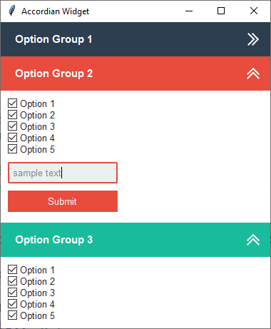

Accordion Widget
================
This example demonstrates how to build an accordian widget that collapses and expands with a button click. The overall
theme is **flatly** and various widget styles are applied to distinguish the option groups.

    :option group 1: ``primary.TFrame``
    :option group 2: ``danger.TFrame``
    :option group 3: ``success.TFrame``

The accordion functionality is created by unpacking the contents of the accordion and then packing it again with the
prior saved settings with a toggle. The toggle checks to see if the contents is visible on the screen, and if not, will
pack, otherwise, unpack. This is all done in the ``toggle_accordian`` method. Additionally the button image alternates
from *open* to *closed* to give a visual hint about the accordion state.

A style argument can be passed into the widget constructor to change the widget header color. The accepted style class
is of ``TFrame``. The default is **primary**, but you can use secondary, success, info, etc... and the styles for the
other components will update based on the color prefix used.

Run this code live on repl.it_

.. _repl.it: https://replit.com/@IsraelDryer/accordion-widget

.. literalinclude:: ../../src/ttkbootstrap/gallery/accordion_widget.py
    :language: python
