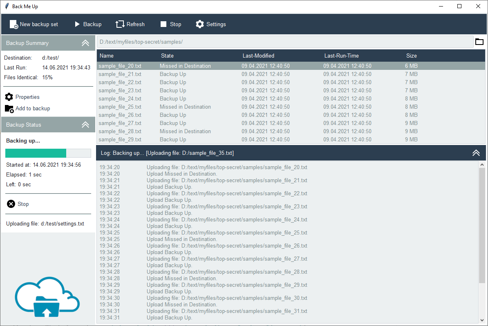

File Backup Utility
===================
In this example, I demonstrate how to use various styles to build a UI for a File Backup UI. The reference material is
from an image you can find here_. The overall theme of this application is **flatly**. I use a ``CollapsingFrame``
class to contain the left-side info panels as well as the output on the bottom right. These contain indicator buttons
on the right-side of the header which collapse and expand the frame with a mouse-click action.

Some of the styles used in this application include:

.. _here: http://www.leo-backup.com/screenshots.shtml

    :top button bar: ``primary.TButton``
    :collapsible frames: ``secondary.TButton``
    :separators: ``secondary.Horizontal.TSeparator``
    :progress bar: ``success.Horizontal.TProgressbar``
    :file open button: ``secondary.TLabel``

There are a few buttons in the collapsible frames on the left-hand side: "properties", "add to backup", "stop". Instead
of using a button style, I applied the ``primary.TLabel`` style to these buttons. This has the effect of giving the
label a white background and primary color foreground, and there are no hover effects. I could have also created a
custom button style by subclassing the existing ``TButton``.

There are two custom styles which are subclassed from ``TFrame`` and ``TLabel``. I used the **inputbg** color from the
``Style.colors`` property and applied this style to the left panel, and the logo image background.

.. literalinclude:: ../../src/ttkbootstrap/gallery/back_me_up.py
    :language: python
