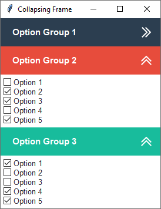

Collapsing Frame
================
This example demonstrates how to build a collapsing frame widget. Each frame added to the widget can be assigned a title
and style. The overall theme is **flatly** and various widget styles are applied to distinguish the option groups.

    :option group 1: ``primary.TFrame``
    :option group 2: ``danger.TFrame``
    :option group 3: ``success.TFrame``

The collapse functionality is created by removing contents of the child frame and then adding it again with the grid
manager. The toggle checks to see if the contents is visible on the screen, and if not, will add the contents back with
the grid manager, otherwise, it will all be removed. This is all done in the ``_toggle_open_close`` method. Additionally
the button image alternates from *open* to *closed* to give a visual hint about the child frame state.

A style argument can be passed into the widget constructor to change the widget header color. The accepted style class
is of ``TButton``. The default is **primary**, but you can use secondary, success, info, etc... and the styles for the
other components will update based on the color prefix used.

Run this code live on repl.it_

.. _repl.it: https://replit.com/@IsraelDryer/collapsing-frame

.. literalinclude:: ../../src/ttkbootstrap/gallery/collapsing_frame.py
    :language: python
