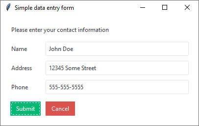
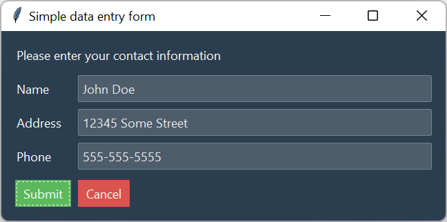

# 简单的数据输入
这个简单的数据输入表单接受用户输入，然后在提交时将其打印到屏幕上。





## 风格总结
上面的两个示例使用了 **litera** 和 **superhero** 主题。

| 项目 | 类 | 配色风格 |
| --- | --- | ---|
| 提交按钮 | `Button` | success|
| 取消按钮 | `Button` | danger |
| 输入 | `Entry` | default |

## 示例代码
[在 repl.it 上实时运行此代码](https://replit.com/@israel-dryer/data-entry#main.py)

```python
import ttkbootstrap as ttk
from ttkbootstrap.constants import *


class DataEntryForm(ttk.Frame):
    
    def __init__(self, master):
        super().__init__(master, padding=(20, 10))
        self.pack(fill=BOTH, expand=YES)

        # form variables
        self.name = ttk.StringVar(value="")
        self.address = ttk.StringVar(value="")
        self.phone = ttk.StringVar(value="")

        # form header
        hdr_txt = "Please enter your contact information" 
        hdr = ttk.Label(master=self, text=hdr_txt, width=50)
        hdr.pack(fill=X, pady=10)

        # form entries
        self.create_form_entry("name", self.name)
        self.create_form_entry("address", self.address)
        self.create_form_entry("phone", self.phone)
        self.create_buttonbox()

    def create_form_entry(self, label, variable):
        """Create a single form entry"""
        container = ttk.Frame(self)
        container.pack(fill=X, expand=YES, pady=5)

        lbl = ttk.Label(master=container, text=label.title(), width=10)
        lbl.pack(side=LEFT, padx=5)

        ent = ttk.Entry(master=container, textvariable=variable)
        ent.pack(side=LEFT, padx=5, fill=X, expand=YES)

    def create_buttonbox(self):
        """Create the application buttonbox"""
        container = ttk.Frame(self)
        container.pack(fill=X, expand=YES, pady=(15, 10))

        sub_btn = ttk.Button(
            master=container,
            text="Submit",
            command=self.on_submit,
            bootstyle=SUCCESS,
            width=6,
        )
        sub_btn.pack(side=RIGHT, padx=5)
        sub_btn.focus_set()

        cnl_btn = ttk.Button(
            master=container,
            text="Cancel",
            command=self.on_cancel,
            bootstyle=DANGER,
            width=6,
        )
        cnl_btn.pack(side=RIGHT, padx=5)

    def on_submit(self):
        """Print the contents to console and return the values."""
        print("Name:", self.name.get())
        print("Address:", self.address.get())
        print("Phone:", self.phone.get())
        return self.name.get(), self.address.get(), self.phone.get()

    def on_cancel(self):
        """Cancel and close the application."""
        self.quit()


if __name__ == "__main__":

    app = ttk.Window("Data Entry", "superhero", resizable=(False, False))
    DataEntryForm(app)
    app.mainloop()
```