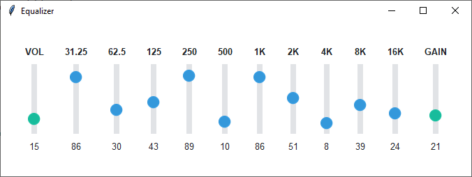

Equalizer
=========
This example demonstrates the use of styles to differentiate scale or "slider" functions. The ``ttk.Scale`` widget is
one of several that include orientation in the style class. The overall theme is **flatly** and the following styles
are applied to the widgets to create contrast:

    :Volume: ``success.Vertical.TScale``
    :Gain: ``success.Vertical.TScale``
    :Other: ``info.Vertical.TScale``

Now for some comments on the code: Because I wanted the scale value to be reflected in a label below the scale, this
application is a lot more complicated than it really needs to be due to some oddities of the ttk scale implementation.
The ``ttk.Scale`` widget outputs a double type, which means that in order to display a nice rounded integer, that number
has to be converted when updated. Fortunately, the scale widget has a ``command`` parameter for setting a callback. The
callback will get the scale value, which can then be converted into a nice clean format.

.. note:: For a vertical orientation, the ``from_`` parameter corresponds to the top and ``to`` corresponds to the
    bottom of the widget, so you'll need to take this into account when you set the minimum and maximum numbers for your
    scale range.

Run this code live on repl.it_

.. _repl.it: https://replit.com/@IsraelDryer/equalizer

.. literalinclude:: ../../src/ttkbootstrap/gallery/equalizer.py
    :language: python
