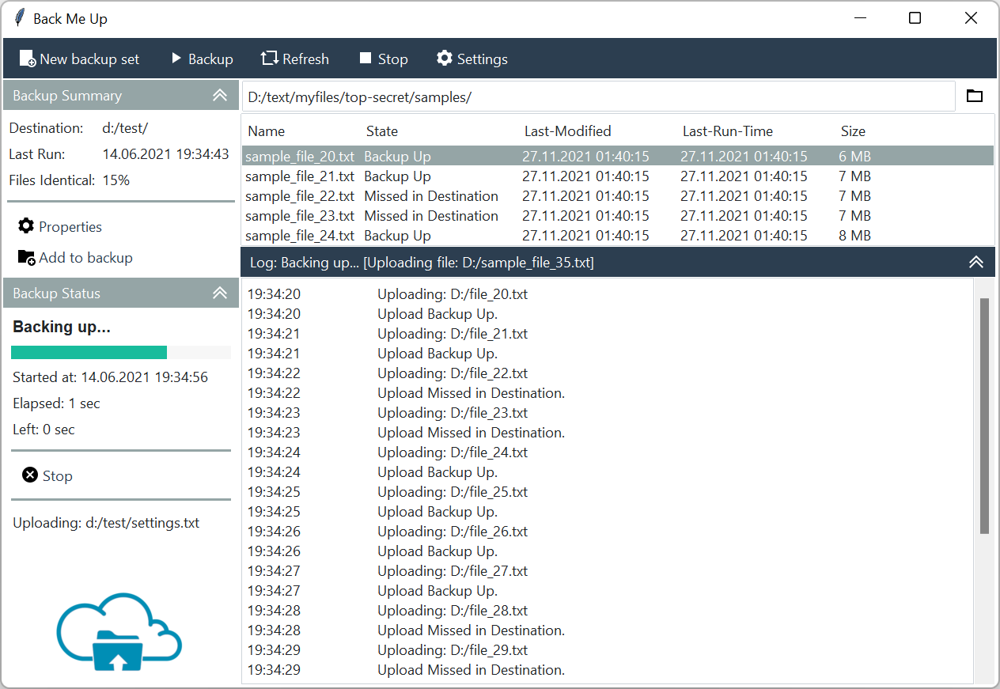

# File Backup Utility
This example demonstrates how to use various styles to build a UI for a 
File Backup Utility application. A custom `CollapsingFrame` class contains 
the left-side info panels as well as the output on the bottom right. These 
contain indicator buttons on the right-side of the header which collapse and 
expand the `Frame` with a mouse-click action. 



## Style Summary
The theme used in this example is **litera**.

| Item                              | Class             | Bootstyle |
| ---                               | ---               | ---|
| Top button bar                    | `Button`          | primary |
| Collapsible frames                | `CollapsingFrame` | secondary |
| Separators                        | `Separator`       | secondary |
| Progressbar                       | `Progressbar`     | success |
| Properties, stop, add to backup   | `Button`          | link |
| File Open                         | `Button`          | secondary-link |

## Example Code
[Run this code live](https://replit.com/@israel-dryer/file-backup-utility#main.py) on repl.it

```python
from datetime import datetime
from random import choices
import ttkbootstrap as ttk
from ttkbootstrap.style import Bootstyle
from tkinter.filedialog import askdirectory
from ttkbootstrap.dialogs import Messagebox
from ttkbootstrap.constants import *
from tkinter.scrolledtext import ScrolledText
from pathlib import Path


PATH = Path(__file__).parent / 'assets'


class BackMeUp(ttk.Frame):

    def __init__(self, *args, **kwargs):
        super().__init__(*args, **kwargs)
        self.pack(fill=BOTH, expand=YES)

        image_files = {
            'properties-dark': 'icons8_settings_24px.png',
            'properties-light': 'icons8_settings_24px_2.png',
            'add-to-backup-dark': 'icons8_add_folder_24px.png',
            'add-to-backup-light': 'icons8_add_book_24px.png',
            'stop-backup-dark': 'icons8_cancel_24px.png',
            'stop-backup-light': 'icons8_cancel_24px_1.png',
            'play': 'icons8_play_24px_1.png',
            'refresh': 'icons8_refresh_24px_1.png',
            'stop-dark': 'icons8_stop_24px.png',
            'stop-light': 'icons8_stop_24px_1.png',
            'opened-folder': 'icons8_opened_folder_24px.png',
            'logo': 'backup.png'
        }

        self.photoimages = []
        imgpath = Path(__file__).parent / 'assets'
        for key, val in image_files.items():
            _path = imgpath / val
            self.photoimages.append(ttk.PhotoImage(name=key, file=_path))

        # buttonbar
        buttonbar = ttk.Frame(self, style='primary.TFrame')
        buttonbar.pack(fill=X, pady=1, side=TOP)

        ## new backup
        _func = lambda: Messagebox.ok(message='Adding new backup')
        btn = ttk.Button(
            master=buttonbar, text='New backup set',
            image='add-to-backup-light', 
            compound=LEFT, 
            command=_func
        )
        btn.pack(side=LEFT, ipadx=5, ipady=5, padx=(1, 0), pady=1)

        ## backup
        _func = lambda: Messagebox.ok(message='Backing up...')
        btn = ttk.Button(
            master=buttonbar, 
            text='Backup', 
            image='play', 
            compound=LEFT, 
            command=_func
        )
        btn.pack(side=LEFT, ipadx=5, ipady=5, padx=0, pady=1)

        ## refresh
        _func = lambda: Messagebox.ok(message='Refreshing...')
        btn = ttk.Button(
            master=buttonbar, 
            text='Refresh', 
            image='refresh',
            compound=LEFT, 
            command=_func
        )
        btn.pack(side=LEFT, ipadx=5, ipady=5, padx=0, pady=1)

        ## stop
        _func = lambda: Messagebox.ok(message='Stopping backup.')
        btn = ttk.Button(
            master=buttonbar, 
            text='Stop', 
            image='stop-light',
            compound=LEFT, 
            command=_func
        )
        btn.pack(side=LEFT, ipadx=5, ipady=5, padx=0, pady=1)

        ## settings
        _func = lambda: Messagebox.ok(message='Changing settings')
        btn = ttk.Button(
            master=buttonbar, 
            text='Settings', 
            image='properties-light',
            compound=LEFT, 
            command=_func
        )
        btn.pack(side=LEFT, ipadx=5, ipady=5, padx=0, pady=1)

        # left panel
        left_panel = ttk.Frame(self, style='bg.TFrame')
        left_panel.pack(side=LEFT, fill=Y)

        ## backup summary (collapsible)
        bus_cf = CollapsingFrame(left_panel)
        bus_cf.pack(fill=X, pady=1)

        ## container
        bus_frm = ttk.Frame(bus_cf, padding=5)
        bus_frm.columnconfigure(1, weight=1)
        bus_cf.add(
            child=bus_frm, 
            title='Backup Summary', 
            bootstyle=SECONDARY)

        ## destination
        lbl = ttk.Label(bus_frm, text='Destination:')
        lbl.grid(row=0, column=0, sticky=W, pady=2)
        lbl = ttk.Label(bus_frm, textvariable='destination')
        lbl.grid(row=0, column=1, sticky=EW, padx=5, pady=2)
        self.setvar('destination', 'd:/test/')

        ## last run
        lbl = ttk.Label(bus_frm, text='Last Run:')
        lbl.grid(row=1, column=0, sticky=W, pady=2)
        lbl = ttk.Label(bus_frm, textvariable='lastrun')
        lbl.grid(row=1, column=1, sticky=EW, padx=5, pady=2)
        self.setvar('lastrun', '14.06.2021 19:34:43')

        ## files Identical
        lbl = ttk.Label(bus_frm, text='Files Identical:')
        lbl.grid(row=2, column=0, sticky=W, pady=2)
        lbl = ttk.Label(bus_frm, textvariable='filesidentical')
        lbl.grid(row=2, column=1, sticky=EW, padx=5, pady=2)
        self.setvar('filesidentical', '15%')

        ## section separator
        sep = ttk.Separator(bus_frm, bootstyle=SECONDARY)
        sep.grid(row=3, column=0, columnspan=2, pady=10, sticky=EW)

        ## properties button
        _func = lambda: Messagebox.ok(message='Changing properties')
        bus_prop_btn = ttk.Button(
            master=bus_frm, 
            text='Properties', 
            image='properties-dark', 
            compound=LEFT,
            command=_func, 
            bootstyle=LINK
        )
        bus_prop_btn.grid(row=4, column=0, columnspan=2, sticky=W)

        ## add to backup button
        _func = lambda: Messagebox.ok(message='Adding to backup')
        add_btn = ttk.Button(
            master=bus_frm, 
            text='Add to backup', 
            image='add-to-backup-dark', 
            compound=LEFT,
            command=_func, 
            bootstyle=LINK
        )
        add_btn.grid(row=5, column=0, columnspan=2, sticky=W)

        # backup status (collapsible)
        status_cf = CollapsingFrame(left_panel)
        status_cf.pack(fill=BOTH, pady=1)

        ## container
        status_frm = ttk.Frame(status_cf, padding=10)
        status_frm.columnconfigure(1, weight=1)
        status_cf.add(
            child=status_frm, 
            title='Backup Status', 
            bootstyle=SECONDARY
        )
        ## progress message
        lbl = ttk.Label(
            master=status_frm, 
            textvariable='prog-message', 
            font='Helvetica 10 bold'
        )
        lbl.grid(row=0, column=0, columnspan=2, sticky=W)
        self.setvar('prog-message', 'Backing up...')

        ## progress bar
        pb = ttk.Progressbar(
            master=status_frm, 
            variable='prog-value', 
            bootstyle=SUCCESS
        )
        pb.grid(row=1, column=0, columnspan=2, sticky=EW, pady=(10, 5))
        self.setvar('prog-value', 71)

        ## time started
        lbl = ttk.Label(status_frm, textvariable='prog-time-started')
        lbl.grid(row=2, column=0, columnspan=2, sticky=EW, pady=2)
        self.setvar('prog-time-started', 'Started at: 14.06.2021 19:34:56')

        ## time elapsed
        lbl = ttk.Label(status_frm, textvariable='prog-time-elapsed')
        lbl.grid(row=3, column=0, columnspan=2, sticky=EW, pady=2)
        self.setvar('prog-time-elapsed', 'Elapsed: 1 sec')

        ## time remaining
        lbl = ttk.Label(status_frm, textvariable='prog-time-left')
        lbl.grid(row=4, column=0, columnspan=2, sticky=EW, pady=2)
        self.setvar('prog-time-left', 'Left: 0 sec')

        ## section separator
        sep = ttk.Separator(status_frm, bootstyle=SECONDARY)
        sep.grid(row=5, column=0, columnspan=2, pady=10, sticky=EW)

        ## stop button
        _func = lambda: Messagebox.ok(message='Stopping backup')
        btn = ttk.Button(
            master=status_frm, 
            text='Stop', 
            image='stop-backup-dark', 
            compound=LEFT, 
            command=_func, 
            bootstyle=LINK
        )
        btn.grid(row=6, column=0, columnspan=2, sticky=W)

        ## section separator
        sep = ttk.Separator(status_frm, bootstyle=SECONDARY)
        sep.grid(row=7, column=0, columnspan=2, pady=10, sticky=EW)

        # current file message
        lbl = ttk.Label(status_frm, textvariable='current-file-msg')
        lbl.grid(row=8, column=0, columnspan=2, pady=2, sticky=EW)
        self.setvar('current-file-msg', 'Uploading: d:/test/settings.txt')

        # logo
        lbl = ttk.Label(left_panel, image='logo', style='bg.TLabel')
        lbl.pack(side='bottom')

        # right panel
        right_panel = ttk.Frame(self, padding=(2, 1))
        right_panel.pack(side=RIGHT, fill=BOTH, expand=YES)

        ## file input
        browse_frm = ttk.Frame(right_panel)
        browse_frm.pack(side=TOP, fill=X, padx=2, pady=1)
        
        file_entry = ttk.Entry(browse_frm, textvariable='folder-path')
        file_entry.pack(side=LEFT, fill=X, expand=YES)
        
        btn = ttk.Button(
            master=browse_frm, 
            image='opened-folder', 
            bootstyle=(LINK, SECONDARY),
            command=self.get_directory
        )
        btn.pack(side=RIGHT)

        ## Treeview
        tv = ttk.Treeview(right_panel, show='headings', height=5)
        tv.configure(columns=(
            'name', 'state', 'last-modified', 
            'last-run-time', 'size'
        ))
        tv.column('name', width=150, stretch=True)
        
        for col in ['last-modified', 'last-run-time', 'size']:
            tv.column(col, stretch=False)
        
        for col in tv['columns']:
            tv.heading(col, text=col.title(), anchor=W)
        
        tv.pack(fill=X, pady=1)

        ## scrolling text output
        scroll_cf = CollapsingFrame(right_panel)
        scroll_cf.pack(fill=BOTH, expand=YES)
        
        output_container = ttk.Frame(scroll_cf, padding=1)
        _value = 'Log: Backing up... [Uploading file: D:/sample_file_35.txt]'
        self.setvar('scroll-message', _value)
        st = ScrolledText(output_container)
        st.pack(fill=BOTH, expand=YES)
        scroll_cf.add(output_container, textvariable='scroll-message')

        # seed with some sample data

        ## starting sample directory
        file_entry.insert(END, 'D:/text/myfiles/top-secret/samples/')

        ## treeview and backup logs
        for x in range(20, 35):
            result = choices(['Backup Up', 'Missed in Destination'])[0]
            st.insert(END, f'19:34:{x}\t\t Uploading: D:/file_{x}.txt\n')
            st.insert(END, f'19:34:{x}\t\t Upload {result}.\n')
            timestamp = datetime.now().strftime('%d.%m.%Y %H:%M:%S')
            tv.insert('', END, x, 
                      values=(f'sample_file_{x}.txt', 
                              result, timestamp, timestamp, 
                              f'{int(x // 3)} MB')
            )
        tv.selection_set(20)

    def get_directory(self):
        """Open dialogue to get directory and update variable"""
        self.update_idletasks()
        d = askdirectory()
        if d:
            self.setvar('folder-path', d)


class CollapsingFrame(ttk.Frame):
    """A collapsible frame widget that opens and closes with a click."""

    def __init__(self, master, **kwargs):
        super().__init__(master, **kwargs)
        self.columnconfigure(0, weight=1)
        self.cumulative_rows = 0

        # widget images
        self.images = [
            ttk.PhotoImage(file=PATH/'icons8_double_up_24px.png'),
            ttk.PhotoImage(file=PATH/'icons8_double_right_24px.png')
        ]

    def add(self, child, title="", bootstyle=PRIMARY, **kwargs):
        """Add a child to the collapsible frame

        Parameters:

            child (Frame):
                The child frame to add to the widget.

            title (str):
                The title appearing on the collapsible section header.

            bootstyle (str):
                The style to apply to the collapsible section header.

            **kwargs (Dict):
                Other optional keyword arguments.
        """
        if child.winfo_class() != 'TFrame':
            return
        
        style_color = Bootstyle.ttkstyle_widget_color(bootstyle)
        frm = ttk.Frame(self, bootstyle=style_color)
        frm.grid(row=self.cumulative_rows, column=0, sticky=EW)

        # header title
        header = ttk.Label(
            master=frm,
            text=title,
            bootstyle=(style_color, INVERSE)
        )
        if kwargs.get('textvariable'):
            header.configure(textvariable=kwargs.get('textvariable'))
        header.pack(side=LEFT, fill=BOTH, padx=10)

        # header toggle button
        def _func(c=child): return self._toggle_open_close(c)
        btn = ttk.Button(
            master=frm,
            image=self.images[0],
            bootstyle=style_color,
            command=_func
        )
        btn.pack(side=RIGHT)

        # assign toggle button to child so that it can be toggled
        child.btn = btn
        child.grid(row=self.cumulative_rows + 1, column=0, sticky=NSEW)

        # increment the row assignment
        self.cumulative_rows += 2

    def _toggle_open_close(self, child):
        """Open or close the section and change the toggle button 
        image accordingly.

        Parameters:
            
            child (Frame):
                The child element to add or remove from grid manager.
        """
        if child.winfo_viewable():
            child.grid_remove()
            child.btn.configure(image=self.images[1])
        else:
            child.grid()
            child.btn.configure(image=self.images[0])


if __name__ == '__main__':
    
    app = ttk.Window("Back Me Up")
    BackMeUp(app)
    app.mainloop()
```