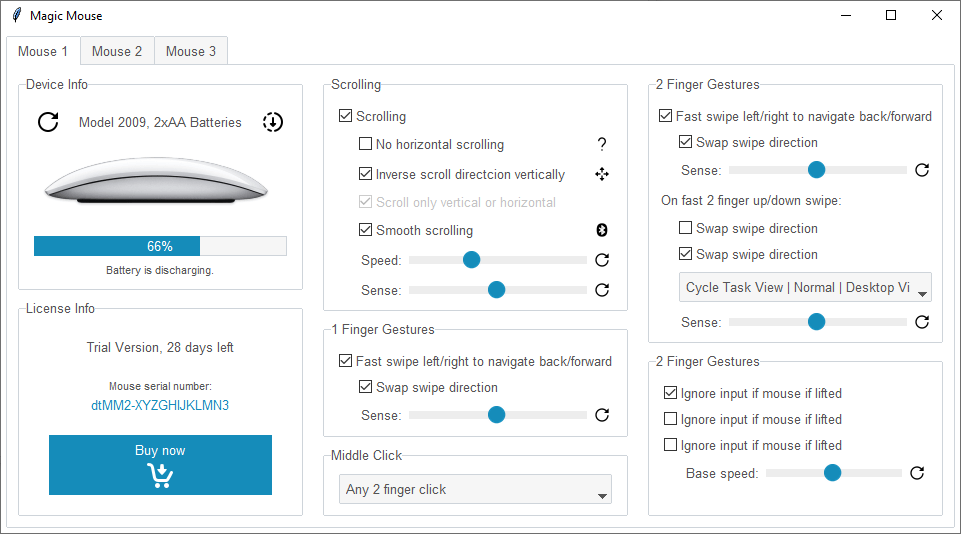

Magic Mouse
===========
This application demonstrates a complicated design with many options and several label frames. The overall theme is
**lumen**. Other than the default styles, the following styles are directly applied directly to widgets:

    :Image Buttons: ``TLabel``
    :License Number: ``primary.TLabel``

.. literalinclude:: ../../src/ttkbootstrap/gallery/magic_mouse.py
    :language: python
