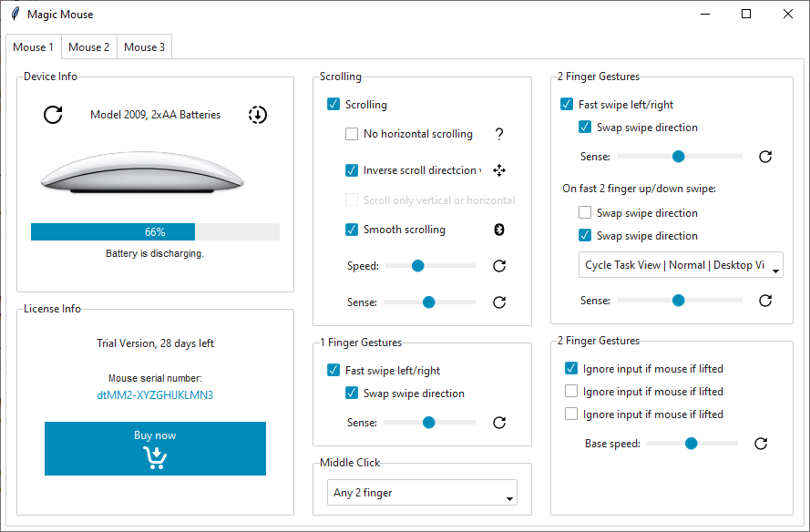

# 魔术鼠标
此应用程序演示了一个具有许多选项和多个标签框架的复杂设计。 **link** 按钮样式用于所有使用图像的按钮。



## 风格总结
使用的主题是**lumen**。

| 项目              | 类        | 配色风格  |
| ---               | ---          | ---        |
| 图像按钮     | `Button`     | link       |
| 许可号    | `Label`      | primary    |

## 示例代码
[在 repl.it 上实时运行此代码](https://replit.com/@israel-dryer/magic-mouse#main.py)

```python
from pathlib import Path
from tkinter import PhotoImage
import ttkbootstrap as ttk
from ttkbootstrap.constants import *
from ttkbootstrap.dialogs import Messagebox


PATH = Path(__file__).parent / 'assets'


class MouseUtilities(ttk.Frame):

    def __init__(self, master):
        super().__init__(master)
        self.pack(fill=BOTH, expand=YES)
        
        self.images = [
            PhotoImage(
                name='reset', 
                file=PATH / 'magic_mouse/icons8_reset_24px.png'),
            PhotoImage(
                name='reset-small', 
                file=PATH / 'magic_mouse/icons8_reset_16px.png'),
            PhotoImage(
                name='submit', 
                file=PATH / 'magic_mouse/icons8_submit_progress_24px.png'),
            PhotoImage(
                name='question', 
                file=PATH / 'magic_mouse/icons8_question_mark_16px.png'),
            PhotoImage(
                name='direction', 
                file=PATH / 'magic_mouse/icons8_move_16px.png'),
            PhotoImage(
                name='bluetooth', 
                file=PATH / 'magic_mouse/icons8_bluetooth_2_16px.png'),
            PhotoImage(
                name='buy', 
                file=PATH / 'magic_mouse/icons8_buy_26px_2.png'),
            PhotoImage(
                name='mouse', 
                file=PATH / 'magic_mouse/magic_mouse.png')
        ]

        for i in range(3):
            self.columnconfigure(i, weight=1)
        self.rowconfigure(0, weight=1)

        # column 1
        col1 = ttk.Frame(self, padding=10)
        col1.grid(row=0, column=0, sticky=NSEW)

        # device info
        dev_info = ttk.Labelframe(col1, text='Device Info', padding=10)
        dev_info.pack(side=TOP, fill=BOTH, expand=YES)

        # header
        dev_info_header = ttk.Frame(dev_info, padding=5)
        dev_info_header.pack(fill=X)

        btn = ttk.Button(
            master=dev_info_header,
            image='reset',
            bootstyle=LINK,
            command=self.callback
        )
        btn.pack(side=LEFT)

        lbl = ttk.Label(dev_info_header, text='Model 2009, 2xAA Batteries')
        lbl.pack(side=LEFT, fill=X, padx=15)

        btn = ttk.Button(
            master=dev_info_header,
            image='submit',
            bootstyle=LINK,
            command=self.callback
        )
        btn.pack(side=LEFT)

        # image
        ttk.Label(dev_info, image='mouse').pack(fill=X)

        # progressbar
        pb = ttk.Progressbar(dev_info, value=66)
        pb.pack(fill=X, pady=5, padx=5)
        ttk.Label(pb, text='66%', bootstyle=(PRIMARY, INVERSE)).pack()

        # progress message
        self.setvar('progress', 'Battery is discharging.')
        lbl = ttk.Label(
            master=dev_info,
            textvariable='progress',
            font='Helvetica 8',
            anchor=CENTER
        )
        lbl.pack(fill=X)

        # licence info
        lic_info = ttk.Labelframe(col1, text='License Info', padding=20)
        lic_info.pack(side=TOP, fill=BOTH, expand=YES, pady=(10, 0))
        lic_info.rowconfigure(0, weight=1)
        lic_info.columnconfigure(0, weight=2)

        lic_title = ttk.Label(
            master=lic_info,
            text='Trial Version, 28 days left',
            anchor=CENTER
        )
        lic_title.pack(fill=X, pady=(0, 20))

        lbl = ttk.Label(
            master=lic_info,
            text='Mouse serial number:',
            anchor=CENTER,
            font='Helvetica 8'
        )
        lbl.pack(fill=X)
        self.setvar('license', 'dtMM2-XYZGHIJKLMN3')

        lic_num = ttk.Label(
            master=lic_info,
            textvariable='license',
            bootstyle=PRIMARY,
            anchor=CENTER
        )
        lic_num.pack(fill=X, pady=(0, 20))

        buy_now = ttk.Button(
            master=lic_info,
            image='buy',
            text='Buy now',
            compound=BOTTOM,
            command=self.callback
        )
        buy_now.pack(padx=10, fill=X)

        # Column 2
        col2 = ttk.Frame(self, padding=10)
        col2.grid(row=0, column=1, sticky=NSEW)

        # scrolling
        scrolling = ttk.Labelframe(col2, text='Scrolling', padding=(15, 10))
        scrolling.pack(side=TOP, fill=BOTH, expand=YES)

        op1 = ttk.Checkbutton(scrolling, text='Scrolling', variable='op1')
        op1.pack(fill=X, pady=5)

        # no horizontal scrolling
        op2 = ttk.Checkbutton(
            master=scrolling,
            text='No horizontal scrolling',
            variable='op2'
        )
        op2.pack(fill=X, padx=(20, 0), pady=5)

        btn = ttk.Button(
            master=op2,
            image='question',
            bootstyle=LINK,
            command=self.callback
        )
        btn.pack(side=RIGHT)

        # inverse
        op3 = ttk.Checkbutton(
            master=scrolling,
            text='Inverse scroll directcion vertically',
            variable='op3'
        )
        op3.pack(fill=X, padx=(20, 0), pady=5)

        btn = ttk.Button(
            master=op3,
            image='direction',
            bootstyle=LINK,
            command=self.callback
        )
        btn.pack(side=RIGHT)

        # Scroll only vertical or horizontal
        op4 = ttk.Checkbutton(
            master=scrolling,
            text='Scroll only vertical or horizontal',
            state=DISABLED
        )
        op4.configure(variable='op4')
        op4.pack(fill=X, padx=(20, 0), pady=5)

        # smooth scrolling
        op5 = ttk.Checkbutton(
            master=scrolling,
            text='Smooth scrolling',
            variable='op5'
        )
        op5.pack(fill=X, padx=(20, 0), pady=5)

        btn = ttk.Button(
            master=op5,
            image='bluetooth',
            bootstyle=LINK,
            command=self.callback
        )
        btn.pack(side=RIGHT)

        # scroll speed
        scroll_speed_frame = ttk.Frame(scrolling)
        scroll_speed_frame.pack(fill=X, padx=(20, 0), pady=5)

        lbl = ttk.Label(scroll_speed_frame, text='Speed:')
        lbl.pack(side=LEFT)

        scale = ttk.Scale(scroll_speed_frame, value=35, from_=1, to=100)
        scale.pack(side=LEFT, fill=X, expand=YES, padx=5)

        scroll_speed_btn = ttk.Button(
            master=scroll_speed_frame,
            image='reset-small',
            bootstyle=LINK,
            command=self.callback
        )
        scroll_speed_btn.pack(side=LEFT)

        # scroll sense
        scroll_sense_frame = ttk.Frame(scrolling)
        scroll_sense_frame.pack(fill=X, padx=(20, 0), pady=(5, 0))

        ttk.Label(scroll_sense_frame, text='Sense:').pack(side=LEFT)

        scale = ttk.Scale(scroll_sense_frame, value=50, from_=1, to=100)
        scale.pack(side=LEFT, fill=X, expand=YES, padx=5)

        scroll_sense_btn = ttk.Button(
            master=scroll_sense_frame,
            image='reset-small',
            bootstyle=LINK,
            command=self.callback
        )
        scroll_sense_btn.pack(side=LEFT)

        # 1 finger gestures
        finger_gest = ttk.Labelframe(
            master=col2,
            text='1 Finger Gestures',
            padding=(15, 10)
        )
        finger_gest.pack(
            side=TOP,
            fill=BOTH,
            expand=YES,
            pady=(10, 0)
        )
        op6 = ttk.Checkbutton(
            master=finger_gest,
            text='Fast swipe left/right',
            variable='op6'
        )
        op6.pack(fill=X, pady=5)

        cb = ttk.Checkbutton(
            master=finger_gest,
            text='Swap swipe direction',
            variable='op7'
        )
        cb.pack(fill=X, padx=(20, 0), pady=5)

        # gest sense
        gest_sense_frame = ttk.Frame(finger_gest)
        gest_sense_frame.pack(fill=X, padx=(20, 0), pady=(5, 0))

        ttk.Label(gest_sense_frame, text='Sense:').pack(side=LEFT)

        scale = ttk.Scale(gest_sense_frame, value=50, from_=1, to=100)
        scale.pack(side=LEFT, fill=X, expand=YES, padx=5)

        btn = ttk.Button(
            master=gest_sense_frame,
            image='reset-small',
            bootstyle=LINK,
            command=self.callback
        )
        btn.pack(side=LEFT)

        # middle click
        middle_click = ttk.Labelframe(
            master=col2,
            text='Middle Click',
            padding=(15, 10)
        )
        middle_click.pack(
            side=TOP,
            fill=BOTH,
            expand=YES,
            pady=(10, 0)
        )
        cbo = ttk.Combobox(
            master=middle_click,
            values=['Any 2 finger', 'Other 1', 'Other 2']
        )
        cbo.current(0)
        cbo.pack(fill=X)

        # Column 3
        col3 = ttk.Frame(self, padding=10)
        col3.grid(row=0, column=2, sticky=NSEW)

        # two finger gestures
        two_finger_gest = ttk.Labelframe(
            master=col3,
            text='2 Finger Gestures',
            padding=10
        )
        two_finger_gest.pack(side=TOP, fill=BOTH)

        op7 = ttk.Checkbutton(
            master=two_finger_gest,
            text='Fast swipe left/right',
            variable='op7'
        )
        op7.pack(fill=X, pady=5)

        op8 = ttk.Checkbutton(
            master=two_finger_gest,
            text='Swap swipe direction',
            variable='op8'
        )
        op8.pack(fill=X, padx=(20, 0), pady=5)

        # gest sense
        gest_sense_frame = ttk.Frame(two_finger_gest)
        gest_sense_frame.pack(fill=X, padx=(20, 0), pady=(5, 0))

        ttk.Label(gest_sense_frame, text='Sense:').pack(side=LEFT)

        scale = ttk.Scale(gest_sense_frame, value=50, from_=1, to=100)
        scale.pack(side=LEFT, fill=X, expand=YES, padx=5)

        btn = ttk.Button(
            master=gest_sense_frame,
            image='reset-small',
            bootstyle=LINK,
            command=self.callback
        )
        btn.pack(side=LEFT)

        # fast two finger swipe down
        lbl = ttk.Label(
            master=two_finger_gest,
            text='On fast 2 finger up/down swipe:'
        )
        lbl.pack(fill=X, pady=(10, 5))

        op9 = ttk.Checkbutton(
            master=two_finger_gest,
            text='Swap swipe direction',
            variable='op9'
        )
        op9.pack(fill=X, padx=(20, 0), pady=5)

        op10 = ttk.Checkbutton(
            master=two_finger_gest,
            text='Swap swipe direction',
            variable='op10'
        )
        op10.pack(fill=X, padx=(20, 0), pady=5)

        two_finger_cbo = ttk.Combobox(
            master=two_finger_gest,
            values=['Cycle Task View | Normal | Desktop View']
        )
        two_finger_cbo.current(0)
        two_finger_cbo.pack(fill=X, padx=(20, 0), pady=5)

        # two finger sense
        two_finger_sense_frame = ttk.Frame(two_finger_gest)
        two_finger_sense_frame.pack(fill=X, padx=(20, 0), pady=(5, 0))

        ttk.Label(two_finger_sense_frame, text='Sense:').pack(side=LEFT)

        scale = ttk.Scale(two_finger_sense_frame, value=50, from_=1, to=100)
        scale.pack(side=LEFT, fill=X, expand=YES, padx=5)

        two_finger_sense_btn = ttk.Button(
            master=two_finger_sense_frame,
            image='reset-small',
            bootstyle=LINK
        )
        two_finger_sense_btn.configure(command=self.callback)
        two_finger_sense_btn.pack(side=LEFT)

        # mouse options
        mouse_options = ttk.Labelframe(
            master=col3,
            text='2 Finger Gestures',
            padding=(15, 10)
        )
        mouse_options.pack(
            side=TOP,
            fill=BOTH,
            expand=YES,
            pady=(10, 0)
        )

        op11 = ttk.Checkbutton(
            master=mouse_options,
            text='Ignore input if mouse if lifted',
            variable='op11'
        )
        op11.pack(fill=X, pady=5)

        op12 = ttk.Checkbutton(
            master=mouse_options,
            text='Ignore input if mouse if lifted',
            variable='op12'
        )
        op12.pack(fill=X, pady=5)

        op13 = ttk.Checkbutton(
            master=mouse_options,
            text='Ignore input if mouse if lifted',
            variable='op13'
        )
        op13.pack(fill=X, pady=5)

        # base speed
        base_speed_sense_frame = ttk.Frame(mouse_options)
        base_speed_sense_frame.pack(fill=X, padx=(20, 0), pady=(5, 0))

        lbl = ttk.Label(base_speed_sense_frame, text='Base speed:')
        lbl.pack(side=LEFT)

        scale = ttk.Scale(base_speed_sense_frame, value=50, from_=1, to=100)
        scale.pack(side=LEFT, fill=X, expand=YES, padx=5)

        base_speed_sense_btn = ttk.Button(
            master=base_speed_sense_frame,
            image='reset-small',
            bootstyle=LINK
        )
        base_speed_sense_btn.configure(command=self.callback)
        base_speed_sense_btn.pack(side=LEFT)

        # turn on all checkbuttons
        for i in range(1, 14):
            self.setvar(f'op{i}', 1)

        # turn off select buttons
        for j in [2, 9, 12, 13]:
            self.setvar(f'op{j}', 0)

    def callback(self):
        """Demo callback"""
        Messagebox.ok(
            title='Button callback', 
            message="You pressed a button."
        )


if __name__ == '__main__':

    app = ttk.Window("Magic Mouse", "yeti")
    MouseUtilities(app)
    app.mainloop()
```