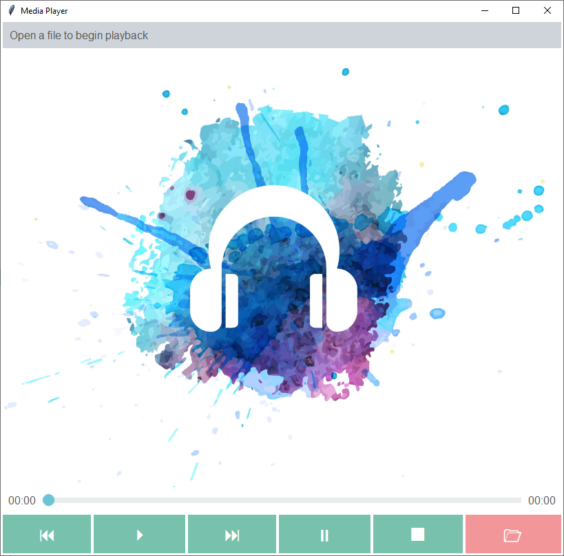

Media Player
============
This example demonstrates how to build a media player GUI. The buttons are simple unicode characters. The overall
theme is **minty** and the following styles are applied to the widgets:

    :Control Buttons: ``primary.TButton``
    :File Button: ``secondary.TButton``
    :Scale: ``info.Horizontal.TScale``

Additionally, I subclassed the ``TLabel`` to create a new ``header.TLabel`` style that changes the background using the
theme color ``border`` with some additional padding.

This is a ttkbootstrap adaptation of the media player GUI you can find here_, which includes the implementation of
the VLC package for controlling audio and video.

.. _here: https://github.com/israel-dryer/Mini-VLC-Player/blob/master/mini_player.py

Run this code live on repl.it_

.. _repl.it: https://replit.com/@IsraelDryer/media-player

.. literalinclude:: ../../src/ttkbootstrap/gallery/media_player.py
    :language: python
