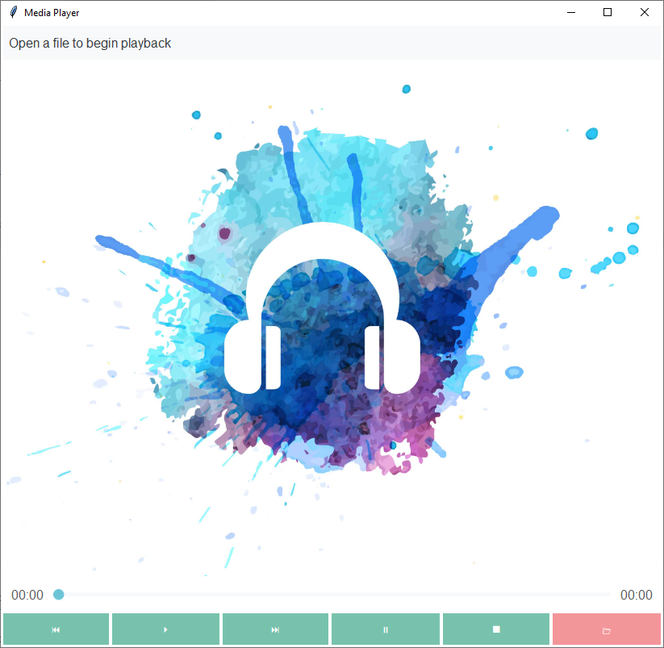

# Media Player
This example demonstrates how to build a media player GUI. The buttons are 
simple unicode characters. 



## Style Summary
The theme used in this example is **yeti**.

| Item                  | Class     | Bootstyle |
| ---                   | ---       | --- |
| Header                | `Label`   | light-inverse |
| Media Controls        | `Button`  | primary |
| File Open             | `Button`  | secondary |
| Time Elapsed Slider   | `Scale`   | secondary |


## Example Code
[Run this code live](https://replit.com/@israel-dryer/media-player#main.py) on repl.it

```python
from pathlib import Path
import ttkbootstrap as ttk
from ttkbootstrap.constants import *
from ttkbootstrap.icons import Emoji


class MediaPlayer(ttk.Frame):

    def __init__(self, master):
        super().__init__(master)
        self.pack(fill=BOTH, expand=YES)
        self.hdr_var = ttk.StringVar()
        self.elapsed_var = ttk.DoubleVar(value=0)
        self.remain_var = ttk.DoubleVar(value=190)
        
        self.create_header()
        self.create_media_window()
        self.create_progress_meter()
        self.create_buttonbox()
    
    def create_header(self):
        """The application header to display user messages"""
        self.hdr_var.set("Open a file to begin playback")
        lbl = ttk.Label(
            master=self, 
            textvariable=self.hdr_var, 
            bootstyle=(LIGHT, INVERSE),
            padding=10
        )
        lbl.pack(fill=X, expand=YES)

    def create_media_window(self):
        """Create frame to contain media"""
        img_path = Path(__file__).parent / 'assets/mp_background.png'
        self.demo_media = ttk.PhotoImage(file=img_path)
        self.media = ttk.Label(self, image=self.demo_media)
        self.media.pack(fill=BOTH, expand=YES)

    def create_progress_meter(self):
        """Create frame with progress meter with lables"""
        container = ttk.Frame(self)
        container.pack(fill=X, expand=YES, pady=10)
        
        self.elapse = ttk.Label(container, text='00:00')
        self.elapse.pack(side=LEFT, padx=10)

        self.scale = ttk.Scale(
            master=container, 
            command=self.on_progress, 
            bootstyle=SECONDARY
        )
        self.scale.pack(side=LEFT, fill=X, expand=YES)

        self.remain = ttk.Label(container, text='03:10')
        self.remain.pack(side=LEFT, fill=X, padx=10)

    def create_buttonbox(self):
        """Create buttonbox with media controls"""
        container = ttk.Frame(self)
        container.pack(fill=X, expand=YES)
        ttk.Style().configure('TButton', font="-size 14")

        rev_btn = ttk.Button(
            master=container,
            text=Emoji.get('black left-pointing double triangle with vertical bar'),
            padding=10,
        )
        rev_btn.pack(side=LEFT, fill=X, expand=YES)

        play_btn = ttk.Button(
            master=container,
            text=Emoji.get('black right-pointing triangle'),
            padding=10,
        )
        play_btn.pack(side=LEFT, fill=X, expand=YES)

        fwd_btn = ttk.Button(
            master=container,
            text=Emoji.get('black right-pointing double triangle with vertical bar'),
            padding=10,
        )
        fwd_btn.pack(side=LEFT, fill=X, expand=YES)

        pause_btn = ttk.Button(
            master=container,
            text=Emoji.get('double vertical bar'),
            padding=10,
        )
        pause_btn.pack(side=LEFT, fill=X, expand=YES)        

        stop_btn = ttk.Button(
            master=container,
            text=Emoji.get('black square for stop'),
            padding=10,
        )
        stop_btn.pack(side=LEFT, fill=X, expand=YES)          

        stop_btn = ttk.Button(
            master=container,
            text=Emoji.get('open file folder'),
            bootstyle=SECONDARY,
            padding=10
        )
        stop_btn.pack(side=LEFT, fill=X, expand=YES)             


    def on_progress(self, val: float):
        """Update progress labels when the scale is updated."""
        elapsed = self.elapsed_var.get()
        remaining = self.remain_var.get()
        total = int(elapsed + remaining)
        
        elapse = int(float(val) * total)
        elapse_min = elapse // 60
        elapse_sec = elapse % 60
        
        remain_tot = total - elapse
        remain_min = remain_tot // 60
        remain_sec = remain_tot % 60

        self.elapsed_var.set(elapse)
        self.remain_var.set(remain_tot)

        self.elapse.configure(text=f'{elapse_min:02d}:{elapse_sec:02d}')
        self.remain.configure(text=f'{remain_min:02d}:{remain_sec:02d}')
        

if __name__ == '__main__':

    app = ttk.Window("Media Player", "yeti")
    mp = MediaPlayer(app)
    mp.scale.set(0.35)  # set default
    app.mainloop()
```