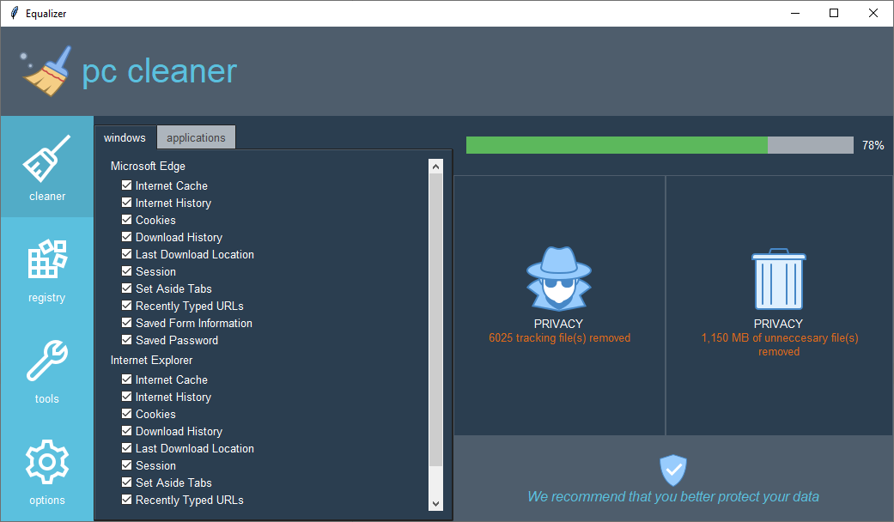
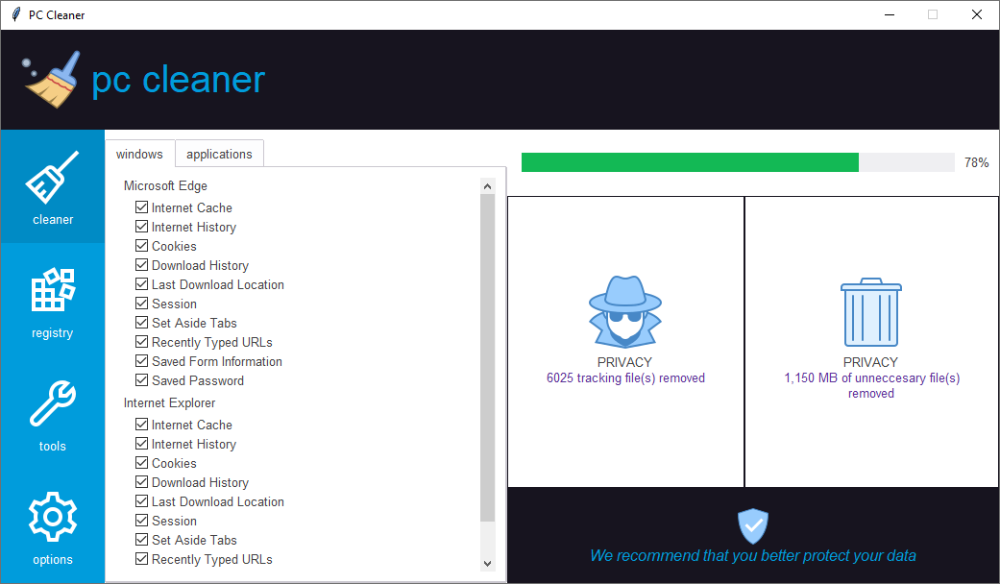

PC Cleaner
==========
In this example, I demonstrate how to use various styles to build a UI for a PC Cleaner application. This is adapted
from an image you can find here_. The images below represent the same build except with the **pulse** as the light theme
and **superhero** as the dark theme.  This application includes several widget styles include a customer header style
which is configured in the ``init`` method that changes the background and foreground colors from theme colors available
in the ``Style.colors`` property.

.. _here: https://images.idgesg.net/images/article/2018/08/cw_win10_utilities_ss_02-100769136-orig.jpg

    :Action buttons: ``info.TButton``
    :Progressbar: ``success.Horizontal.TProgressbar``

There is a ``secondary.TButton`` style applied to the result card frames. This gives the cards the same format as a
button for any attributes they share. This effectively gives it a highlight color and hover effect. Additionally, by
putting another label or card inside with padding around, you can create a border effect, with the card background
serving as the border. By increasing the internal padding, you can effectively increase the border size.

Run this code live on repl.it_

.. _repl.it: https://replit.com/@IsraelDryer/pc_cleaner

.. literalinclude:: ../../src/ttkbootstrap/gallery/pc_cleaner.py
    :language: python
