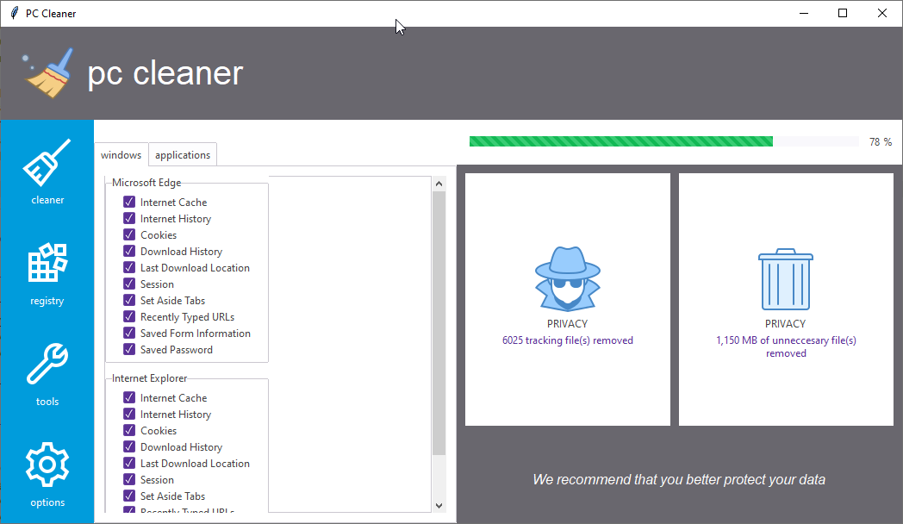

# PC Cleaner
This example demonstrates how to use various styles to build a UI for a PC 
Cleaner application. This is adapted from an image you can find 
[here](https://images.idgesg.net/images/article/2018/08/cw_win10_utilities_ss_02-100769136-orig.jpg).



## Style Summary
The theme used in this example is **pulse**.

| Item                  | Class         | Bootstyle |
| ---                   | ---           | --- |
| Action buttons        | `Button`      | info |
| Progressbar           | `Progressbar` | success-striped |

## Example Code
[Run this code live](https://replit.com/@israel-dryer/pc-cleaner#main.py) on repl.it

```python
from pathlib import Path
import ttkbootstrap as ttk
from ttkbootstrap.constants import *

PATH = Path(__file__).parent / 'assets'


class Cleaner(ttk.Frame):

    def __init__(self, master, **kwargs):
        super().__init__(master, **kwargs)
        self.pack(fill=BOTH, expand=YES)

        # application images
        self.images = [
            ttk.PhotoImage(
                name='logo',
                file=PATH / 'icons8_broom_64px_1.png'),
            ttk.PhotoImage(
                name='cleaner',
                file=PATH / 'icons8_broom_64px.png'),
            ttk.PhotoImage(
                name='registry',
                file=PATH / 'icons8_registry_editor_64px.png'),
            ttk.PhotoImage(
                name='tools',
                file=PATH / 'icons8_wrench_64px.png'),
            ttk.PhotoImage(
                name='options',
                file=PATH / 'icons8_settings_64px.png'),
            ttk.PhotoImage(
                name='privacy',
                file=PATH / 'icons8_spy_80px.png'),
            ttk.PhotoImage(
                name='junk',
                file=PATH / 'icons8_trash_can_80px.png'),
            ttk.PhotoImage(
                name='protect',
                file=PATH / 'icons8_protect_40px.png')
        ]

        # header
        hdr_frame = ttk.Frame(self, padding=20, bootstyle=SECONDARY)
        hdr_frame.grid(row=0, column=0, columnspan=3, sticky=EW)

        hdr_label = ttk.Label(
            master=hdr_frame,
            image='logo',
            bootstyle=(INVERSE, SECONDARY)
        )
        hdr_label.pack(side=LEFT)

        logo_text = ttk.Label(
            master=hdr_frame,
            text='pc cleaner',
            font=('TkDefaultFixed', 30),
            bootstyle=(INVERSE, SECONDARY)
        )
        logo_text.pack(side=LEFT, padx=10)

        # action buttons
        action_frame = ttk.Frame(self)
        action_frame.grid(row=1, column=0, sticky=NSEW)

        cleaner_btn = ttk.Button(
            master=action_frame,
            image='cleaner',
            text='cleaner',
            compound=TOP,
            bootstyle=INFO
        )
        cleaner_btn.pack(side=TOP, fill=BOTH, ipadx=10, ipady=10)

        registry_btn = ttk.Button(
            master=action_frame,
            image='registry',
            text='registry',
            compound=TOP,
            bootstyle=INFO
        )
        registry_btn.pack(side=TOP, fill=BOTH, ipadx=10, ipady=10)

        tools_btn = ttk.Button(
            master=action_frame,
            image='tools',
            text='tools',
            compound=TOP,
            bootstyle=INFO
        )
        tools_btn.pack(side=TOP, fill=BOTH, ipadx=10, ipady=10)

        options_btn = ttk.Button(
            master=action_frame,
            image='options',
            text='options',
            compound=TOP,
            bootstyle=INFO
        )
        options_btn.pack(side=TOP, fill=BOTH, ipadx=10, ipady=10)

        # option notebook
        notebook = ttk.Notebook(self)
        notebook.grid(row=1, column=1, sticky=NSEW, pady=(25, 0))

        # windows tab
        windows_tab = ttk.Frame(notebook, padding=10)
        wt_scrollbar = ttk.Scrollbar(windows_tab)
        wt_scrollbar.pack(side=RIGHT, fill=Y)
        wt_scrollbar.set(0, 1)

        wt_canvas = ttk.Canvas(
            master=windows_tab,
            relief=FLAT,
            borderwidth=0,
            selectborderwidth=0,
            highlightthickness=0,
            yscrollcommand=wt_scrollbar.set
        )
        wt_canvas.pack(side=LEFT, fill=BOTH)

        # adjust the scrollregion when the size of the canvas changes
        wt_canvas.bind(
            sequence='<Configure>',
            func=lambda e: wt_canvas.configure(
                scrollregion=wt_canvas.bbox(ALL))
        )
        wt_scrollbar.configure(command=wt_canvas.yview)
        scroll_frame = ttk.Frame(wt_canvas)
        wt_canvas.create_window((0, 0), window=scroll_frame, anchor=NW)

        radio_options = [
            'Internet Cache', 'Internet History', 'Cookies',
            'Download History', 'Last Download Location',
            'Session', 'Set Aside Tabs', 'Recently Typed URLs',
            'Saved Form Information', 'Saved Password'
        ]

        edge = ttk.Labelframe(
            master=scroll_frame,
            text='Microsoft Edge',
            padding=(20, 5)
        )
        edge.pack(fill=BOTH, expand=YES, padx=20, pady=10)

        explorer = ttk.Labelframe(
            master=scroll_frame,
            text='Internet Explorer',
            padding=(20, 5)
        )
        explorer.pack(fill=BOTH, padx=20, pady=10, expand=YES)

        # add radio buttons to each label frame section
        for section in [edge, explorer]:
            for opt in radio_options:
                cb = ttk.Checkbutton(section, text=opt, state=NORMAL)
                cb.invoke()
                cb.pack(side=TOP, pady=2, fill=X)
        notebook.add(windows_tab, text='windows')

        # empty tab for looks
        notebook.add(ttk.Frame(notebook), text='applications')

        # results frame
        results_frame = ttk.Frame(self)
        results_frame.grid(row=1, column=2, sticky=NSEW)

        # progressbar with text indicator
        pb_frame = ttk.Frame(results_frame, padding=(0, 10, 10, 10))
        pb_frame.pack(side=TOP, fill=X, expand=YES)

        pb = ttk.Progressbar(
            master=pb_frame,
            bootstyle=(SUCCESS, STRIPED),
            variable='progress'
        )
        pb.pack(side=LEFT, fill=X, expand=YES, padx=(15, 10))

        ttk.Label(pb_frame, text='%').pack(side=RIGHT)
        ttk.Label(pb_frame, textvariable='progress').pack(side=RIGHT)
        self.setvar('progress', 78)

        # result cards
        cards_frame = ttk.Frame(
            master=results_frame,
            name='cards-frame',
            bootstyle=SECONDARY
        )
        cards_frame.pack(fill=BOTH, expand=YES)

        # privacy card
        priv_card = ttk.Frame(
            master=cards_frame, 
            padding=1, 
        )
        priv_card.pack(side=LEFT, fill=BOTH, padx=(10, 5), pady=10)

        priv_container = ttk.Frame(
            master=priv_card, 
            padding=40,
        )
        priv_container.pack(fill=BOTH, expand=YES)

        priv_lbl = ttk.Label(
            master=priv_container,
            image='privacy',
            text='PRIVACY',
            compound=TOP,
            anchor=CENTER
        )
        priv_lbl.pack(fill=BOTH, padx=20, pady=(40, 0))

        ttk.Label(
            master=priv_container,
            textvariable='priv_lbl',
            bootstyle=PRIMARY
        ).pack(pady=(0, 20))
        self.setvar('priv_lbl', '6025 tracking file(s) removed')

        # junk card
        junk_card = ttk.Frame(
            master=cards_frame,
            padding=1,
        )
        junk_card.pack(side=LEFT, fill=BOTH, padx=(5, 10), pady=10)
        
        junk_container = ttk.Frame(junk_card, padding=40)
        junk_container.pack(fill=BOTH, expand=YES)
        
        junk_lbl = ttk.Label(
            master=junk_container, 
            image='junk',
            text='PRIVACY', 
            compound=TOP, 
            anchor=CENTER,
        )
        junk_lbl.pack(fill=BOTH, padx=20, pady=(40, 0))
        
        ttk.Label(
            master=junk_container, 
            textvariable='junk_lbl',
            bootstyle=PRIMARY, 
            justify=CENTER
        ).pack(pady=(0, 20))
        self.setvar('junk_lbl', '1,150 MB of unneccesary file(s)\nremoved')

        # user notification
        note_frame = ttk.Frame(
            master=results_frame, 
            bootstyle=SECONDARY, 
            padding=40
        )
        note_frame.pack(fill=BOTH)
        
        note_msg = ttk.Label(
            master=note_frame, 
            text='We recommend that you better protect your data', 
            anchor=CENTER,
            font=('Helvetica', 12, 'italic'),
            bootstyle=(INVERSE, SECONDARY)
        )
        note_msg.pack(fill=BOTH)


if __name__ == '__main__':

    app = ttk.Window("PC Cleaner", "pulse")
    Cleaner(app)
    app.mainloop()
```