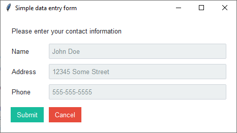
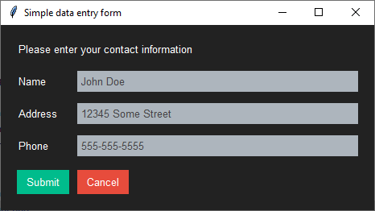

Simple Data Entry Form
======================
This simple data entry form accepts user input and then prints it to the screen when submitted. The overall theme is
**flatly** on the first example and **darkly** on the second, with the following styles applied to specific widgets:

    :Submit: ``style="info.TButton"``
    :Cancel: ``style="danger.TButton"``

Run this code live on repl.it_

.. _repl.it: https://replit.com/@IsraelDryer/simple-data-entry

.. literalinclude:: ../../src/ttkbootstrap/gallery/simple_data_entry.py
    :language: python
