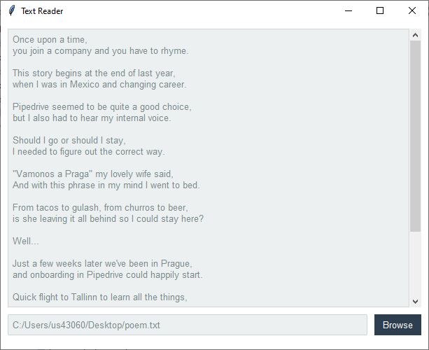

Text Reader
===========
This application opens a text file and puts the data into a scrolled text widget. The overall theme is **flatly**. The
``Style.colors`` property was used to adjust the highlight colors on the text widget.

Run this code live on repl.it_

.. _repl.it: https://replit.com/@IsraelDryer/text-reader

.. literalinclude:: ../../src/ttkbootstrap/gallery/text_reader.py
    :language: python

The poem used in this demonstration can be found here_.

.. _here: https://gist.githubusercontent.com/mrtnzlml/1e35b552b24e0637d2e3d1dcd9154de7/raw/95b055dd524a45df9a7d004a7bd310c031401d59/poem.txt
