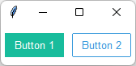
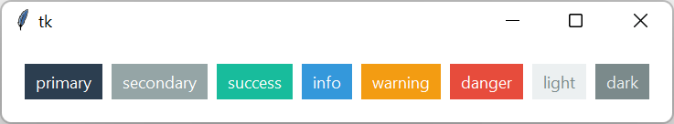
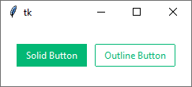

# 教程

## 创建应用程序

在构建 ttkbootstrap 应用程序时，可以使用两种方法。如果您使用过**tkinter**和**ttk**，则第一个是熟悉的。第二个使用新的[Window](../../api/window/window)类来简化整个过程。

### 传统方法

此方法使用熟悉的模式。但是，存在一些差异：

- 导入`ttkbootstrap`而不是`ttk`
- 使用`bootstyle`参数添加关键字，而不是使用`style`参数。

!!! note "常量是首选"
    我更喜欢代码中的常量而不是字符串。但是，请随意使用您觉得舒服的编码风格。bootstyle关键字API非常灵活，因此请务必[查看语法选项](#keyword-usage)。

```python
import tkinter as tk
import ttkbootstrap as ttk
from ttkbootstrap.constants import *

root = tk.Tk()

b1 = ttk.Button(root, text="Button 1", bootstyle=SUCCESS)
b1.pack(side=LEFT, padx=5, pady=10)

b2 = ttk.Button(root, text="Button 2", bootstyle=(INFO, OUTLINE))
b2.pack(side=LEFT, padx=5, pady=10)

root.mainloop()
```

上面的代码将生成带有两个按钮的此窗口。



### 新方法
可以使用新的[Window](../../api/window/window)类生成相同的结果，您可以在 API 文档中阅读有关该类的信息。起初，差异可能看起来很小，但正如您将看到的，`Window`类使用参数来设置许多属性和质量，而这些属性和质量只能在使用`Tk`类时使用方法进行设置。此外，`Style`对象会自动附加到`Window`对象，如后面的示例所示。

```python
import ttkbootstrap as ttk
from ttkbootstrap.constants import *

root = ttk.Window()

b1 = ttk.Button(root, text="Button 1", bootstyle=SUCCESS)
b1.pack(side=LEFT, padx=5, pady=10)

b2 = ttk.Button(root, text="Button 2", bootstyle=(INFO, OUTLINE))
b2.pack(side=LEFT, padx=5, pady=10)

root.mainloop()
```

## 选择主题
默认主题是**litera**，但您可以通过单独使用`Style`对象或通过`Window`类使用任何[内置主题](../themes/index.md)来启动应用程序。

```python
import ttkbootstrap as ttk

# 传统方法
root = ttk.Tk()
style = ttk.Style("darkly")

# 新方法
root = ttk.Window(themename="darkly")
```

## 使用主题小部件

ttkbootstrap 小部件具有[数十种预定义的样式](../styleguide/index.md) ，这些样式使用修改小部件**类型**和**颜色***的**关键字**进行应用。每个主题都定义了实际的颜色值。

例如，使用关键字**outline**将绘制一个具有外框 _类型_ 的按钮，但使用关键字**info**将更改外框和文本的 _颜色_ 。

### 样式颜色
下面的示例显示了每种颜色的按钮。

```python
import ttkbootstrap as ttk
from ttkbootstrap.constants import *

root = ttk.Window()

b1 = ttk.Button(root, text='primary', bootstyle=PRIMARY)
b1.pack(side=LEFT, padx=5, pady=5)

b2 = ttk.Button(root, text='secondary', bootstyle=SECONDARY)
b2.pack(side=LEFT, padx=5, pady=5)

b3 = ttk.Button(root, text='success', bootstyle=SUCCESS)
b3.pack(side=LEFT, padx=5, pady=5)

b4 = ttk.Button(root, text='info', bootstyle=INFO)
b4.pack(side=LEFT, padx=5, pady=5)

b5 = ttk.Button(root, text='warning', bootstyle=WARNING)
b5.pack(side=LEFT, padx=5, pady=5)

b6 = ttk.Button(root, text='danger', bootstyle=DANGER)
b6.pack(side=LEFT, padx=5, pady=5)

b7 = ttk.Button(root, text='light', bootstyle=LIGHT)
b7.pack(side=LEFT, padx=5, pady=5)

b8 = ttk.Button(root, text='dark', bootstyle=DARK)
b8.pack(side=LEFT, padx=5, pady=5)

root.mainloop()
```



我可以通过`Style.colors`对象使用更简单的方式创建这些按钮，其中包含对所有颜色的引用主题，它也是一个 _迭代器_ 。

至于`Style`对象，您可以使用`Style`类，或使用`Window`对象的`style`属性。

```python
import ttkbootstrap as ttk
from ttkbootstrap.constants import *

root = ttk.Window()

for color in root.style.colors:
    b = ttk.Button(root, text=color, bootstyle=color)
    b.pack(side=LEFT, padx=5, pady=5)
```

### 样式类型

**keyword**可以控制显示的小部件的**类型**。考虑
以下示例显示了一个**solid**和一个**outline**按钮。它们
都是按钮，但具有不同的**类型**。

```python
import ttkbootstrap as ttk
from ttkbootstrap.constants import *

root = ttk.Window()

b1 = ttk.Button(root, text="Solid Button", bootstyle=SUCCESS)
b1.pack(side=LEFT, padx=5, pady=10)

b2 = ttk.Button(root, text="Outline Button", bootstyle=(SUCCESS, OUTLINE))
b2.pack(side=LEFT, padx=5, pady=10)

root.mainloop()
```
如您所见，通过添加**outline**关键字，按钮已
从**solid**转换为**outline**按钮类型。



### 关键字用法

关于使用关键字的最后一点……**bootstyle**参数非常灵活。关键字的外观并不重要。后台有一个正则表达式，用于分析输入并将其转换为适当的 ttk 样式。您可以传入一串关键字，也可以传入可迭代的关键字，例如使用`列表`或`元组`。

以下所有变体都是合法的，并且将产生相同的样式。

* `"info-outline"`
* `"infooutline"`
* `"info outline"`
* `"outline-info"`
* `("info", "outline")`
* `(INFO, OUTLINE)`

!!! note "建议的关键字分隔符为短划线"
    如果使用**字符串**作为关键字，建议尽可能使用短划线分隔关键字，如上面的 _第一个_ 示例所示。

    如果使用**常量**，并且您使用的是多个关键字，则您应该使用`列表`或`元组`，如上面的 _最后一个_ 示例所示。