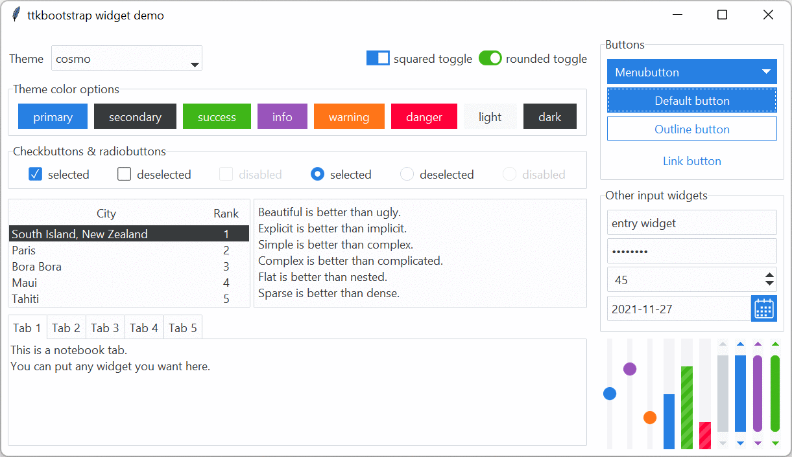

# ttkbootstrap

A supercharged theme extension for tkinter that enables on-demand modern 
flat style themes inspired by [Bootstrap](https://getbootstrap.com/).

**_Features include_:**

- customizable pre-defined styles

- simple keyword API (`bootstyle`) similar to **Bootstrap**

- new widgets: **Meter**, **DateEntry**, **Floodgauge**, **DatePickerPopup**

- many new styles for existing widgets, such as **Striped progressbar**, or **Toggle button**

- a built-in [theme creator]() if you want to create your own customized themed

**_Theme samples_:**<br>



## Installation

Easy peezy.

!!! note "Version 1.0 - Github Installation"
    This version includes the new API, but it is not 100% finished and is not
    yet published to PyPI. Don't worry, it's coming soon.
    ```bash
    python -m pip install git+https://github.com/israel-dryer/ttkbootstrap
    ```

Lemon squeezy.

!!! note "Version 0.5 - PyPI Installation"
    This version does not use the new keyword api. See the 0.5 
    [documentation](https://ttkbootstrap.readthedocs.io/en/version-0.5/)
    for examples, usage, and tutorials.
    ```bash
    python -m pip install ttkbootstrap
    ```


## Project goals
  
I set the following goals for myself when creating and updating this project;
especially for version 1.0. It is a work in progress, but hopefully I've 
achieved most or all of these.

#### Create a set of beautifully designed and easy-to-use styles

As you may know, creating ttk styles can be _very time-consuming_. This library 
takes the pain out of creating a modern look and feel so that you can focus on 
_designing your application_ instead of adjusting 25 style settings on a submit 
button.

#### Set the widget style with keywords

Keep it simple. Set the style with keywords. Stop using convoluted ttk style 
classes such as **success.Horizontal.TProgressbar**. Instead, use **success**, 
which is a keyword that can indicate the same semantic color meaning for _all_ 
widgets.

Many people are familiar with bootstrap for web developement which comes 
pre-packaged with built-in css style classes that provide a professional and 
consistent api for quick development. I took a similar approach with this 
project by pre-defining styles for nearly all ttk widgets, and which can be 
customized with simple _simple keywords_.

#### Only create themes and styles that are actually used

If you're not using it, then it shouldn't be taking up memory in your
application. Nothing bogs down your application more than a bunch of 
boilerplate predefined assets that you may or may not use. 

To fix this, I've designed a styling engine for ttk that builds ttk styles and 
themes _on demand_. If a style is not used, it will not be created. This adds a 
tremendous amount of flexibility in theme and style design as I am no longer 
limited by the memory limits of _pre-loaded image-based widget styles_. 

To put this into perspective... in version 0.5, if I had a single scale widget 
in my application, I would need to load 288 images to account for all potential 
theme and color combinations!! This is how styles are handled traditionally in 
ttk. In version 1.0, I only need to load 3 or 4 images for this example to 
account for hover effects, etc...  Only the styles actually used are built. 

## Legacy support

Some ttk widgets utilize existing tkinter widgets under the hood. For example: 
there is a tkinter popdown list in the **Combobox**, and a legacy tkinter widget 
inside the **OptionMenu**. To make sure these widgets don't stick out like a 
sore thumb, I have applied default styling to ensure the look and feel is 
consistent across the board.

## Quickstart

#### Creating an application
If you've used **tkinter** and **ttk**, the following example will look familiar. 
I'll explain a few of the differences.

- import `ttkbootstrap` instead of `ttk`
- use the `bootstyle` parameter to add keywords instead of `style`

```python
import tkinter as tk
import ttkbootstrap as ttk

root = tk.Tk()
style = ttk.Style()

b1 = ttk.Button(root, text="Button 1", bootstyle="success")
b1.pack(side=tk.LEFT, padx=5, pady=10)

b2 = ttk.Button(root, text="Button 2", bootstyle="info-outline")
b2.pack(side=tk.LEFT, padx=5, pady=10)

root.mainloop()
```

The code above will produce this window with two buttons.


#### Choosing a theme

The default theme is **litera**, but you can start the application with any of 
the [built-in themes](themes.md) by passing in the theme name when you create 
the style object.

```python
>>> style = Style("darkly")
```

!!! danger "Style is not a class in **ttkbootstrap**!"
    In ttkbootstrap, `Style` is a function that returns an instance of a 
    `StyleManager` class which manages the themes and predefined styles. This
    class is not intended to be inherited.

#### Use themed widgets

ttkbootstrap widgets have [dozens of predefined styles](styleguide.md) which are 
applied using **keywords** that modify both the **type** and **color** of the 
widget. The actual color values are defined for each theme.

For example, using the keyword **outline** would draw a button with an outline 
_type_, but using the keyword **info** would change the _color_ of the outline
and text.

##### Style Colors
The example below shows a button for every color.

```python
import tkinter as tk
import ttkbootstrap as ttk

root = tk.Tk()
style = ttk.Style()

b1 = ttk.Button(root, text='primary', bootstyle='primary')
b1.pack(side=tk.LEFT, padx=5, pady=5)

b2 = ttk.Button(root, text='secondary', bootstyle='secondary')
b2.pack(side=tk.LEFT, padx=5, pady=5)

b3 = ttk.Button(root, text='success', bootstyle='success')
b3.pack(side=tk.LEFT, padx=5, pady=5)

b4 = ttk.Button(root, text='info', bootstyle='info')
b4.pack(side=tk.LEFT, padx=5, pady=5)

b5 = ttk.Button(root, text='warning', bootstyle='warning')
b5.pack(side=tk.LEFT, padx=5, pady=5)

b6 = ttk.Button(root, text='danger', bootstyle='danger')
b6.pack(side=tk.LEFT, padx=5, pady=5)

b7 = ttk.Button(root, text='light', bootstyle='light')
b7.pack(side=tk.LEFT, padx=5, pady=5)

b8 = ttk.Button(root, text='dark', bootstyle='dark')
b8.pack(side=tk.LEFT, padx=5, pady=5)

root.mainloop()
```


I could have created those buttons in a simpler fashion by using the 
`Style.colors` object, which contains a reference to all colors used in the 
theme, and which is also an _iterator_.

```python
for color in style.colors:
    b = ttk.Button(root, text=color, bootstyle=color)
    b.pack(side=tk.LEFT, padx=5, pady=5)
```

##### Style Types

The **keyword** can control the **type** of widget that is presented. Consider 
the following example, which shows a **solid** and an **outline** button. They
are both buttons, but of different **types**.

```python
import tkinter as tk
import ttkbootstrap as ttk

root = tk.Tk()
style = ttk.Style()

b1 = ttk.Button(root, text="Solid Button", bootstyle="success")
b1.pack(side=tk.LEFT, padx=5, pady=10)

b2 = ttk.Button(root, text="Outline Button", bootstyle="success-outline")
b2.pack(side=tk.LEFT, padx=5, pady=10)

root.mainloop()
```
As you can see, by adding the **outline** keyword, the button has been
transformed from a **solid** to an **outline** button type.


##### Keyword usage

On final note on using keywords... the **bootstyle** parameter is VERY flexible. 
It doesn't really matter how the keyword looks. There is a regex expression in 
the background that parses the input and converts it into the appropriate ttk 
style.

All of the following variations are legal and will result in the same style.

* `"info-outline"`
* `"infooutline"`
* `"info outline"`
* `"outline-info"`
* `("info", "outline")`

!!! note "The recommended keyword separator is a dash"
    While you can use any convention that you want as long as it works, it is
    recommended to separate the keywords using a dash when possible. Otherwise,
    it may sometimes be necessary or more convenient to use a `list` or `tuple`.