# Style Guide

This is a style guide for applying ttkbootstrap styles. All ttkbootstrap styles
are applied using the `bootstyle` parameter that has been injected into the
`ttk` widget constructor.

## Colors

The following color options are available on _all_ widgets, except where 
excluded, and can be used along with widget specific style keywords which 
are described for each widget. Keywords are not required for default styles. 

The actual color value of the keywords below are 
[defined in each specific theme](themes.md#how-are-themes-created), but the 
descriptions below are what you can expect typically from each color keyword.

| Keyword      | Description                           | Example |
| ---          | ---                                   | ---      |
| primary    | The default color for most widgets    |  |
| secondary  | Typically a _gray_ color              |  |
| success    | Typically a _green_ color             |  |
| info       | Typically a _blue_ color              |  |
| warning    | Typically an _orange_ color           |  |
| danger     | Typically a _red_ color               |  |
| light      | Typically a _light gray_ color        |  |
| dark       | Typically a _dark gray_ color         |  |


```python
# info colored button style
Button(bootstyle="info")

# warning colored scale style
Scale(bootstyle="warning")

# success colored progressbar
Progressbar(bootstyle="success")
```

---
## Button

ttkbootstrap includes many predefined button styles that provide quick 
access to a varied [color palette](#colors) and adds semantic meaning to your 
application design. 

This widget supports a special style for [disabled state](#other-button-styles).

### Solid button (default)

A solid background color that lightens on _hover_ and darkens on _press_. When
the widget has focus, a dashed focus ring appears in the same color as the
text foreground.


```python
# default style
Button()

# success style
Button(bootstyle="success")
```

### Outline button

A thin outline with a background color that matches the theme default. When the
widget has focus, a dashed focus ring appears in the same color as the text 
foreground.


```python
# default outline style
Button(bootstyle="outline")

# success outline style
Button(bootstyle="success-outline")
```

### Link button

A button with the appearance of a label. The text color changes to **info** on 
_hover_. When the widget has focus, a dashed focus ring appears in the same color 
as the foreground. On _press_ the text has a slight shift-relief.


```python
# default link style
Button(bootstyle="link")

# success link style
Button(bootstyle="success-link")
```

### Other button styles

##### Disabled button
This style _cannot be applied via keywords_; it is configured through widget 
settings.

```python
# create the button in a disabled state
Button(state="disabled")

# disable a button after creation
b = Button()
b.configure(state="disabled")
```

---
## Checkbutton

ttkbootstrap includes many checkbutton types. In addition to the traditional 
[checkbutton](#checkbutton) and [toolbutton](#toolbutton) styles, 
[round](#round-toggle-button) and [square](#square-toggle-button) toggle 
button styles have been added. 

This widget supports a special style for 
[disabled state](#other-checkbutton-styles).

### Checkbutton (default)

A standard checkbutton which displays a checkmark when invoked. The indicator
color is set by the selected [color keyword](#colors). 


```python
# default checkbutton style
Checkbutton()

# success checkbutton style
Checkbutton(bootstyle="success")
```

### Toolbutton

A solid color toolbutton with a background that alternates between colors when 
invoked. The _off_ state color is fixed, but the _on_ state color is based on the 
[color keyword](#colors) selected as indicated below.


```python
# default toolbutton style
Checkbutton(bootstyle="toolbutton")

# success toolbutton style
Checkbutton(bootstyle="success-toolbutton")
```

### Outline toolbutton

A thin outlined button with a background color that alternates between the theme
background color and the outline color. The _on_ state color is based on the 
[color keyword](#colors) as indicated below.


```python
# default outline toolbutton style
Checkbutton(bootstyle="outline-toolbutton")

# success outline toolbutton style
Checkbutton(bootstyle="success-outline-toolbutton")
```

### Round toggle button

A rounded toggle button with an indicator that shifts left and right as it is 
toggled _on_ and _off_. The background color alternates between the theme 
background color and the [color keyword](#colors) selected as indicated below.


```python
# default round toggle style
Checkbutton(bootstyle="round-toggle")

# success round toggle style
Checkbutton(bootstyle="success-round-toggle")
```

### Square toggle button

A square toggle button with an indicator that shifts left and right as it is 
toggled _on_ and _off_. The background color alternates between the theme 
background color and the [color keyword](#colors) selected as indicated below.


```python
# default square toggle style
Checkbutton(bootstyle="square-toggle")

# success square toggle style
Checkbutton(bootstyle="success-square-toggle")
```

### Other checkbutton styles

##### Disabled checkbutton
This style _cannot be applied via keywords_; it is configured through widget 
settings.

```python
# create the checkbutton in a disabled state
Checkbutton(state="disabled")

# disable a checkbutton after creation
cb = Checkbutton()
cb.configure(state="disabled")
```

---
## Combobox

This widget has a colored border that has _hover_ and _focus_ effects. When 
hovering, this border changes to a thin **primary** color by default or the 
selected [color](#colors). When focused, the border becomes twice a thick. 

This widget also supports special styles for [disabled state](#disabled-combobox), 
[readonly state](#readonly-combobox), and [invalid state](#invalid-combobox).


```python
# default combobox style
Combobox()

# danger colored combobox style
Combobox(bootstyle="danger")
```

### Other combobox styles

##### Disabled combobox

This style _cannot be applied via keywords_; it is configured through widget 
settings.

```python
# create the combobox in a disabled state
Combobox(state="disabled")

# disable a combobox after creation
cb = Combobox()
cb.configure(state="disabled")
```

##### Readonly combobox

This style _cannot be applied via keywords_; it is configured through widget 
settings.


```python
# create the combobox in a readonly state
Combobox(state="readonly")

# set the combobox readonly state after creation
cb = Combobox()
cb.configure(state="readonly")
```

##### Invalid combobox

This style _cannot be applied via keywords_, but rather is the result of a 
validation process implemented on the widget. In the **Cookbook** you will find 
an example of [how to apply validation](cookbook.md#validate-user-input) to an 
`Entry` based widget.

---
## DateEntry

This widget is composed of two widgets, the `Entry` widget and the `Button` 
widget. Both the `Entry` widget and the `Button` widget use the same default
styles as their independent versions. 

The [DatePickerPopup](#datepickerpopup) is invoked when the calendar
button is pressed. The default color applied to the popup is **primary**.

This widget also supports special styles for [disabled state](#disabled-date-entry), 
[readonly state](#readonly-date-entry),  and [invalid state](#invalid-date-entry).


```python
# default date entry
DateEntry()

# success colored date entry
DateEntry(bootstyle="success")
```

### Other date entry styles

##### Disabled date entry

This style _cannot be applied via keywords_; it is configured through widget 
settings.

```python
# create the date entry in a disabled state
DateEntry(state="disabled")

# disable a date entry after creation
d = DateEntry()
d.configure(state="disabled")
```

##### Readonly date entry

This style _cannot be applied via keywords_; it is configured through widget 
settings.

```python
# create the date entry in a readonly state
DateEntry(state="readonly")

# set the date entry readonly state after creation
d = DateEntry()
d.configure(state="readonly")
```

##### Invalid date entry

This style _cannot be applied via keywords_, but rather is the result of a 
validation process implemented on the widget. In the **Cookbook** you will find 
an example of [how to apply validation](cookbook.md#validate-user-input) to an 
`Entry` based widget.

---
## DatePickerPopup

By default, this widget uses the `primary` color for the _header_ and
_active date_. The _weekdays header_ and _current date_ use the `secondary`
color by default.

**add detail here**

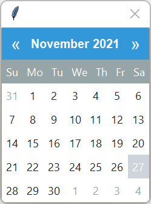

```python
# default popup
DatePickerPopup()

# warning colored popup
DatePickerPopup(bootstyle="warning")
```

---
## Entry

This widget has a colored border that has _hover_ and _focus_ effects. When 
hovering, this border changes to a thin **primary** color by default or the 
selected [color](#colors). When focused, the border becomes twice a thick. 

This widget also supports special styles for [disabled state](#disabled-entry), 
[readonly state](#readonly-entry), and [invalid state](#invalid-entry).


```python
# default entry style
Entry()

# danger colored entry style
Entry(bootstyle="danger")
```

### Other entry styles

##### Disabled entry

This style _cannot be applied via keywords_; it is configured through widget 
settings.

```python
# create the widget in a disabled state
Entry(state="disabled")

# disable the widget after creation
e = Entry()
e.configure(state="disabled")
```

##### Readonly entry

This style _cannot be applied via keywords_; it is configured through widget 
settings.

```python
# create the widget in a readonly state
Entry(state="readonly")

# set the widget readonly state after creation
e = Entry()
e.configure(state="readonly")
```

##### Invalid entry

This style _cannot be applied via keywords_, but rather is the result of a 
validation process implemented on the widget. In the **Cookbook** you will find 
an example of [how to apply validation](cookbook.md#validate-user-input) to an 
`Entry` based widget.

---
## Floodgauge

A progressbar with an optional display text.

The indicator is **primary** color by default or the [selected color](#colors).
The trough color is a desaturated variation of the indicator color. This 
ensures that, for the most part, the text is still visible when the indicator 
is not underneath directly underneath text.

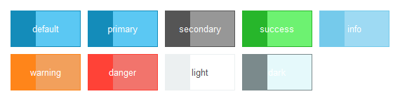

```python
# default floodgauge style
Floodgauge()

# success colored floodguage style
Floodgauge(bootstyle="success")
```

---
## Frame

This widget container has a default background color that matches the **bg**
color for the selected theme; however any of the [available colors](#colors)
can be used to style the background color.

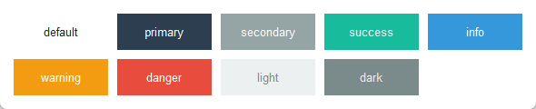

```python
# default frame style
Frame()

# info colored frame style
Frame(bootstyle="info")
```

---
## Label

A standard textual widget that can be customized with **type** and **color** 
keywords in order to adjust the background and foreground colors. By default
the foreground and background colors are defined by the theme using the 
**bg** and **fg** theme colors.

### Default label

The foreground can be customized with any of the [available colors](#colors). 
The background color for this style is the default theme defined background 
color.

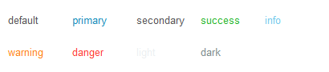

```python
# default label style
Label()

# danger colored label style
Label(bootstyle="danger")
```

### Inverse label

The colors for this style are an inverted version of the _normal_ style. The 
foreground color becomes the background color, and vice versa. This is
especially useful when you are adding labels to a colored `Frame`, or you want
to add a [label heading](gallery.md#media-player) that does not have a default 
background color.

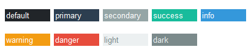

```python
# default inverse label style
Label(bootstyle="inverse")

# danger colored inverse label style
Label(bootstyle="inverse-danger")
```

---
## Labelframe

This widget container has a border and a label. The default color for the
border is typically the themed defined border color. The default text color
is the same as the [default label](#default-label).

If any of the [color keywords](#colors) are used, both the border and the 
label will use the same color, as illustrated in the exhibit below.


```python
# default labelframe style
Labelframe()

# info colored labelframe style
Labelframe(bootstyle="info")
```

## Menubutton

A button with an arrow. The default background color is **primary**, but any 
of the [available colors](#colors) can be used to modify the background color. 
The foreground color is the theme defined **selectbg** color unless otherwise 
specified in the style builder, and styles both the text and the arrow.

This widget supports a special style for [disabled state](#disabled-menubutton).

### Solid (default)

A solid background color that lightens on _hover_ and darkens on _press_. 


```python
# default solid menubutton style
Menubutton()

# success colored solid menubutton style
Menubutton(bootstyle="success")
```

### Outline

A thin outline with a background color that matches the theme default. When 
the widget is active, the foreground and background colors reverse.


```python
# default outline menubutton style
Menubutton(bootstyle="outline")

# info colored outline menubutton style
Menubutton(bootstyle="info-outline")
```

### Other menubutton styles

##### Disabled menubutton
This style _cannot be applied via keywords_; it is configured through widget 
settings.

```python
# create the menubutton in a disabled state
Menubutton(state="disabled")

# disable a menubutton after creation
b = Menubutton()
b.configure(state="disabled")
```

## Meter

The indicator and main label on this widget are **primary** colored by 
default. The subtext can be styled as well, and is **secondary** by default
for light themes and **light** for dark themes. However, all of these 
elements can be configured to any of the [available colors](#colors).

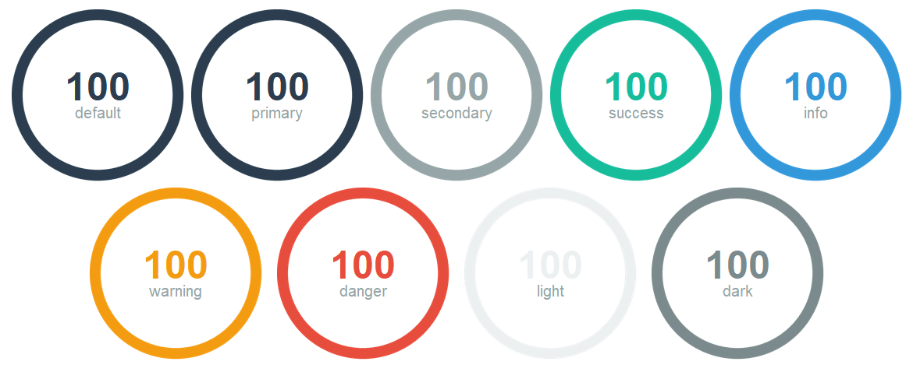

The meter widget is highly configurable, and can produce a diversity of
interesting meters by mixing colors and other widget specific settings.


```python
# default meter style
Meter()

# info colored meter
Meter(bootstyle="info")

# danger color subtext
Meter(subtextstyle="danger")

# success colored meter with warning colored subtext
Meter(bootstyle="success", subtextstyle="warning")
```

## Notebook

This container widget has minimal styling by default. However, you can add some
flair to the _inactive_ tab by using any of the [available colors](#colors) as 
demonstrated in the exhibit below.


```python
# default notebook style
Notebook()

# info colored notebook style - inactive tab color
Notebook(bootstyle="info")
```

## Panedwindow

This container widget has a background color that is the same as the default **bg**
color for the seleted theme. The sash is a light-gray typically. However, you can add 
some flair to the _sash_ by using any of the [available colors](#colors) as 
demonstrated in the exhibit below.


```python
# default panedwindow style
Panedwindow()

# info colored panedwindow style
Panedwindow(bootstyle="info")
```

## Progressbar

This widget has a **primary** colored indicator by default, but can be colored
any of the [available colors](#colors).

### Solid (default)

The default style for a progressbar; has as solid color indicator which is either
**primary** by default or the [selected color](#colors).


```python
# default solid progressbar style
Progressbar()

# success colored solid progressbar style
Progressbar(bootstyle="success")
```


### Striped

A striped indicator where the dark line uses **primary** or the 
[selected color](#colors), and the light line uses a desaturated version of the 
same color.


```python
# default striped progressbar style
Progressbar(bootstyle="striped")

# danger colored striped progressbar style
Progressbar(bootstyle="danger-striped")
```

## Radiobutton

ttkbootstrap includes several radiobutton types that can be styled using
any of the [available colors](#colors).   
This widget supports a special style for 
[disabled state](#other-radiobutton-styles).

### Radio (default)

The default radiobutton type is the traditional **radiobutton** which has a
round indicator that is **primary** by default when selected with a small
white circle in the center that matches the **selectfg** color for the
selected theme. However, any of the [available colors](#colors) can be used
to style the selected indicator as shown in the exhibit below.


```python
# default radiobutton style
Radiobutton()

# secondary colored radiobutton style
Radiobutton(bootstyle="secondary")
```

### Solid toolbutton

When selected, the color is **primary** by default or the 
[selected color](#colors). When deselected, the button color is typically
a muted gray, but can vary by theme.

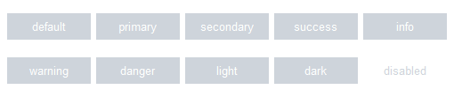

```python
# default toolbutton style
Radiobutton(bootstyle="toolbutton")

# danger colored radio toolbutton style
Radiobutton(bootstyle="danger-toolbutton")
```

### Outline toolbutton

When selected, the background color is **primary** by default, or the
[selected color](#colors). When deselected, the background color matches
the selected theme default, and there is a thin border that matches the
default or selected color.

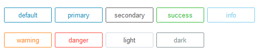

```python
# default outline radio toolbutton style
Radiobutton(bootstyle="outline-toolbutton")

# info colored outline radio toolbutton style
Radiobutton(bootstyle="info-outline-toolbutton")
```

### Other radiobutton styles

##### Disabled radiobutton
This style _cannot be applied via keywords_; it is configured through widget 
settings.

```python
# create the radiobutton in a disabled state
Radiobutton(state="disabled")

# disable a radiobutton after creation
rb = Radiobutton()
rb.configure(state="disabled")
```

## Scale

This widget has a slider handle that is **primary** by default or the 
[selected color](#colors). When _hovering_, the color lightens slightly and
darkens when _pressed_.

This widget supports a special style for 
[disabled state](#other-scale-styles).

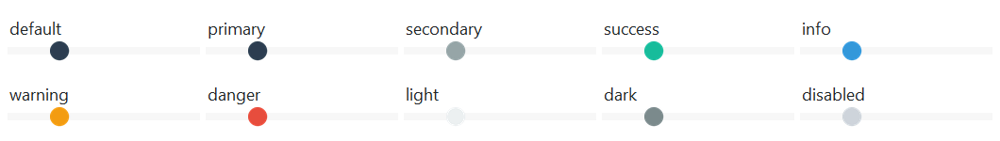

```python
# default Scale style
Scale()

# info colored label style
Scale(bootstyle="info")
```

### Other scale styles

##### Disabled scale
This style _cannot be applied via keywords_; it is configured through widget 
settings.

```python
# create the scale in a disabled state
Scale(state="disabled")

# disable a scale after creation
scale = Scale()
scale.configure(state="disabled")
```

## Scrollbar

**add detail here**

### Square (default)

**add detail here**

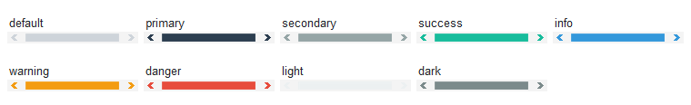

### Round

**add detail here**

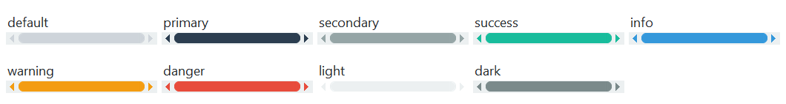

```python
# default scrollbar style
Scrollbar()

# success colored default scrollbar style
Scrollbar(bootstyle="success")

# default round scrollbar style
Scrollbar(bootstyle="round")

# danger colored round scrollbar style
Scrollbar(bootstyle="danger-round")
```

## Separator

**add detail here**


```python
# default separator style
Separator()

# info colored separator style - handle color
Separator(bootstyle="info")
```

## Sizegrip

**add detail here**


```python
# default separator style
Sizegrip()

# info colored separator style - handle color
Sizegrip(bootstyle="info")
```

## Spinbox

**add detail here**

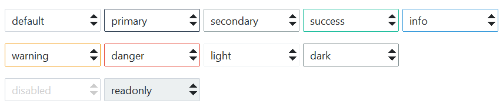

```python
# default spinbox style
Spinbox()

# danger colored spinbox style
Spinbox(bootstyle="danger")
```

### Other styles

##### Disabled

This widget supports a style reserved for the **disabled** state, which you 
can see in the exhibit above. This style _cannot be applied via keywords_. To 
apply the disabled style:

```python
# create the widget in a disabled state
Spinbox(state="disabled")

# disable the widget after creation
e = Spinbox()
e.configure(state="disabled")
```

##### Readonly

This widget supports a style reserved for the **readonly** state, which you 
can see in the exhibit above. This style _cannot be applied via keywords_.  To 
apply the readonly style:

```python
# create the widget in a readonly state
Spinbox(state="readonly")

# set the widget readonly state after creation
e = Spinbox()
e.configure(state="readonly")
```

##### Invalid

Add content here.

## Treeview

**add detail here**


```python
# default Treeview style
Treeview()

# info colored treeview style
Treeview(bootstyle='info')
```


