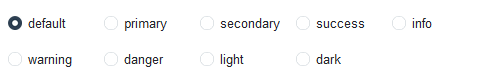
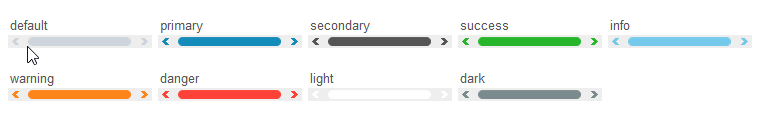

# Style Guide

This is a style guide for applying ttkbootstrap styles. All ttkbootstrap styles
are applied using the `bootstyle` parameter that has been injected into the
`ttk` widget constructor.

As this is a style guide, you will need to consult the references at the bottom
of each widget section for information on how to _use_ the widget and to determine
what ttk option are available. 

## Colors

The following color options are available on all widgets, except where excluded,
and can be used along with widget specific style keywords which are described for
each widget. Keywords are not required for default styles. 

The actual color value of the color keywords are defined in each specific theme, 
but the descriptions below are what you can expect typically from each color keyword.

| Keyword      | Description                           | Example |
| ---          | ---                                   | ---      |
| `primary`    | The default color for most widgets    |  |
| `secondary`  | Typically a _gray_ color              |  |
| `success`    | Typically a _green_ color             |  |
| `info`       | Typically a _blue_ color              |  |
| `warning`    | Typically an _orange_ color           |  |
| `danger`     | Typically a _red_ color               |  |
| `light`      | Typically a _light gray_ color        |  |
| `dark`       | Typically a _dark gray_ color         |  |


```python
# info colored button style
Button(bootstyle="info")

# warning colored scale style
Scale(bootstyle="warning")

# success colored progressbar
Progressbar(bootstyle="success")
```

---
## Button

ttkbootstrap includes many predefined button styles that provide quick 
access to a varied color palette and semantic meaning to your application
design.

### Solid buttons (default)

A solid background color that lightens on _hover_ and darkens on _press_. When
the widget has focus, a dashed focus ring appears in the same color as the
text foreground.


```python
# default style
Button()

# success style
Button(bootstyle="success")
```

### Outline buttons

A thin outline with a background color that matches the theme default. When the
widget has focus, a dashed focus ring appears in the same color as the text 
foreground.


```python
# default outline style
Button(bootstyle="outline")

# success outline style
Button(bootstyle="success-outline")
```

### Link buttons

A button with the appearance of a label. The text color changes to **info** on 
_hover_. When the widget has focus, a dashed focus ring appears in the same color 
as the foreground. 


```python
# default link style
Button(bootstyle="link")

# success link style
Button(bootstyle="success-link")
```

---
## Checkbutton

ttkbootstrap includes many types of checkbutton styles. In addition to the
traditional checkbutton and toolbutton styles, round and square toggle buttons
have been added.

### Checkbutton (default)

A standard checkbutton which displays a checkmark when invoked. The indicator
color is set by the selected color keyword.


```python
# default checkbutton style
Checkbutton()

# success checkbutton style
Checkbutton(bootstyle="success")
```

### Toolbutton

A solid color button with a background that alternates between colors when invoked.
The _off_ state color is always the **secondary** color of the selected theme. The 
_on_ state color is based on the [color keyword](#colors) as indicated below.


```python
# default toolbutton style
Checkbutton(bootstyle="toolbutton")

# success toolbutton style
Checkbutton(bootstyle="success-toolbutton")
```

### Outline toolbutton

A thin outlined button with a background color that alternates between the theme
background color and the outline color. The _on_ state color is based on the 
[color keyword](#colors) as indicated below.


```python
# default outline toolbutton style
Checkbutton(bootstyle="outline-toolbutton")

# success outline toolbutton style
Checkbutton(bootstyle="success-outline-toolbutton")
```

### Round toggle button

A rounded toggle button with an indicator that shifts left and right as it is toggled
on and off. The background color alternates between the theme background color and
the [color keyword](#colors) as indicated below.


```python
# default round toggle style
Checkbutton(bootstyle="round-toggle")

# success round toggle style
Checkbutton(bootstyle="success-round-toggle")
```

### Square toggle button

A square toggle button with an indicator that shifts left and right as it is toggled
on and off. The background color alternates between the theme background color and
the [color keyword](#colors) as indicated below.


```python
# default square toggle style
Checkbutton(bootstyle="square-toggle")

# success square toggle style
Checkbutton(bootstyle="success-square-toggle")
```

---
## Combobox

By default, the combobox widget has a light colored border. On _hover_ this border
changes to a thin **primary** color by default or the selected [color](#colors). 
On _focus_ the border becomes twice a thick.


```python
# default combobox style
Combobox()

# danger colored combobox style
Combobox(bootstyle="danger")
```

---
## DateEntry

This widget is composed of two widgets, the `Entry` widget and the `Button` 
widget. Both the `Entry` widget and the `Button` widget use the same default
styles as their independent versions.

The [DatePickerPopup](#datepickerpopup) is invoked when the calendar
button is pressed. The default color applied to the popup is **primary**.


```python
# default dateentry
DateEntry()

# success colored dateentry
DateEntry(bootstyle="success")
```

---
## DatePickerPopup

By default, this widget uses the `primary` color for the _header_ and
_active date_. The _weekdays header_ and _current date_ use the `secondary`
color by default.

**add detail here**


```python
# default popup
DatePickerPopup()

# warning colored popup
DatePickerPopup(bootstyle="warning")
```

---
## Entry

**add detail here**


```python
# default entry style
Entry()

# danger colored entry style
Entry(bootstyle="danger")
```

---
## Floodgauge

**add detail here**


```python
# default floodgauge style
Floodgauge()

# success colored floodguage style
Floodgauge(bootstyle="success")
```

---
## Frame

**add detail here**


```python
# default frame style
Frame()

# info colored frame style
Frame(bootstyle="info")
```

---
## Label

**add detail here**

### Normal (default)


### Inverse


```python
# default label style
Label()

# danger colored label style
Label(bootstyle="danger")

# default inverse label style
Label(bootstyle="inverse")

# danger colored inverse label style
Label(bootstyle="inverse-danger")
```

---
## Labelframe

**add detail here**


```python
# default labelframe style
Labelframe()

# info colored labelframe style
Labelframe(bootstyle="info")
```

## Menubutton

**add detail here**

### Solid (default)

**add detail here**


### Outline

**add detail here**


```python
# default solid menubutton style
Menubutton()

# success colored solid menubutton style
Menubutton(bootstyle="success")

# default outline menubutton style
Menubutton(bootstyle="outline")

# info colored outline menubutton style
Menubutton(bootstyle="info-outline")
```

## Meter

By default, the background color for this widget is the same as the theme 
background color, the _indicator_ and _text_ are set to `primary`. 
The _subtext_ is set to `secondary` if the theme is _light_ or `selectbg` 
if the theme is _dark_, which is a color not accessible via keywords. 

In the widget constructor, use the `bootstyle` parameter to customize the 
_indicator_ and _text_ element colors. Use the `subtextstyle` to customize 
the _subtext_ element color.


```python
# default meter style
Meter()

# info colored meter
Meter(bootstyle="info")

# danger color subtext
Meter(subtextstyle="danger")

# success colored meter with warning colored subtext
Meter(bootstyle="success", subtextstyle="warning")
```

## Notebook

**add detail here**


```python
# default notebook style
Notebook()

# info colored notebook style - inactive tab color
Notebook(bootstyle="info")
```

## Panedwindow

**add detail here**


```python
# default panedwindow style
Panedwindow()

# info colored panedwindow style
Panedwindow(bootstyle="info")
```

## Progressbar

**add detail here**

### Solid (default)

**add detail here**


### Striped

**add detail here**


```python
# default solid progressbar style
Progressbar()

# success colored solid progressbar style
Progressbar(bootstyle="success")

# default striped progressbar style
Progressbar(bootstyle="striped")

# danger colored striped progressbar style
Progressbar(bootstyle="danger-striped")
```

## Radiobutton

**add detail here**

### Radio (default)

**add detail here**



### Solid toolbutton

**add detail here**


### Outline toolbutton

**add detail here**


```python
# default radiobutton style
Radiobutton()

# secondary colored radiobutton style
Radiobutton(bootstyle="secondary")

# default toolbutton style
Radiobutton(bootstyle="toolbutton")

# danger colored radio toolbutton style
Radiobutton(bootstyle="danger-toolbutton")

# default outline radio toolbutton style
Radiobutton(bootstyle="outline-toolbutton")

# info colored outline radio toolbutton style
Radiobutton(bootstyle="info-outline-toolbutton")
```

## Scale

**add detail here**


```python
# default Scale style
Scale()

# info colored label style
Scale(bootstyle="info")
```

## Scrollbar

**add detail here**

### Square (default)
**add detail here**


### Round
**add detail here**


```python
# default scrollbar style
Scrollbar()

# success colored default scrollbar style
Scrollbar(bootstyle="success")

# default round scrollbar style
Scrollbar(bootstyle="round")

# danger colored round scrollbar style
Scrollbar(bootstyle="danger-round")
```

## Separator
**add detail here**


```python
# default separator style
Separator()

# info colored separator style - handle color
Separator(bootstyle="info")
```

## Sizegrip
**add detail here**


```python
# default separator style
Sizegrip()

# info colored separator style - handle color
Sizegrip(bootstyle="info")
```

## Spinbox
**add detail here**


```python
# default spinbox style
Spinbox()

# danger colored spinbox style
Spinbox(bootstyle="danger")
```

## Treeview

**add detail here**


```python
# default Treeview style
Treeview()

# info colored treeview style
Treeview(bootstyle='info')
```


