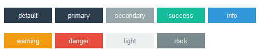
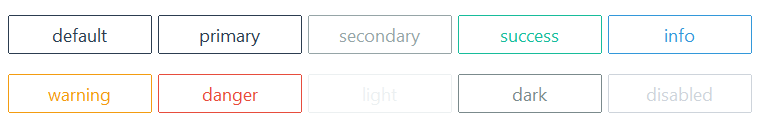
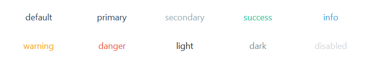

# 按钮

此小部件具有多种按钮样式类型，它们使用**primary**作为默认颜色，或[选定的颜色](index.md#colors)。

此小部件支持[禁用状态](#other-button-styles)的特殊样式。

## 实心按钮（默认）

默认样式具有纯色背景，在 _鼠标悬浮_ 和 _按下_ 时变暗。当小部件被聚焦时，按钮内会出现一个虚线环。



```python
# 默认样式
Button()

# success样式
Button(bootstyle="success")
```

## 外框按钮

这种风格的特点是具有纤细的轮廓。当 _鼠标悬浮_ 或 _按下_ 时，
按钮变为类似于默认按钮样式的纯色。当小部件被聚焦时，按钮内会出现一个虚线环。



```python
# default outline style
Button(bootstyle="outline")

# success outline style
Button(bootstyle="success-outline")
```

## 链接按钮

此样式具有带有标签外观的按钮。当 _鼠标悬浮_ 或 _按下_ 时，文字颜色改变为**info**以模拟您期望的HTML 超链接效果。按下按钮时会有轻微的虚线框效果。当小部件被聚焦时，它会展现被激活的外观。



```python
# default link style
Button(bootstyle="link")

# success link style
Button(bootstyle="success-link")
```

## 其他按钮样式

#### 禁用按钮
这种风格 _不能通过关键字应用_；它是通过小部件配置的设置。

```python
# create the button in a disabled state
Button(state="disabled")

# disable a button after creation
b = Button()
b.configure(state="disabled")
```