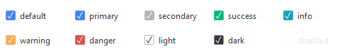
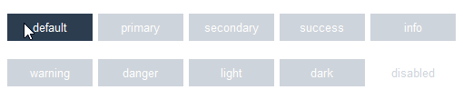
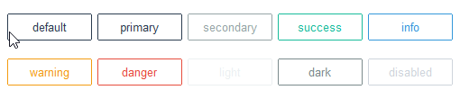

# 检查按钮

此小部件具有多种检查按钮样式类型，默认为 **primary** 颜色或 [选定颜色](index.md#colors)。

这个小部件支持一种特殊的样式
[禁用状态](#other-checkbutton-styles)。

## 复选按钮（默认）

默认样式具有方形复选框和标签。该复选框在未选中时具有柔和的颜色轮廓，在选中时具有带复选标记的实心正方形。



```python
# 默认检查按钮样式
Checkbutton()

# success检查按钮样式
Checkbutton(bootstyle="success")
```

## 工具按钮

这种风格有一个实心矩形按钮，可以在 _关闭_ 和 _启用_ 颜色之间切换。 _关闭_ 时背景为柔和的灰色，_启用_ 或 _激活_ 时为默认或 [选定颜色](index.md#colors)。



```python
# 默认工具按钮样式
Checkbutton(bootstyle="toolbutton")

# 成功工具按钮样式
Checkbutton(bootstyle="success-toolbutton")
```

## 外框工具按钮

此样式具有一个矩形按钮，可在样式之间切换
 _关闭_ 时为**outline**，_启用_ 或 _激活_ 时为**solid**背景。



```python
# 默认外框工具按钮样式
Checkbutton(bootstyle="outline-toolbutton")

# success外框工具按钮样式
Checkbutton(bootstyle="success-outline-toolbutton")
```

## 圆形切换按钮

这种风格的特点是带有**圆形**指示器的圆形按钮，当切换 _关闭_ 和 _启用_ 时会改变颜色和位置。 _关闭_ 时，该按钮是一个带有静音颜色指示器的静音轮廓。 _启用_ 时，该按钮将填充默认或 [选定颜色](index.md#colors) 并带有重音指示符。


```python
# 默认圆形切换样式
Checkbutton(bootstyle="round-toggle")

# success圆形切换样式
Checkbutton(bootstyle="success-round-toggle")
```

## 方形切换按钮

这种风格的特点是带有**square** 指示器的方形按钮，当切换 _关闭_ 和 _启用_ 时会改变颜色和位置。 _关闭_ 时，该按钮是一个带有关闭颜色指示器的关闭轮廓； _启用_ 时，该按钮将填充默认或 [选定颜色](index.md#colors) 并带有启用指示符。


```python
# 默认方形切换样式
Checkbutton(bootstyle="square-toggle")

# success方形切换样式
Checkbutton(bootstyle="success-square-toggle")
```

## 其他检查按钮样式

#### 禁用复选按钮
这种风格 _不能通过关键字应用_；它是通过小部件设置进行配置的。

```python
# 创建处于禁用状态的复选按钮
Checkbutton(state="disabled")

# 创建后禁用复选按钮
cb = Checkbutton()
cb.configure(state="disabled")
```