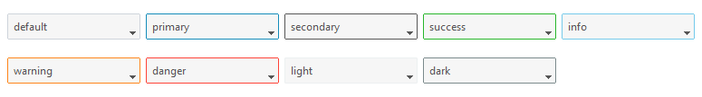

# 下拉框

此小部件样式具有一个带有样式边框和箭头的输入框。边框颜色默认为未激活的颜色并在 _鼠标悬浮_ 时更改为 **primary** 或 [选定颜色](index.md#colors)。边框厚度在 _得到焦点_ 时增加。箭头颜色在 _鼠标悬浮_ 或 _获得焦点_ 时更改为默认或[选定颜色](index.md#colors)。

此小部件还支持 [禁用状态](#disabled-combobox)、[只读状态]（#readonly-combobox）和[无效状态]（#invalid-combobox）的特殊样式。




```python
# 默认下拉框样式
Combobox()

# 危险的彩色下拉框样式
Combobox(bootstyle="danger")
```

## 其他下拉框样式

#### 禁用的下拉框

这种风格 _不能通过关键字应用_ ；它是通过小部件配置的设置。

```python
# 创建一个被禁用的下拉框
Combobox(state="disabled")

# 创建后禁用下拉框
cb = Combobox()
cb.configure(state="disabled")
```

#### 只读下拉框

这种风格 _不能通过关键字应用_ ；它是通过小部件配置的设置。


```python
# 创建一个只读的下拉框
Combobox(state="readonly")

# 创建后设置下拉框只读状态
cb = Combobox()
cb.configure(state="readonly")
```

#### 无效的下拉框

这种风格 _不能通过关键字应用_ ，而是在小部件上实现的验证过程。在**食谱**中，您会发现[如何应用验证](../cookbook/validate-user-input.md) 基于`文本框`的小部件的示例。
