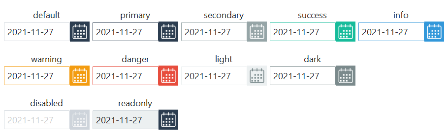

# DateEntry

This widget is composed of two widgets, the **Entry** widget and the **Button**
widget. The **Entry** component behaves identically to the 
[default entry widget](entry.md), and the calendar button behaves as the 
[default solid button](button.md).

The [DatePickerPopup](datepickerpopup.md) is invoked when the calendar
button is pressed. The default color applied to the popup is **primary**.

This widget also supports special styles for [disabled state](#disabled-date-entry), 
[readonly state](#readonly-date-entry),  and [invalid state](#invalid-date-entry).



```python
# default date entry
DateEntry()

# success colored date entry
DateEntry(bootstyle="success")
```

## Other date entry styles

#### Disabled date entry

This style _cannot be applied via keywords_; it is configured through widget 
settings.

```python
# create the date entry in a disabled state
DateEntry(state="disabled")

# disable a date entry after creation
d = DateEntry()
d.configure(state="disabled")
```

#### Readonly date entry

This style _cannot be applied via keywords_; it is configured through widget 
settings.

```python
# create the date entry in a readonly state
DateEntry(state="readonly")

# set the date entry readonly state after creation
d = DateEntry()
d.configure(state="readonly")
```

#### Invalid date entry

This style _cannot be applied via keywords_, but rather is the result of a 
validation process implemented on the widget. In the **Cookbook** you will find 
an example of [how to apply validation](../cookbook/validate-user-input.md) to an 
`Entry` based widget.