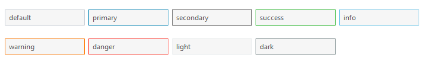

# 文本框

此小部件带有可选各种颜色的文本框。
边框颜色在失去焦点时默认为 __淡色__ ， _得到焦点后_ 颜色会被更改为 **主要颜色** 或 [选定颜色](index.md#colors)。
_获得焦点时_ 边框厚度将会被增加。

此小部件还支持 [禁用状态](#disabled-entry)，
[只读状态](#readonly-entry)和[无效状态](#invalid-entry)的特殊样式。



```python
# 默认的文本框(样式)
Entry()

# 应用了"danger"样式的文本框
Entry(bootstyle="danger")
```

## 其他文本框样式

#### 被禁用的文本框

此样式 _不能通过关键字来创建_；它是通过小部件设置进行配置的。

```python
# 创建一个被禁用的文本框
Entry(state="disabled")

# 创建之后再设置文本框为禁用
e = Entry()
e.configure(state="disabled")
```

#### 只读输入框

此样式 _不能通过关键字来创建_；它是通过小部件设置进行配置的。

```python
# 创建一个只读的文本框
Entry(state="readonly")

# 创建之后再设置文本框为只读
e = Entry()
e.configure(state="readonly")
```

#### 验证无效输入

此样式 _不能通过关键字来创建_；你需要在输入框上实施验证。
在**Cookbook**中,你将会找到一个名为[如何验证无效输入并且应用到到文本框](../cookbook/validate-user-input.md)的事例。
