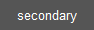

# 样式指南

这是应用 ttkbootstrap 样式的样式指南。所有 ttkbootstrap 样式
使用已注入的 **bootstyle** 参数应用
**ttk** 小部件构造函数。

ℹ️ [了解更多关于样式化遗留小部件的信息](legacywidgets.md)。

## 颜色

以下颜色选项可用于 _所有_ 小部件，除非说明，并且可以与小部件特定的已被描述的样式关键字一起使用。默认样式不需要关键字。

下面关键字的实际颜色值为
[在每个特定主题中定义](../themes/definitions.md)，但是
下面的描述是您通常可以从每个颜色关键字中获得的内容。

|关键字 |说明 |示例 |
| --- | --- | --- |
|主要 |大多数小部件的默认颜色 |  |
|次要 |通常是 _灰色_ |  |
|成功|通常是 _绿色_  |  |
|信息 |通常是 _蓝色_|  |
|警告 |通常是 _橙色_  |  |
|危险 |通常是 _红色_ |  |
|亮色 |通常是 _浅灰色_  |  |
|深色 |通常是 _深灰色_ |  |


```python
# 信息彩色按钮样式
Button(bootstyle="info")

# 警告彩色刻度样式
Scale(bootstyle="warning")

# 成功彩色进度条
Progressbar(bootstyle="success")
```