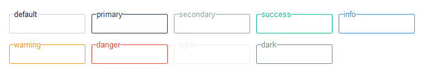

# Labelframe

This widget style features a styled border and label. By default, the border 
and label use theme defined defaults for border and foreground colors. When a
[selected color](index.md#colors) is used, both the label text and the border use this
color.



```python
# default labelframe style
Labelframe()

# info colored labelframe style
Labelframe(bootstyle="info")
```
