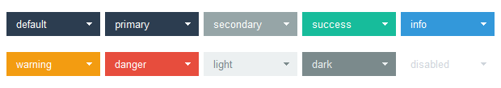
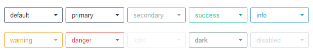

# Menubutton

This widget features a styled button with an arrow that can be styled using
any of the [available colors](index.md#colors). 

This widget supports a special style for [disabled state](#disabled-menubutton).

## Solid (default)

This widget style features a solid background color that lightens on _hover_ 
and darkens when _pressed_. 



```python
# default solid menubutton style
Menubutton()

# success colored solid menubutton style
Menubutton(bootstyle="success")
```

## Outline

This style features a thin styled outline. When _pressed_ or on _hover_, the
button changes to a solid color similar to the default menubutton style. 



```python
# default outline menubutton style
Menubutton(bootstyle="outline")

# info colored outline menubutton style
Menubutton(bootstyle="info-outline")
```

## Other menubutton styles

#### Disabled menubutton
This style _cannot be applied via keywords_; it is configured through widget 
settings.

```python
# create the menubutton in a disabled state
Menubutton(state="disabled")

# disable a menubutton after creation
b = Menubutton()
b.configure(state="disabled")
```
