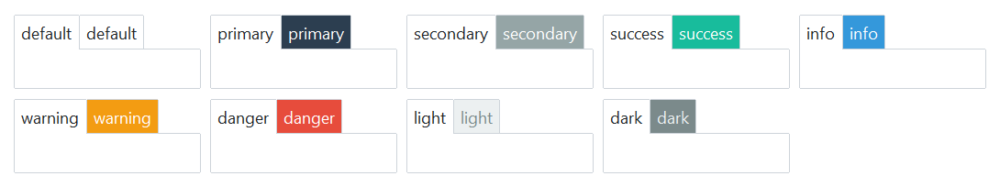

# Notebook

This widget style features minimal styling by default. However, you can add some
flair to the _inactive_ tab by using any of the [available colors](index.md#colors) as 
demonstrated in the exhibit below.



```python
# default notebook style
Notebook()

# info colored notebook style - inactive tab color
Notebook(bootstyle="info")
```
