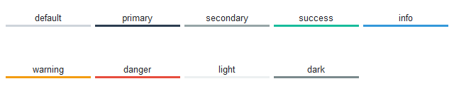

# Panedwindow

This widget style features containers with the themed defined background color 
separated by a styled sash that is grayish by default or of the
[selected color](index.zh.md#颜色).



```python
# default panedwindow style
Panedwindow()

# info colored panedwindow style
Panedwindow(bootstyle="info")
```