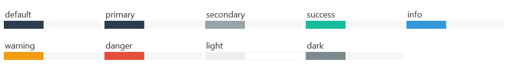

# Progressbar

This widget features a few style types that have **primary** colored indicator
bars by default, but can by styled using any of the 
[available colors](index.md#colors).

## Solid (default)

The default widget style features a solid color indicator bar.



```python
# default solid progressbar style
Progressbar()

# success colored solid progressbar style
Progressbar(bootstyle="success")
```


## Striped

This widget style features a striped indicator bar that uses the default or 
[selected color](index.md#colors) for the main color, and a desaturated version 
of this color for the alternating stripe.


```python
# default striped progressbar style
Progressbar(bootstyle="striped")

# danger colored striped progressbar style
Progressbar(bootstyle="danger-striped")
```