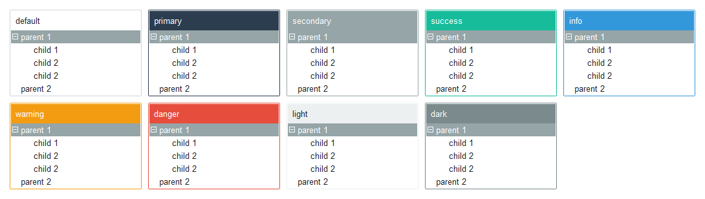

## 树形菜单

树形菜单可以应用默认主题的纯色背景或[选定的颜色](index.md#colors)。

此小部件带有可选各种颜色的文本框。
边框颜色在失去焦点时默认为 __淡色__ ， _得到焦点后_ 颜色会被更改为 **主要颜色** 或 [选定颜色](index.md#colors)。
_获得焦点时_ 边框厚度将会被增加。



```python
# 默认的树形图样式
Treeview()

# 应用了'info'彩色样式的树形菜单
Treeview(bootstyle='info')
```


