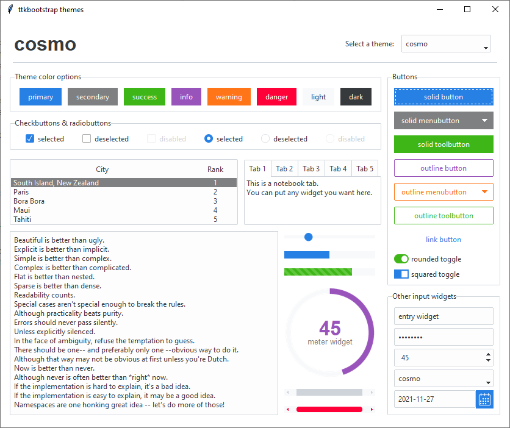
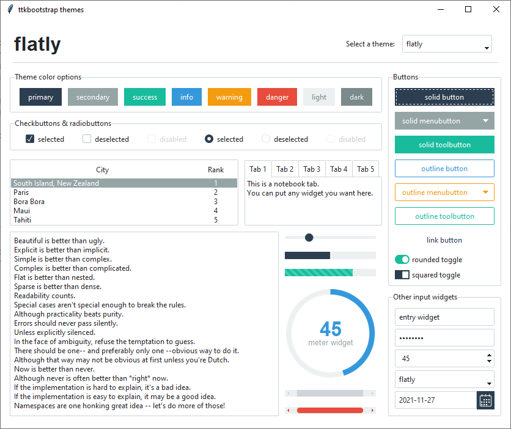
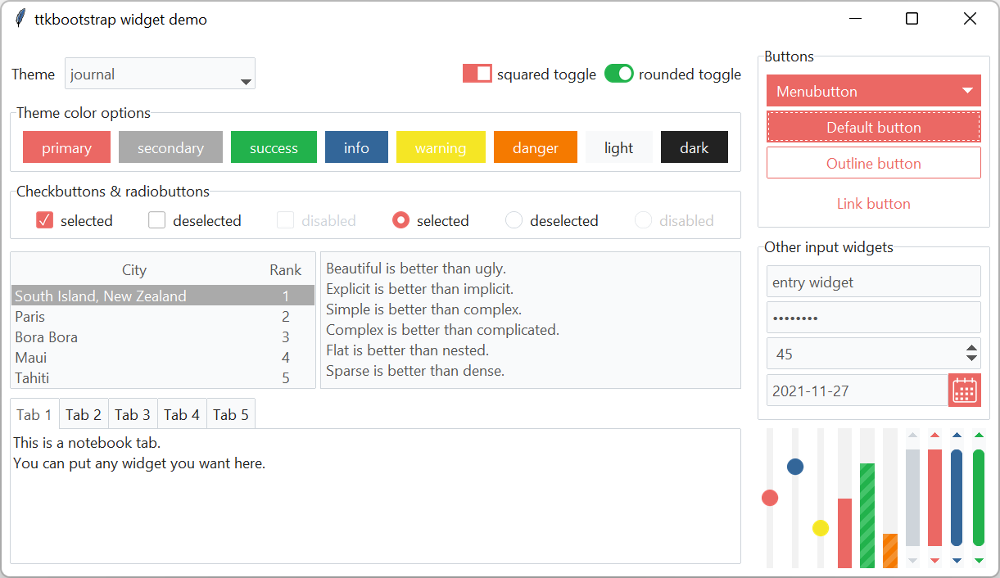
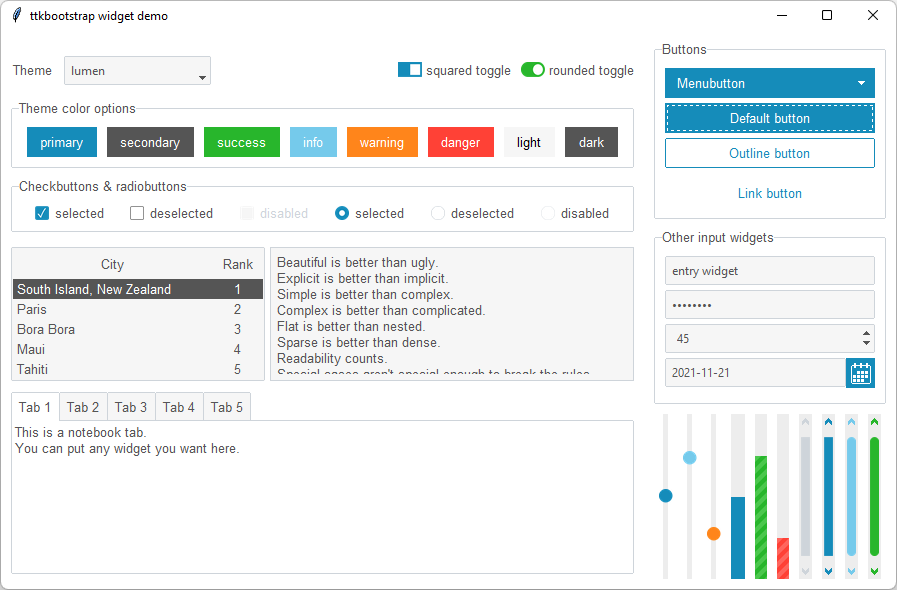
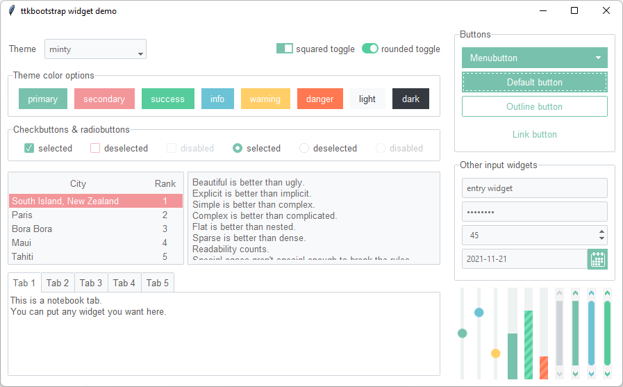
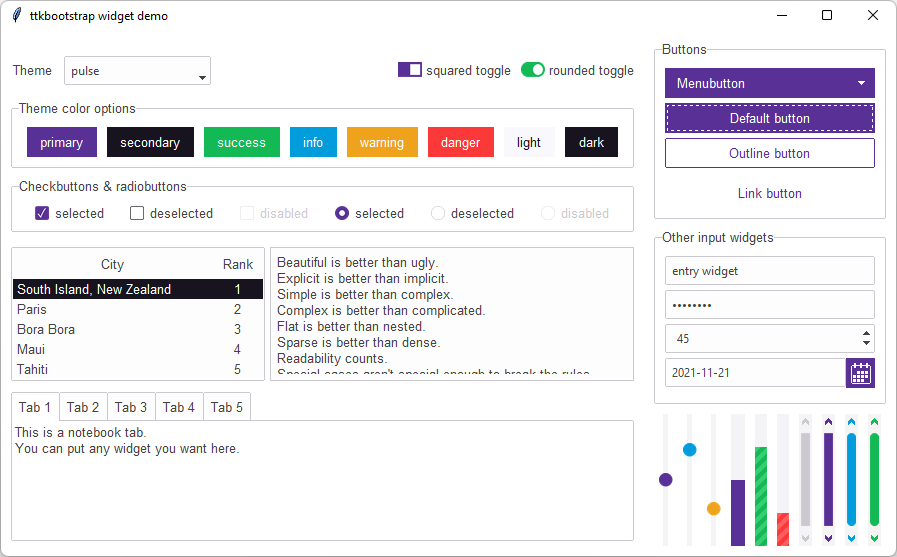
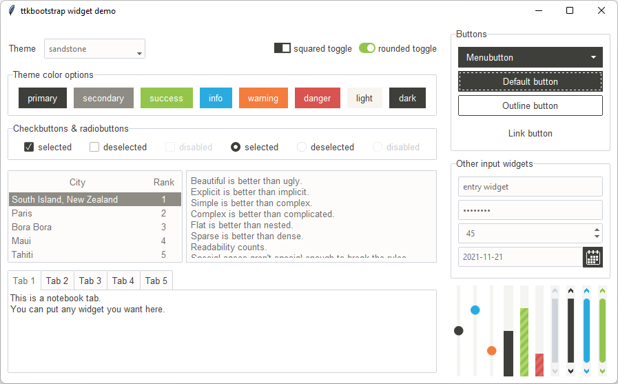
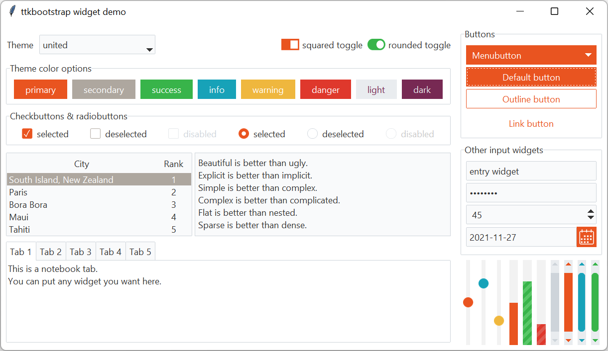
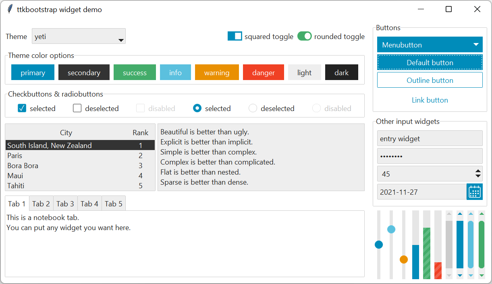

# Themes

All of the following themes are available in ttkbootstrap and can be viewed
with a live demo. 

Open the shell or command prompt and run the following:

```shell
python -m ttkbootstrap
```

## Light themes

The following light themes are largly inspired by [https://bootswatch.com/](https://bootswatch.com/)

### cosmo

Source of [inspiration](https://bootswatch.com/cosmo/)

### flatly

Source of [inspiration](https://bootswatch.com/flatly/)

### journal

Source of [inspiration](https://bootswatch.com/journal/)

### litera

Source of [inspiration](https://bootswatch.com/litera/)

### lumen

Source of [inspiration](https://bootswatch.com/lumen/)

### minty

Source of [inspiration](https://bootswatch.com/minty/)

### pulse

Source of [inspiration](https://bootswatch.com/pulse/)

### sandstone

Source of [inspiration](https://bootswatch.com/sandstone/)

### united

Source of [inspiration](https://bootswatch.com/united/)

### yeti

Source of [inspiration](https://bootswatch.com/yeti/)

## Dark themes

The following dark themes are largly inspired by [https://bootswatch.com/](https://bootswatch.com/)

### solar

Source of [inspiration](https://bootswatch.com/solar/)

### superhero

Source of [inspiration](https://bootswatch.com/superhero/)

### darkly

Source of [inspiration](https://bootswatch.com/darkly/)

### cyborg

Source of [inspiration](https://bootswatch.com/cyborg/)

## How are themes created?

Imagine being able to take the parts from several existing cars to design the 
one that you really want… that’s basically how ttkbootstrap was created… I used 
the best parts of the existing themes to craft a brand new theme template.

The base of all widgets in the ttkbootstrap template is the _clam_ theme. You 
may be wondering why the ttkbootstrap theme looks so different than the 
built-in clam theme… Each ttk widget is created from a collection of elements. 
These elements, when combined together, create what we see as a ttk widget. Aside 
from changing colors and state behavior, I constructed new widget layouts using 
the elements from various themes to give the desired look and feel. There is an 
old, but excellent reference to widget layouts [here](https://anzeljg.github.io/rin2/book2/2405/docs/tkinter/ttk-themes.html).

As an example: the `ttk.Combobox` widget contains a field element. In order to 
get the border effect I wanted, I constructed a new layout for the `ttk.Combobox` 
using the field from the `ttk.Spinbox`.

The `ttkbootstrap.style_builder.StylerBuilderTTK` contains a style template for
each widget style that takes pre-defined color themes from `ttkbootstrap.themes` 
module. These theme definitions are loaded into a `ThemeDefinition` class and 
used by the style builder methods to build each widget style for the colors
requested.

A pre-defined ttkbootstrap theme looks like this:

```json
"cosmo": {
    "type": "light",
    "colors": {
        "primary": "#2780e3",
        "secondary": "#373a3c",
        "success": "#3fb618",
        "info": "#9954bb",
        "warning": "#ff7518",
        "danger": "#ff0039",
        "light":"#ecf0f1",
        "dark": "#7b8a8b",
        "bg": "#ffffff",
        "fg": "#373a3c",
        "selectbg": "#373a3c",
        "selectfg": "#ffffff",
        "border": "#ced4da",
        "inputfg": "#373a3c",
        "inputbg": "#fdfdfe"
    }
}
```

## Legacy widget styles

While they are not the focus of this package, if you need to use legacy tkinter 
widgets, they should not look completely out-of-place. Below is an example of 
the widgets using the **journal** theme. Legacy tkinter widgets will have the 
**primary** bootstyle color applied. If you wish to use other theme colors on the 
widgets, you can override the widget colors as you would normally when using 
tkinter widgets. The [style colors are defined](/styleguide/#colors) 
in the `Color` object, so you can use theme consistent colors.

**add image here**

