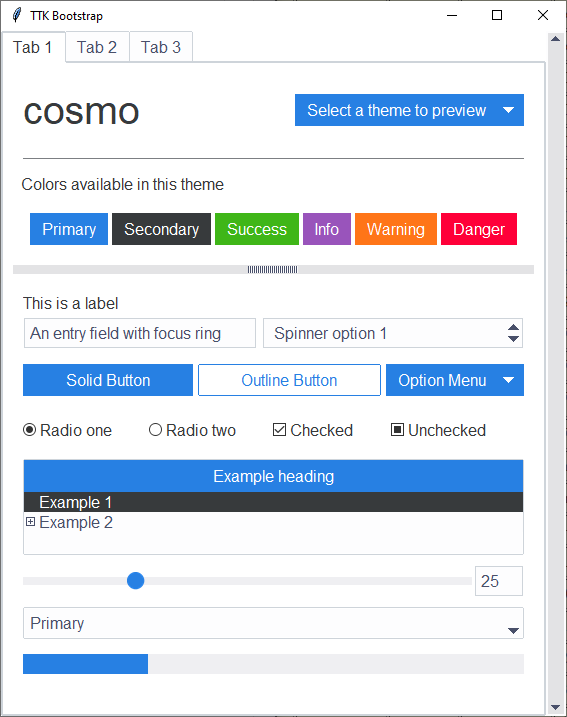
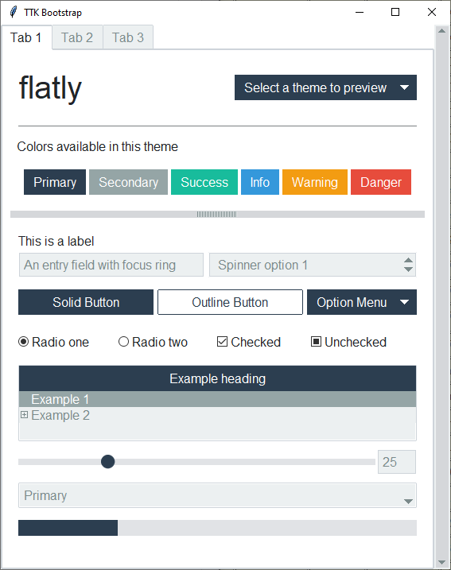
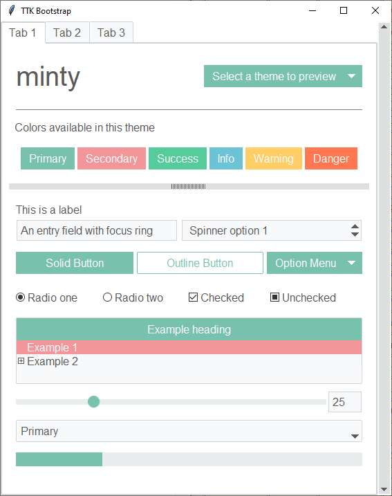
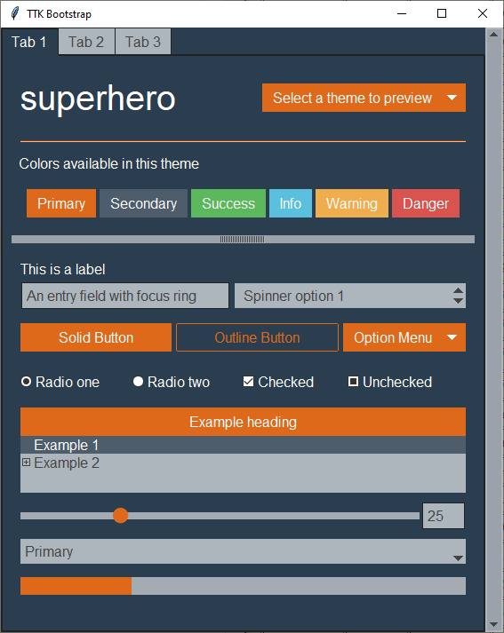
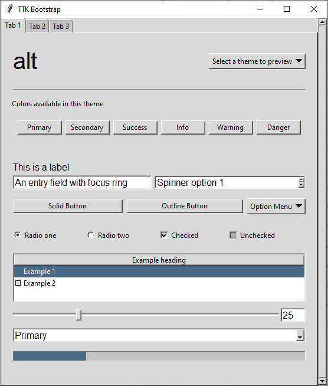

.. _themes:

Themes
======

How are themes created?
-----------------------
Imagine being able to take the parts from several existing cars to design the one that you really want... that's
basically what happened. I used the best parts of the existing themes to craft a brand new theme template.

The base of all widgets in the ttkbootstrap template is the *clam* theme. You may be wondering why the ttkbootstrap
theme looks so different than the built-in clam theme... Each ttk widget is created from a collection of elements.
These elements, when combined together, create what we see as a ttk widget. Aside from changing colors and state
behavior, I constructed new widget layouts using the elements from various themes to give the desired look and feel.
There is an old, but excellent reference to widget layouts here_.

.. _here: https://anzeljg.github.io/rin2/book2/2405/docs/tkinter/ttk-themes.html

As an example: the ``ttk.Combobox`` widget contains a *field* element. In order to get the border effect I wanted,
I constructed a new layout for the ``ttk.Combobox`` using the *field* from the ``ttk.Spinbox``.

So, the ``ttkbootstrap.StylerTTK`` contains the style template for all ttkbootstrap themes. From there, a set of
theme definitions (which includes color maps, default font, etc...) are extracted from a json file at runtime and
loaded as a new theme by the ``ttkbootstrap.Style`` class.

You can read more about how this works, and how you can create your own themes with :ref:`TTK Creator <ttkcreator>`.

Themes included with ttkbootstrap
---------------------------------
All of the following themes are available with ttkbootstrap and can be viewed live with the ttkbootstrap demo:

.. code-block:: python

    python -m ttkbootstrap

Light themes
............

    inspired by https://bootswatch.com/cosmo/

    inspired by https://bootswatch.com/flatly/

.. figure:: _static/examples/journal.png
    :scale: 70%
    :alt: an example image of theme journal

    inspired by https://bootswatch.com/journal/

.. figure:: _static/examples/litera.png
    :scale: 70%
    :alt: an example image of theme litera

    inspired by https://bootswatch.com/litera/

.. figure:: _static/examples/lumen.png
    :scale: 70%
    :alt: an example image of theme lumen

    inspired by https://bootswatch.com/lumen/

    inspired by https://bootswatch.com/minty/

.. figure:: _static/examples/pulse.png
    :scale: 70%
    :alt: an example image of theme pulse

    inspired by https://bootswatch.com/pulse/

.. figure:: _static/examples/sandstone.png
    :scale: 70%
    :alt: an example image of theme sandstone

    inspired by https://bootswatch.com/sandstone/

.. figure:: _static/examples/united.png
    :scale: 70%
    :alt: an example image of theme united

    inspired by https://bootswatch.com/united/

.. figure:: _static/examples/yeti.png
    :scale: 70%
    :alt: an example image of theme yeti

Dark themes
...........
.. figure:: _static/examples/darkly.png
    :scale: 70%
    :alt: an example image of theme darkly

    inspired by https://bootswatch.com/darkly/

.. figure:: _static/examples/cyborg.png
    :scale: 70%
    :alt: an example image of theme cyborg

    inspired by https://bootswatch.com/cyborg/

    inspired by https://bootswatch.com/superhero/

.. figure:: _static/examples/solar.png
    :scale: 70%
    :alt: an example image of theme solar

Legacy themes
.............
Just for reference, these are some of the built in themes

.. figure:: _static/examples/classic.png
    :scale: 70%
    :alt: an example image of theme classic

.. figure:: _static/examples/clam.png
    :scale: 70%
    :alt: an example image of theme clam

.. figure:: _static/examples/xpnative.png
    :scale: 70%
    :alt: an example image of theme xpnative

    This theme is for Windows only.

